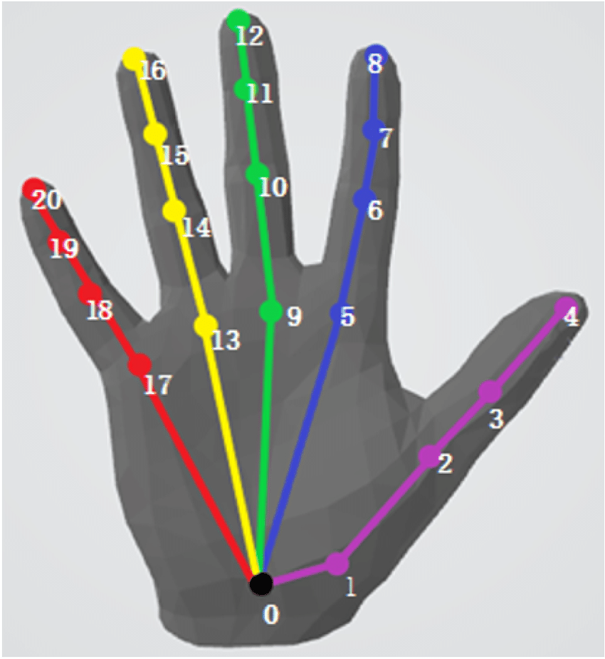
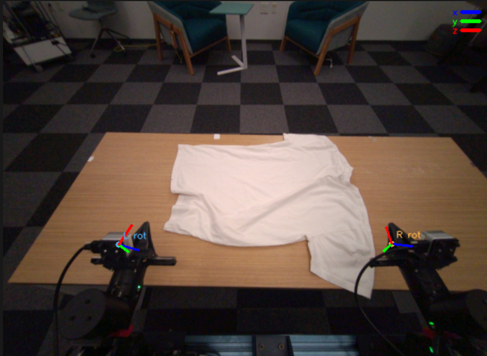

# EgoVerse Data Contribution Guide

*For labs and companies contributing human or robot demonstration data to EgoVerse.*

**Dexterous robot hands:** use the separate [dexterous-hand contribution guide](docs/CONTRIBUTING_DEXTEROUS_HANDS.md)
for joint and keypoint arrays, registry entries, camera calibration, and verification commands.

---

## Table of Contents

1. [Overview](#1-overview)
2. [Dataset Practices](#2-dataset-practices)
3. [Prerequisites](#3-prerequisites)
4. [Episode Hash Convention](#4-episode-hash-convention)
5. [Database Registry](#5-database-registry)
6. [Zarr v3 Episode Format](#6-zarr-v3-episode-format)
7. [Coordinate Frame Conventions](#7-coordinate-frame-conventions)
8. [Language Annotations](#8-language-annotations)
9. [Embodiment Identifiers](#9-embodiment-identifiers)
10. [Uploading to S3](#10-uploading-to-s3)
11. [Validation and Verification](#11-validation-and-verification)
12. [Pre-Submission Checklist](#12-pre-submission-checklist)
13. [Getting Access and Contact](#13-getting-access-and-contact)

---

## 1. Overview

EgoVerse is a multi-lab human and robot demonstration dataset. The primary storage and training format is **EgoVerse's own Zarr v3 schema**.

Every contributed episode must satisfy these check lists:

| Contract | What it enforces |
|---|---|
| **File format** | Zarr v3 store with specific key names, dtypes, and shapes |
| **Coordinate frame** | All poses expressed in a consistent reference frame |
| **Database record** | One row per episode in the PostgreSQL episode registry (added by the RL2 team on ingest — external contributors skip this, see §5) |
| **[Dataset Practices](#2-dataset-practices)** | Example: reducing idle times, check for data flaws |

The pipeline at a glance:

```
Your raw data
    └─► Convert to Zarr v3 (this guide)
    └─► Validate and preview locally
    └─► Upload to s3://rldb/processed_v3/<assigned_prefix>/<episode_hash>.zarr/
    └─► RL2 ingestion maintainer stages/registers the episode row
    └─► Available for download dynamically through S3MultiDataset
```

---

## 2. Dataset Practices

*What to capture, and how to keep it clean.*

We want to capture **economically useful work performed by a proficient demonstrator**.

### 2.1 Target Data Composition

A rough heuristic for the data **in aggregate**:

| Dimension | Target mix |
|---|---|
| **Task type** | no more than ~5% navigation · ~10% mobile manipulation · ~85% manipulation |
| **Gripper** | ~60% doable with a parallel-jaw gripper · ~40% doable by either a parallel-jaw gripper or a dexterous hand |
| **Setting** | ~70% tabletop · ~30% non-tabletop |

### 2.2 Capture Settings

Data can range from **staged studios** (realistic work captured in a controlled setting) all the way to **in the wild** — people doing tasks at home or in factory settings. If you are capturing real labor in the wild, it is **especially important to trim down to the relevant portions.**

### 2.3 Quality — Avoid These Failure Modes

A common failure mode is the demonstrator **randomly stalling, inspecting an item, patting clothes**, etc. Capture proficient, purposeful execution — not idle filler.

### 2.4 Trimming Rules

- **Trim out aggressive head movements.**
- **Hand tracking must be visible in all frames** — trim out any frames without hands.
- In-the-wild captures: **trim down to the task-relevant portions** (drop setup, breaks, wandering).

### 2.5 Example Tasks

Some example tasks we would prefer:

| # | Task | What it covers |
|---|---|---|
| 1 | **Sorting** | Sort parts/components into bins by type, color, or size (factory); sort utensils into a cutlery tray, or sort a cluttered table by category (food / tool / toy), color, or shape (home). |
| 2 | **Packing** | Place items into a box, bin, or bag with room to spare (loose packing, not tight-fit). |
| 3 | **Opening & closing containers** | Drawers, cabinet doors, box lids/flaps, bags (ziploc, drawstring). |
| 4 | **Tidying a cluttered table** | Return scattered objects to their places / into containers (dry, no wiping). |
| 5 | **Spatial arrangement** | Arrange objects into an approximate target layout: line up, group by type, set out in roughly canonical positions (exact spacing not required). |
| 6 | **Stacking** | Stack wide, stable items (plates, bowls, books) or nest bowls; no precise tall towers. |
| 7 | **Folding** | Rough-fold towels / cloth / clothing in half or thirds; crisp creases not required. |
| 8 | **Capping & uncapping** | Place or remove loose lids on boxes/jars, or large-thread caps; no fine threading. |
| 9 | **Hanging** | Drape a cloth/towel over a rod, or hang a bag/mug on a large hook; generous targets. |
| 10 | **Shelving** | Place books/boxes onto an open shelf with free space; no tight insertion. |
| 11 | **Loading & unloading** | Load items into a tray, caddy, or dish rack with generous slots; unload onto the table. |
| 12 | **Buttons & switches** | Press large buttons, flip switches, toggle controls. |
| 13 | **Retrieval by description** | Pick a specified item from a mixed set and bring it to a drop zone — e.g. "the red mug," "the biggest book," "the metal one." Delivery to a zone, not a precise pose. |
| 14 | **Relational placement** | Place an object relative to another by instruction: to the left of, behind, between, or on top of a reference object. Approximate positions are fine. |
| 15 | **Matching & pairing** | Pair like items (socks, gloves, shoes), match lids to their containers, or match an object to its printed outline. Forgiving placement. |
| 16 | **Reorientation & flipping** | Turn objects to a target pose: stand cups upright, flip cards face-up, or rotate items so labels face front. Forgiving rotation, no exact angle. |
| 17 | **Search & retrieve** | Open a drawer/box, find a specified item inside, and take it out (combines opening, selection, and extraction). |

---

## 3. Prerequisites

### 3.1 Hardware

EgoVerse is hardware-agnostic. Any egocentric camera with a SLAM system that provides 6-DOF pose tracking is supported. The minimum requirements are:

| Item | Requirement |
|---|---|
| Egocentric camera | Any camera worn or mounted on the head/torso providing a first-person RGB stream at ≥ 30 fps. Examples: Project Aria glasses, OAK-D, ZED Mini, RealSense T265, GoPro + external SLAM. |
| SLAM / pose tracking | A system that outputs 6-DOF device pose in a consistent metric world frame at ≥ 30 fps, synchronized with the RGB stream. Examples: Aria MPS, ZED SDK positional tracking, ORB-SLAM3, OpenVINS, RealSense tracking firmware. |
| Hand tracking | Per-frame 3D hand landmark estimates (21 keypoints per hand) synchronized to the RGB stream, expressed in the same SLAM world frame. Examples: Aria MPS hand tracking, MediaPipe + depth unprojection, OAK-D depthai hand tracker, Ultraleap. If your setup does not produce hand keypoints, omit `*.obs_keypoints` and `*.obs_wrist_pose` and use only `*.obs_ee_pose` (e.g. derived from a robot's FK or a wrist-worn IMU). |
| Wrist cameras | Optional. Include as `images.left_wrist` / `images.right_wrist` if present. |
| Robot | Any bimanual arm or single-arm platform. See §9 for embodiment identifiers. |

**Minimum viable setup (no robot):** egocentric camera + SLAM + hand tracking → contributes `images.front_1`, `obs_head_pose`, `left/right.obs_ee_pose`, `left/right.obs_wrist_pose`, `left/right.obs_keypoints`.

**If your SLAM system does not run at 30 fps**, ensure you upsample or interpolate pose tracks to match the RGB frame rate before writing. The training pipeline assumes all arrays are frame-aligned.

### 3.2 Software

```bash
# Clone and install EgoVerse
git clone git@github.com:GaTech-RL2/EgoVerse.git
cd EgoVerse
uv sync --locked
```

If using a custom environment directory, set `UV_PROJECT_ENVIRONMENT` to its path.

### 3.3 Credentials

**External contributors (partner labs / vendors): you only need Cloudflare R2
credentials for the data bucket — nothing else.** An RL2 team member will send
them to you directly (DM), scoped to your upload prefix. You do NOT need AWS
account keys, Secrets Manager, or database access (episode registration is
handled by the RL2 team, see §5).

Set the credentials in your environment:

```bash
export AWS_ACCESS_KEY_ID=<R2 access key from your RL2 contact>
export AWS_SECRET_ACCESS_KEY=<R2 secret from your RL2 contact>
export AWS_ENDPOINT_URL_S3=<R2 endpoint URL from your RL2 contact>
export AWS_DEFAULT_REGION=auto
```

Verify (should list your prefix, or return empty without erroring):

```bash
aws s3 ls --endpoint-url "$AWS_ENDPOINT_URL_S3" s3://rldb/processed_v3/<your_prefix>/
```

Note the endpoint: plain `aws s3` against AWS servers will return AccessDenied —
the bucket lives on R2, so every call needs `--endpoint-url`.

**RL2-internal members** additionally need AWS credentials for the episode
registry (PostgreSQL via Secrets Manager):

```bash
aws configure
# AccessKeyId / SecretAccessKey: ask the consortium lead
# Default region: us-east-2
bash egomimic/utils/aws/setup_secret.sh
# Writes ~/.egoverse_env with R2_ACCESS_KEY_ID, R2_SECRET_ACCESS_KEY,
# AWS_ENDPOINT_URL_S3, SECRETS_ARN, etc.
```

Internal verification:

```python
from egomimic.utils.aws.aws_data_utils import load_env
from egomimic.utils.aws.aws_sql import create_default_engine

load_env()
engine = create_default_engine()   # should print: Tables in schema 'app': ['episodes']
```

---

## 4. Episode Hash Convention

Every episode is identified by a **UTC timestamp** rendered as:

```
YYYY-MM-DD-HH-MM-SS-ffffff
```

where `ffffff` is microseconds zero-padded to 6 digits.

Examples:
```
2025-10-14-04-15-30-000000
2026-01-12-03-47-29-664000
```

**Compatibility:** Existing Human/EVA episodes do not acquire mandatory morphology,
joints, keypoints, timestamps, model assets, or new calibration blocks. Legacy
matrix and camera-mapping intrinsics remain readable. Missing information is
reported as a limitation; an operation needing that information may be unavailable.
Do not rewrite old episodes solely to adopt new metadata. New dexterous deliveries
follow the separate [hand guide](docs/CONTRIBUTING_DEXTEROUS_HANDS.md).

**Writer rules for new exports:**
- The episode hash is the **primary key** in the database. It must be globally unique.
- Use the UTC wall-clock time at the **start of the recording** as the hash.
- If your hardware does not produce a UTC timestamp natively, convert from device clock using a synchronized offset.
- The `.zarr` directory on S3 is named exactly `<episode_hash>.zarr`.

**Python helpers:**
```python
from egomimic.utils.aws.aws_sql import episode_hash_to_timestamp_ms, timestamp_ms_to_episode_hash

# Convert a UTC epoch millisecond integer to an episode hash string
hash_str = timestamp_ms_to_episode_hash(1736651249664)
# → "2026-01-12-03-47-29-664000"

# Convert back
ts_ms = episode_hash_to_timestamp_ms("2026-01-12-03-47-29-664000")
# → 1736651249664
```

---

## 5. Database Registry

Every episode is registered in the PostgreSQL `app.episodes` table, the authoritative
index used by all download and training tooling. **Registration is performed by the RL2
team — external contributors do NOT need database access and should skip this section.**
Deliver your episodes (`.zarr` stores + `.mp4` previews, with the attributes from §6) and
we register them on ingest. The schema below is documented for RL2-internal use.

### 5.1 Schema

The authoritative schema is the `TableRow` dataclass defined in [egomimic/utils/aws/aws_sql.py](egomimic/utils/aws/aws_sql.py). Refer to that file for the exact set of fields, defaults, and types — this guide may drift if the schema changes.

Key field notes:
- `episode_hash`: PRIMARY KEY, must match the `.zarr` directory name exactly (see §4).
- `operator`: **hashed** operator ID (e.g. SHA-256 hex digest). MUST be hashed before insertion — never store raw names/emails.
- `lab`: short, stable, lowercase string. Once set, do not change it (used in filters).
- `task`: high-level `task_name` that groups related episodes. Before inventing a new name, check the existing tasks in the episode registry via [`sql_tutorial.ipynb`](egomimic/scripts/tutorials/sql_tutorial.ipynb) (`df.groupby("task").size()`) and reuse one if your episode fits. If no existing task matches, canonicalize your new `task_name` to a short, stable, lowercase string that names a semantically meaningful category (e.g. `fold_clothes`, `object_in_container`) — not a one-off trial description. Put trial-specific detail in `task_description`, `scene`, and `objects`.
- `embodiment`: must be one of the strings in §9.
- `robot_name`: the same registered identifier as `embodiment`; record the contributing lab or vendor in `lab`.

### 5.2 Inserting a Row

```python
from egomimic.utils.aws.aws_sql import TableRow, add_episode, create_default_engine
from egomimic.utils.aws.aws_data_utils import load_env

load_env()
engine = create_default_engine()

# IMPORTANT: hash the operator identifier before inserting. Do not store raw
# names, emails, or any PII in the `operator` column.
import hashlib
operator_hash = hashlib.sha256(b"jane_doe").hexdigest()

row = TableRow(
    episode_hash   = "2026-03-15-14-22-10-000000",
    operator       = operator_hash,
    lab            = "rl2",
    task           = "fold_clothes",
    embodiment     = "human_bimanual",
    robot_name     = "human_bimanual",
    task_description = "folding a 2T baby shirt on a blue table",
    scene          = "kitchen_A",
    objects        = "baby_shirt_2T",
    num_frames     = 2712,
)

add_episode(engine, row)
```

`add_episode` raises `RuntimeError` on a duplicate `episode_hash`. Check for collisions before inserting.

### 5.3 Updating a Row After Upload

```python
from egomimic.utils.aws.aws_sql import update_episode

row.zarr_processed_path = "s3://rldb/processed_v3/human/2026-03-15-14-22-10-000000.zarr"
row.num_frames = 2712
update_episode(engine, row)
```

---

## 6. Zarr v3 Episode Format

Each episode is a **Zarr v3 group** (a directory ending in `.zarr`) containing arrays and top-level attributes.

### 6.1 Directory Structure

```
<episode_hash>.zarr/
├── zarr.json                       ← top-level group metadata + episode attrs
├── annotations/                    ← language annotations (may be empty)
│   ├── zarr.json
│   └── c/                          ← chunk data
├── images.front_1/                 ← egocentric RGB frames (required)
│   ├── zarr.json
│   └── c/
├── images.left_wrist/              ← left wrist camera RGB frames (optional)
│   ├── zarr.json
│   └── c/
├── images.right_wrist/             ← right wrist camera RGB frames (optional)
│   ├── zarr.json
│   └── c/
├── left.obs_ee_pose/               ← left end-effector pose (required for bimanual)
├── right.obs_ee_pose/              ← right end-effector pose (required for bimanual)
├── left.obs_wrist_pose/            ← left wrist pose (required if hand tracking available)
├── right.obs_wrist_pose/           ← right wrist pose (required if hand tracking available)
├── left.obs_keypoints/             ← left hand keypoints (required if hand tracking available)
├── right.obs_keypoints/            ← right hand keypoints (required if hand tracking available)
├── left.obs_gripper/               ← left gripper state (required if parallel gripper)
├── right.obs_gripper/              ← right gripper state (required if parallel gripper)
├── left.cmd_gripper/               ← left gripper command (required if parallel gripper)
├── right.cmd_gripper/              ← right gripper command (required if parallel gripper)
├── obs_head_pose/                  ← optical ego camera pose (when needed by the consumer)
├── obs_eye_gaze/                   ← eye gaze direction (if available)
└── obs_rgb_timestamps_ns/          ← per-frame capture timestamps
```

### 6.2 Required Arrays

All arrays are indexed along axis 0 by frame index. **`zarr.attrs["total_frames"]` is the
authoritative episode length**: every array covers frames `[0, total_frames)` along axis 0.
Arrays MAY extend past `total_frames` with zero-padding (writers commonly pad to a chunk
boundary — e.g. `ZarrWriter` pads to `chunk_timesteps`); consumers must slice
`[:total_frames]` and never interpret the padded tail as data.

#### Images

| Key | Shape | Dtype | Notes |
|---|---|---|---|
| `images.front_1` | `(T,)` of variable-length bytes | `VariableLengthBytes` | JPEG-encoded RGB frames |
| `images.left_wrist` | `(T,)` of variable-length bytes | `VariableLengthBytes` | Optional. Include if wrist camera present. |
| `images.right_wrist` | `(T,)` of variable-length bytes | `VariableLengthBytes` | Optional. Include if wrist camera present. |

#### Optical Ego Camera Pose

| Key | Shape | Dtype | Frame | Notes |
|---|---|---|---|---|
| `obs_head_pose` | `(T, 7)` | `float64` | SLAM world frame | Optical camera pose `[x, y, z, qw, qx, qy, qz]` in the episode reference frame. Needed by moving-camera consumers; optional for legacy ingestion/raw loading. New dexterous deliveries require this trajectory or an explicit valid fixed camera transform. |

#### Hand and Wrist Poses (if hand tracking is available)

Provide these if your setup produces 3D hand estimates. Omit the entire key (do not write zeros) if not available.

| Key | Shape | Dtype | Frame | Notes |
|---|---|---|---|---|
| `left.obs_ee_pose` | `(T, 7)` | `float64` | SLAM world frame | Left hand end-effector (fingertip centroid or palm center) pose as XYZWXYZ. If you have keypoints, derive this from them — see [Deriving `obs_ee_pose` from MANO keypoints](#deriving-obs_ee_pose-from-mano-keypoints-recommended) |
| `right.obs_ee_pose` | `(T, 7)` | `float64` | SLAM world frame | Right hand end-effector pose as XYZWXYZ (same derivation guidance as the left) |
| `left.obs_wrist_pose` | `(T, 7)` | `float64` | SLAM world frame | Left wrist origin pose as XYZWXYZ |
| `right.obs_wrist_pose` | `(T, 7)` | `float64` | SLAM world frame | Right wrist origin pose as XYZWXYZ |
| `left.obs_keypoints` | `(T, 63)` | `float64` | SLAM world frame | 21 hand landmarks × 3 (x, y, z); flattened row-major (see ordering below) |
| `right.obs_keypoints` | `(T, 63)` | `float64` | SLAM world frame | 21 hand landmarks × 3 (x, y, z); flattened row-major |

**If your system only provides wrist pose (not full keypoints)**, include `*.obs_wrist_pose` and `*.obs_ee_pose` and omit `*.obs_keypoints`.

**If your system provides only a single aggregate hand pose** (e.g. palm center from a depth sensor), populate `*.obs_ee_pose` only.

Keypoint ordering (21 landmarks):
Use the keypoints convention of MANO.



If you need to convert your proprietary keypoints to MANO, try using [otaheri/MANO](https://github.com/otaheri/MANO).

##### Deriving `obs_ee_pose` from MANO keypoints (recommended)

**Derive `*.obs_ee_pose` from your fitted MANO keypoints.** The frame is built
directly from the landmarks: the translation is a palm-center stand-in — the
centroid of the wrist and the index/middle/ring MCPs (joints `0, 5, 9, 13`) —
and the orientation is built from the wrist→palm direction plus a palm normal
taken as `(index_MCP − wrist) × (pinky_MCP − wrist)`, sign-flipped for the left
hand so the normal points out of the palm on both sides. Frames with missing or
degenerate keypoints carry the `1e9` sentinel. Output is `(T, 7)` `XYZWXYZ`,
the same layout as every other pose key. EgoVerse provides this as
`mano_keypoints_to_cartesian` in
[`egomimic/scripts/aria_process/aria_utils.py`](egomimic/scripts/aria_process/aria_utils.py):

```python
from egomimic.scripts.aria_process.aria_utils import mano_keypoints_to_cartesian

# mano_kp: (T, 63) canonical-MANO keypoints in the SLAM world frame,
#          i.e. exactly what you store in <side>.obs_keypoints
ee_pose = mano_keypoints_to_cartesian(mano_kp, is_rhand=True)   # -> (T, 7)
```


#### Robot Arm Poses (if operating alongside a robot)

The gripper fields below apply to parallel-jaw robots. For dexterous hands, follow
the [joint, keypoint, and camera requirements](docs/CONTRIBUTING_DEXTEROUS_HANDS.md)
in the separate guide.

| Key | Shape | Dtype | Notes |
|---|---|---|---|
| `left.obs_ee_pose` | `(T, 7)` | `float64` | Left arm EEF pose as XYZWXYZ in robot base frame |
| `right.obs_ee_pose` | `(T, 7)` | `float64` | Right arm EEF pose as XYZWXYZ in robot base frame |
| `left.obs_gripper` | `(T, 1)` | `float64` | Left gripper aperture in [0, 1] (0 = fully closed) |
| `right.obs_gripper` | `(T, 1)` | `float64` | Right gripper aperture in [0, 1] |
| `left.cmd_ee_pose` | `(T, 7)` | `float64` | Commanded left EEF pose (if available) |
| `right.cmd_ee_pose` | `(T, 7)` | `float64` | Commanded right EEF pose (if available) |
| `left.cmd_gripper` | `(T, 1)` | `float64` | Commanded left gripper (if available) |
| `right.cmd_gripper` | `(T, 1)` | `float64` | Commanded right gripper (if available) |

#### Timestamps and Misc

| Key | Shape | Dtype | Notes |
|---|---|---|---|
| `obs_rgb_timestamps_ns` | `(T,)` | `int64` | UTC nanoseconds for each RGB frame |
| `obs_eye_gaze` | `(T, 3)` | `float64` | Unit gaze direction vector in SLAM world frame (x, y, z) |

### 6.3 Top-Level Attributes (`zarr.attrs`)

The root group's `.attrs` dictionary is the **episode metadata**. It is written as JSON and is the primary indexing surface.

```python
{
    "embodiment":        str,   # e.g. "human_bimanual"  (must match DB row)
    "total_frames":      int,   # number of valid frames (not padded)
    "fps":               int,   # capture frame rate (typically 30)
    "task_name":         str,   # e.g. "fold_clothes"  (must match DB row)
    "task_description":  str,   # free-text description of the trial
    "intrinsics":        dict,  # New-writer output: {camera_key: 3x4 K matrix} (single-camera =
                                #   one entry, e.g. {"front_1": K}; 3x4 = the 3x3 pinhole K
                                #   with a zero last column). Projection uses the selected image camera.
    "extrinsics":  dict | None, # None, or a non-empty dict of 4x4 ref_T_cam transforms.
                                #   Robots key per-arm, e.g. {"left": left_base_T_cam,
                                #   "right": right_base_T_cam}.
                                #   Egocentric human contributors omit it (None).
    "features": {
        "<key>": {
            "dtype":  str,        # numpy dtype string, or "jpeg" for images, "json" for annotations
            "shape":  list[int],  # per-frame shape (no time dimension)
            "names":  list[str],  # dimension labels (e.g. ["dim_0"] or ["height", "width", "channel"])
            # images only:
            # "dtype": "jpeg", "shape": [H, W, 3], "names": ["height", "width", "channel"]
            # annotations only:
            # "dtype": "json", "shape": [N], "names": ["json"], "format": "annotation_v1"
        },
        ...
    }
}
```

**Rules:**
- `total_frames` must equal `len(store["images.front_1"])` and every other non-padded array.
- `fps` must be the actual capture rate of `images.front_1`. Do not set to a target rate if the actual rate differs.
- `features` must have one entry per array key present in the store.
- `embodiment` and `task_name` must exactly match the values in the DB row for this episode.
- `intrinsics` is **mandatory** and is always a `{camera_key: 3×4 K matrix}` dict in `zarr.attrs` (single-camera = one entry, e.g. `{"front_1": K}`). `ZarrWriter.create_and_write` raises if it is not a non-empty dict.
- `extrinsics` must be `None` or a non-empty dictionary of 4×4 `ref_T_cam`
  transforms. Each matrix gives the camera pose in its reference frame. See
  [Coordinate conventions](docs/CONVENTIONS.md). Robot episodes use the arm
  names as keys. For example, use
  `{"left": left_base_T_cam, "right": right_base_T_cam}`. Egocentric human
  episodes use `None`.
  `ZarrWriter.create_and_write` rejects all other values.

### 6.4 Storage / Chunking

> # ⚠️ **USE THE [`ZarrWriter`](egomimic/rldb/zarr/zarr_writer.py) CLASS** ⚠️
> # **This is the only supported way to produce EgoVerse Zarr stores. It guarantees sharding and chunking match the rest of the dataset — do NOT roll your own writer.**

- **Numeric arrays**: chunk shape `(chunk_timesteps, *frame_shape)` with `chunk_timesteps=100`, sharded to full array shape.
- **Image arrays**: chunk shape `(1,)` (one JPEG blob per chunk), sharded to full array shape.
- **Annotation arrays**: chunk shape `(N,)`, sharded to `(N,)`.
- **Zarr format version**: always **v3** (`zarr_format=3`).

See example usage in eva_to_zarr.py and aria_to_zarr.py.

#### Camera intrinsics and extrinsics for new exports

For new exports, pass calibration to `ZarrWriter.create_and_write` (or the
`ZarrWriter(...)` constructor). Use `calibration=` for the current camera block,
as described in the [dexterous guide](docs/CONTRIBUTING_DEXTEROUS_HANDS.md); the
writer derives equivalent legacy fields when possible. Existing converters may
continue to use `intrinsics=` / `extrinsics=`, serialized into the corresponding
`zarr.attrs` keys (§6.3).

- Supply a non-empty **`intrinsics` dictionary** of the form `{camera_key: 3x4 K matrix}`, or a **`calibration` block** containing camera intrinsics. Single-camera legacy exports use one dictionary entry, e.g. `{"front_1": K}`. The compatibility reader also accepts older bare 3×3/3×4 matrices without a rewrite.
- Each value is a **3×4** K matrix: the standard 3×3 pinhole matrix with an appended **zero column** (i.e. `[K | 0]`). New exports use 3×4 matrices; the compatibility reader pads older 3×3 matrices. To pad one explicitly, use `np.hstack([K_3x3, np.zeros((3, 1))])`.
- **Multi-camera rigs:** add one entry per camera, e.g. `{"front_1": K_front, "left_wrist": K_lw, "right_wrist": K_rw}`. Each projection uses the entry for the image stream actually selected by the loader or viewer. The complete dexterous check requires the canonical `front_1` view.
- `extrinsics` must be `None` or a non-empty dictionary of 4×4 `ref_T_cam`
  transforms. Each matrix gives the camera pose in its reference frame. See
  [Coordinate conventions](docs/CONVENTIONS.md). Robot episodes use the arm
  names as keys. For example, use
  `{"left": left_base_T_cam, "right": right_base_T_cam}`. Egocentric human
  episodes pass `None`.
  `create_and_write` rejects all other values.

```python
import numpy as np
from egomimic.rldb.zarr.zarr_writer import ZarrWriter

# fx=fy=248.57, cx=320, cy=180  ->  3x4 K (note the zero last column)
K_front = np.array([
    [248.57,   0.0,   320.0, 0.0],
    [  0.0,  248.57,  180.0, 0.0],
    [  0.0,    0.0,     1.0, 0.0],
])

ZarrWriter.create_and_write(
    episode_path="path/to/<episode_hash>.zarr",
    embodiment="human_bimanual",
    numeric_data=numeric_arrays,        # left/right.obs_ee_pose, obs_head_pose, ...
    image_data=image_arrays,            # images.front_1, ...
    intrinsics={"front_1": K_front},    # Legacy API; a current calibration= block is also supported
    # extrinsics=...,                   # Legacy robot arm-base-to-camera transforms, where applicable
    fps=30,
    task_name="...",
    task_description="...",
)
```

### 6.5 Episode Preview MP4 (sibling artifact)

Alongside each `<episode_hash>.zarr` store, write a preview video of the egocentric RGB stream named **`<episode_hash>.mp4`** (e.g. `2026-03-15-14-22-10-000000.mp4`). The Mecka AI dataset viz looks previews up by this exact filename, so any deviation from the `<episode_hash>.mp4` convention will break it.

Any standard MP4 encoder works. If it's convenient, the [`save_preview_mp4`](egomimic/utils/video_utils.py) helper is available — `aria_to_zarr.py` and `eva_to_zarr.py` use it (via the `--save-mp4` flag) and emit the file next to the `.zarr` directory.

---

## 7. Coordinate Frame Conventions

### 7.1 SLAM World Frame (storage frame)

For human demonstrations, poses are stored in the **SLAM world frame** produced by your pose-tracking system (e.g. Aria MPS, ZED SDK, ORB-SLAM3). This is an arbitrary fixed Euclidean frame that is consistent within a single recording session but **not** consistent across sessions or between different hardware setups. Robot demonstrations use their declared reference frame; see the [dexterous-hand guide](docs/CONTRIBUTING_DEXTEROUS_HANDS.md).

- Origin: defined by the SLAM system at recording start; treat as opaque.
- Axes: right-handed, metric (meters).
- **This is what you write into the Zarr arrays.** Do not pre-transform poses to any other frame before writing.

The SLAM world frame origin and orientation will differ between labs and hardware. That is expected and fine — the training-time head-frame normalization (§7.2) cancels out any global offset or rotation.

### 7.2 Head Frame (training frame)

For the configured Human head-frame transforms, the pipeline re-expresses poses **relative to the current optical camera pose** (`obs_head_pose`) using `ActionChunkCoordinateFrameTransform`. You do **not** need to do this conversion yourself; it is applied on-the-fly by the data loader.

The head frame is:
- Origin: the optical egocentric camera center at the current timestep.
- +X: right.
- +Y: down.
- +Z: forward (into the scene from the camera).

The end-effector frame uses the same convention (+X right, +Y down, +Z forward).



### 7.3 Wrist Frame (optional training frame)

For keypoint-based models, keypoints can optionally be further expressed relative to the wrist frame via `PoseCoordinateFrameTransform`. Again, this is a training-time transform; store everything in the SLAM world frame.

### 7.4 Frame Summary

The Human rows below describe the usual SLAM-world configuration. Robot loading
uses the configured reference/arm-base transforms and selected image calibration.
The dexterous ego view projects reference-frame points into the current camera.

| Array | Written in | Re-expressed at train time |
|---|---|---|
| `left.obs_ee_pose` | SLAM world | Head frame |
| `right.obs_ee_pose` | SLAM world | Head frame |
| `left.obs_wrist_pose` | SLAM world | Head frame |
| `right.obs_wrist_pose` | SLAM world | Head frame |
| `left.obs_keypoints` | SLAM world | Head frame, then optionally wrist frame |
| `right.obs_keypoints` | SLAM world | Head frame, then optionally wrist frame |
| `obs_head_pose` | SLAM world | Used as the re-expression pivot; deleted from batch after transform |
| `obs_eye_gaze` | SLAM world | Not re-expressed (stored as unit direction) |
| Robot `*.obs_ee_pose` | Declared reference or legacy arm-base frame | Consumer/configuration dependent |

---

## 8. Language Annotations

Language annotations are **optional but strongly encouraged**. They are stored as a span-based structure: each annotation covers a contiguous range of frames.

### 8.1 Format (`annotation_v1`)

The `annotations` array in the Zarr store contains `N` entries, where `N` is the total number of annotation spans in the episode (not the number of frames). Each entry is a UTF-8-encoded JSON string:

```json
{"text": "pick up the shirt", "start_idx": 0, "end_idx": 145}
```

| Field | Type | Description |
|---|---|---|
| `text` | `str` | Natural-language description of what is happening during `[start_idx, end_idx)` |
| `start_idx` | `int` | First frame index (inclusive) |
| `end_idx` | `int` | Last frame index (exclusive). Must satisfy `0 <= start_idx < end_idx <= total_frames`. |

**Rules:**
- Spans may overlap.
- Spans do not need to cover the entire episode.
- `text` must be in English.
- Use the imperative or present-continuous form: "pick up the shirt", "folding the left sleeve", etc.
- Do **not** encode task-level descriptions here (those go in `task_description`). Use annotations for sub-step descriptions.
- An empty `annotations` array (shape `(0,)`) is valid when no annotation is available.

### 8.2 Annotation Granularity

Use at minimum one annotation per task phase. For `fold_clothes`, for example:

| Phase | Example annotation text |
|---|---|
| Grasp | "grasping the shirt by the collar" |
| Unfold | "unfolding and laying the shirt flat" |
| Fold left sleeve | "folding the left sleeve towards the center" |
| Fold right sleeve | "folding the right sleeve towards the center" |
| Fold body | "folding the bottom half up to complete the fold" |

### 8.3 Writing Annotations

Via `ZarrWriter`:
```python
from egomimic.rldb.zarr.zarr_writer import ZarrWriter

annotations = [
    ("grasping the shirt by the collar",        0,   145),
    ("unfolding and laying the shirt flat",    145,   420),
    ("folding the left sleeve towards center", 420,   680),
    ("folding the right sleeve",               680,   910),
    ("folding the bottom half up",             910,  1200),
]

writer = ZarrWriter(
    episode_path="path/to/<episode_hash>.zarr",
    embodiment="human_bimanual",
    fps=30,
    task_name="fold_clothes",
    task_description="folding a 2T baby shirt",
    annotations=annotations,
)
```

To append annotations to an **existing** Zarr store:
```python
writer = ZarrWriter(episode_path="path/to/<episode_hash>.zarr")
writer.append_annotations(
    annotation_key="annotations",
    annotations=annotations,
    mode="w",   # replace the existing annotation track and update its feature metadata
)
```

### 8.4 Scale AI Annotation Format

If you are delivering data through Scale AI, annotations are generated via the Scale annotation API. The `ScaleAnnotationDatasetFilter` class can be used to filter episodes to only those with completed Scale annotations. Set `SCALE_API_KEY` in your environment.

---

## 9. Embodiment Identifiers

The `embodiment` field in the DB row and in `zarr.attrs` must match the
[platform registry](egomimic/rldb/embodiment/registry/platforms.yaml).
Human demonstrations use `human_*`; robot demonstrations use their registered
platform identifier. Record the contributing lab or vendor in the SQL `lab` field.

| `embodiment` string | Integer id | Description |
|---|---|---|
| `human_right_arm` | 1 | Egocentric human demonstration, right arm only |
| `human_left_arm` | 2 | Egocentric human demonstration, left arm only |
| `human_bimanual` | 3 | Egocentric human demonstration, two-arm |
| `eva_right_arm` | 4 | Eva camera + right-arm robot |
| `eva_left_arm` | 5 | Eva camera + left-arm robot |
| `eva_bimanual` | 6 | Eva camera + bimanual robot |
| `dexmate_bimanual` | 7 | Dexmate robot with registered dexterous hands |
| `yam_bimanual` | 8 | YAM bimanual robot |

If you are contributing egocentric human data, you use `human_bimanual` (or the single-arm variants) regardless of your hardware — set the `lab` field (e.g. `lab="microagi"`) to identify your source.

### 9.1 Using the `Human` embodiment (no subclass, no per-vendor identifier)

There is a **single concrete `Human` embodiment class** ([`egomimic/rldb/embodiment/human.py`](egomimic/rldb/embodiment/human.py)) shared by all human data. You do **not** write a per-vendor subclass, and there is **no per-vendor embodiment identifier** — every human contributor uses `human_*` and records their source in the `lab` field. Camera intrinsics travel with the data (`zarr.attrs`, §6.3 / §6.4); per-vendor structural choices are passed as explicit arguments from the data config:

- `Human.get_keymap(keymap_mode="cartesian"|"keypoints", has_head_pose=<bool>, include_aria_keypoints=<bool>)`
- `Human.get_transform_list(mode="cartesian"|"keypoints_headframe_ypr"|..., stride=<int>)`

Onboarding human data is just two steps:

1. Write `embodiment="human_bimanual"` (or `human_left_arm` / `human_right_arm`) in the DB row and in `zarr.attrs`; record your lab/hardware in the `lab` field.
2. Add a data config under [`egomimic/hydra_configs/data/`](egomimic/hydra_configs/data/) whose `key_map` / `transform_list` point at `Human.get_keymap` / `Human.get_transform_list` with the args your data needs. Copy `aria.yaml` (head-mounted, `stride: 3`) or `scale.yaml` (no head pose: `has_head_pose: false`, `stride: 1`).

Notes:
- New exports supply camera intrinsics through the writer (§6.4). Existing episodes keep their established representations and source-specific fallbacks; absent calibration limits projection, not raw loading.
- `has_head_pose=False` if your data has no `obs_head_pose`; `stride` is the action-chunk stride (`3` for ~30 fps egocentric, `1` for already-downsampled data).
- **Robot contributors:** register the platform and installed end effectors, and
  supply calibration with each episode. See the
  [dexterous-hand guide](docs/CONTRIBUTING_DEXTEROUS_HANDS.md) for hand requirements.

---

## 10. Uploading to S3

### 10.1 S3 Path Convention

**External contributors (partner labs / vendors): upload everything under your
assigned company prefix —**

```
s3://rldb/processed_v3/<company_name>/<episode_hash>.zarr/
```

`<company_name>` is the short lowercase name your RL2 contact gives you along
with your credentials (which are scoped to exactly this prefix — uploads
anywhere else will be denied). Batch deliveries (e.g. a `.tar.zst` of many
episodes) also go under this prefix.

Example:
```
s3://rldb/processed_v3/acmecorp/2026-03-15-14-22-10-000000.zarr/
```

**RL2-internal uploads** use the embodiment prefix instead:

| Embodiment | `<embodiment_prefix>` |
|---|---|
| `human_*` | `human` |
| `eva_*` | `eva` |

```
s3://rldb/processed_v3/human/2026-03-15-14-22-10-000000.zarr/
s3://rldb/processed_v3/eva/2025-11-04-09-30-00-000000.zarr/
```

### 10.2 Upload with `s5cmd`

`s5cmd` is the recommended upload tool (installed as part of the Python environment).

```bash
# Upload a local .zarr directory
s5cmd --endpoint-url "$AWS_ENDPOINT_URL_S3" \
      sync "/local/processed/2026-03-15-14-22-10-000000.zarr/*" \
           "s3://rldb/processed_v3/<assigned_prefix>/2026-03-15-14-22-10-000000.zarr/"
```

Or using the Python utility:
```python
from egomimic.utils.aws.aws_data_utils import upload_dir_to_s3, load_env

load_env()
upload_dir_to_s3(
    local_dir = "/local/processed/2026-03-15-14-22-10-000000.zarr",
    bucket    = "rldb",
    prefix    = "processed_v3/<assigned_prefix>/2026-03-15-14-22-10-000000.zarr",
)
```

### 10.3 Bulk Upload with Ray

For batch uploads of many episodes, use Ray to parallelize:

```python
import ray
from egomimic.utils.aws.aws_data_utils import upload_dir_to_s3, load_env

ray.init()

@ray.remote
def upload_one(local_zarr_path: str, s3_prefix: str):
    load_env()
    upload_dir_to_s3(local_zarr_path, bucket="rldb", prefix=s3_prefix)

tasks = [
    upload_one.remote(
        f"/local/processed/{h}.zarr",
        f"processed_v3/<assigned_prefix>/{h}.zarr"
    )
    for h in episode_hashes
]
ray.get(tasks)
```

---

## 11. Validation and Verification

### 11.1 Automated Checks

For established Human/EVA uploads and compatibility checks:

```bash
uv run python -m egomimic.rldb.zarr.validate /path/to/episode.zarr
```

Pass multiple episode paths to check a batch; malformed inputs receive individual
reports and do not stop subsequent episodes. `--json` emits detailed reports.
Declared shapes, numeric poses, and annotation intervals must be valid. Missing
new metadata is reported as a limitation under this invocation. `--help` lists
optional consumer requirements. Pose-only Human data and legacy Aria keypoint
aliases remain supported.

For **new dexterous deliveries**, use the stronger command in the
[dexterous-hand guide](docs/CONTRIBUTING_DEXTEROUS_HANDS.md#verify-before-delivery),
including `--ego-overlay`. The compatibility invocation does not certify a
complete dexterous delivery. Structural validity, status eligibility, and overlay
availability are reported separately.

### 11.2 Ordinary Local Load Check

Use the normal resolver to verify the supplied representations. This small raw
load does not require a GPU or head-camera geometry:

```python
from pathlib import Path
from egomimic.rldb.zarr.zarr_dataset_multi import LocalEpisodeResolver, MultiDataset

resolver = LocalEpisodeResolver(
    folder_path=Path("/path/to/episodes"),
    key_map={"left_pose": {"zarr_key": "left.obs_ee_pose"}},
)
dataset = MultiDataset._from_resolver(resolver, mode="total")
for index in range(len(dataset)):
    sample = dataset[index]
```

Select keys for the active sides. For Cartesian transformed batches, retain the
existing `Human.get_keymap("cartesian", has_head_pose=...)` and corresponding
`Human.get_transform_list(...)` configuration. New hand-array loading is described
in the dexterous guide. Explicit structural samples are excluded by the resolver;
use the local inspector/preview directly to review them.

### 11.3 Visual Verification

```bash
uv run python -m egomimic.scripts.data_visualization.latent_inspector \
  --dataset-path /path/to/episodes --host 127.0.0.1 --port 8653
uv run python -m egomimic.rldb.zarr.render_check /path/to/episode.zarr \
  --mode cartesian --horizon 30 --out outputs/episode-trajectory.mp4
```

Select an episode, play/scrub, and choose Cartesian, Orientation, or Keypoints.
For supplied keypoint deliveries, use `--mode keypoint` for the artifact. Review
left/right identity, finger order, moving-camera alignment, the end of the
episode, annotations, and any validation/estimated-data messages. Missing
calibration keeps RGB browsing available with an explanation. See
[preview modes and camera selection](docs/DELIVERY_PREVIEW.md).

A rendered video is not a validation pass. Correct visibly wrong transforms or
landmark exports in your conversion pipeline before delivery.

---

## 12. Pre-Submission Checklist

- [ ] Episode hashes follow the UTC naming convention and are unique in the delivery.
- [ ] Arrays cover retained `total_frames`; feature descriptions match the stored arrays.
- [ ] Active-side poses use `[x, y, z, qw, qx, qy, qz]`, meter translations, and usable rotations.
- [ ] Human SLAM-world or robot reference/arm-base conventions match the supplied transforms (§7).
- [ ] RGB and calibration describe the same image stream, including any crop or resize, for projection consumers.
- [ ] Annotations use valid retained-frame intervals and plain task text.
- [ ] The appropriate compatibility or complete dexterous validation command passes; warnings have been reviewed.
- [ ] A local load and familiar inspector/MP4 check succeed for the intended consumers.
- [ ] Estimated/incomplete analysis copies remain `structural_sample`; finished new deliveries declare `complete`.
- [ ] Episode directories and sibling previews are uploaded under the assigned prefix.
- [ ] The ingestion maintainer stages/registers the rows and verifies `embodiment`, task, `num_frames`, and `zarr_processed_path`.

External contributors need bucket access for their assigned prefix. The ingestion
maintainer handles database registration. Existing supported Human/EVA uploads
need no new vendor metadata backfill.

---

## 13. Getting Access and Contact

### Access Request

To request access to your contribution prefix:

1. Email the consortium leads with your lab name, GitHub handle, and a brief description of the data you intend to contribute.
2. External contributors receive scoped bucket credentials; internal ingestion maintainers arrange database access separately (§3.3).

### Consortium Leads

| Person | Affiliation | Role |
|---|---|---|
| **Danfei Xu** | Georgia Tech / NVIDIA GEAR | PI, consortium lead |
| **Simar Kareer** | Georgia Tech | Infrastructure, website, data pipeline |
| **Ryan Punamiya** | Georgia Tech / NVIDIA GEAR | Technical lead, format and schema |

### Resources

| Resource | URL |
|---|---|
| Website | https://egoverse.ai |
| Data browser | https://partners.mecka.ai/egoverse |
| arXiv paper | https://arxiv.org/abs/2604.07607 |
| GitHub | https://github.com/GaTech-RL2/EgoVerse |
| License | CC BY-SA 4.0 |
| Onboarding Slack channel (GT workspace) | `#egoverse-onboarding` |

### Reporting Issues

If you encounter processing errors, S3 permission issues, or schema questions, post in `#egoverse-onboarding` with:
- Your episode hash(es)
- The error message or symptom
- The output of `validate_episode()` for the affected episode
