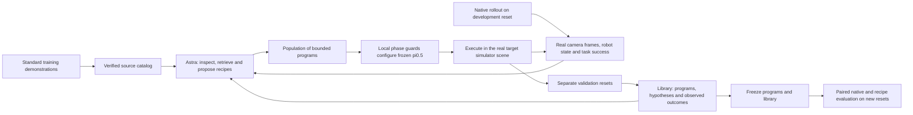

# ASPIRE-inspired libraries of π0.5 input settings

Status: experimental implementation; new GPU success-rate results are not yet
available. Previous FRS/TEI/TLI/VEI/VLI results are separate experiments and are
not evidence for this library method.

The proposed extension is to make a robot skill an executable configuration of a
frozen policy: source representations or demonstration frames, interpolation
strengths, activation and termination conditions, and measured outcomes. Astra
searches over these configurations and reuses prior programs and observations.
π0.5 supplies the motor actions. There is no weight update in this study.

[ASPIRE](https://arxiv.org/html/2607.00272v1) motivates the execution-feedback,
program-repair and accumulating skill-library loop. Our adaptation changes the
program primitives to π0.5 input settings and demonstration segments. It is an
ASPIRE-inspired implementation, not an exact paper reproduction; novelty has not
been established by a comprehensive literature review.



## Two experimental arms

| Arm | Executable primitive | Action generation |
| --- | --- | --- |
| A: `action_composition` | Ordered segments of actual recorded demonstration actions, mixed with native predictions | Native prediction → mixed reference → Euler-10 reversal → Euler-10 generation; execute the generated actions |
| B: `input_skill_library` | Phase-dependent TEI, TLI, camera edits, VEI or VLI | Compile the selected input settings, then native Euler-10 generation |

Each arm owns a separate knowledge library. The native baseline uses exactly the
same five-action execution cadence, action budget, reset and keyed noise stream
as its paired evaluation. Old studies with different cadences are not substituted
for this baseline. References span the checkpoint's full **50-action prediction
horizon**; the executor consumes five actions before replanning. The ten Euler
solver steps are independent of both of these counts. Finite-step reversal is a heuristic; it does not guarantee that
a rough reference becomes physically appropriate or more successful.

## Input-setting primitives

| Setting | What changes | Neutral setting and limitations |
| --- | --- | --- |
| TEI | Instruction embeddings become `(1-a) E_A + a E_B` | Omit the language edit for native behavior. `a=0` selects source A; it is **not** native. |
| TLI | Add `(1-2a) (T_A-T_B)` in instruction slots after transformer blocks 0–16, retaining the target text | `a=0.5`, or equal sources, is neutral. Only verified text banks may be used. |
| Donor pixels | Blend both live camera images with an aligned external/wrist donor frame or advance through a donor segment | `a=0` is native. `a=1` replaces the images. Live proprioception is the default. |
| Occlusion | Blend a normalized rectangular region toward RGB 127 in both live images | `a=0` is native. The rectangle covers at most half each image; rasterization rounds inward. |
| VEI | Interpolate projected visual tokens with a paired donor frame | `a=0` is native vision. Donor representations are captured under the target instruction. |
| VLI | Interpolate visual slots after blocks 0–16 with the paired donor representation | `a=0` is native vision; same-camera/patch correspondence is retained. |

Language and vision strengths are independent. TLI can coexist with VEI/VLI in
one stage. TEI can coexist with pixel edits or occlusion; combining TEI with
VEI/VLI currently requires separate stages. An optional donor-state setting
replaces the model's state input exactly alongside donor pixels. It never resets
or moves the simulator, and is logged separately because scene/state mismatch
can be harmful.

A hypothetical skill might configure language interpolation toward a familiar
placement behavior during transport, use a relevant demonstration image segment
during another phase, and return to native inputs before release. That is a
testable hypothesis, **not a verified “lift higher” skill**. Names and expected
effects supplied by Astra are not treated as measurements.

## When Astra acts and what it sees

The committed prompt is `demo_skill_agent.SYSTEM_PROMPT`; the harness is the
existing local Codex relay with `gpt-6-astra`, **medium** reasoning effort. Each
model request, response, prompt hash, image attachment, model receipt, token
usage and latency is retained. Unknown usage remains unknown. A Codex job is not
equated to a known number of internal provider requests or a dollar API charge.

Astra acts **between attempts**, not every five actions. First it selects up to
six sources from the catalog; then it sees chronological paired-camera previews
and proposes programs. Each proposal includes the initial real target scene,
live robot state and sparse frames from completed real rollouts. If a program
fails on one development reset and succeeds on the other, the failure frames
are shown and both outcomes are reported. Up to three top/recent program traces
and six retrieved knowledge records are supplied. There are no privileged object
poses, dense rewards, invented success signals or OOD teacher demonstrations.

During a rollout, a local executor checks stage guards every five actions using
**live** proprioception, even if model inputs contain donor images/state. Guards
include relative end-effector lift, gripper width, segment exhaustion and action
limits. Narrow gripper width is not evidence of a successful grasp. Stages are
bounded to 100 actions, and the entire rollout to 300. After the last stage,
the model returns to native inputs. Source actions are controller deltas, consumed
one per simulator action; dataset video FPS does not rescale those deltas.

## Search, validation and evaluation

The protocol is `configs/demo_skill_library_v1.json`.

| Setting | Full study |
| --- | --- |
| OOD tasks | All 10 Goal OOD and all 10 Spatial OOD tasks from the existing paper benchmark |
| Source catalog | One complete, lowest-index demonstration from each of 40 standard LIBERO tasks; pinned dataset revision and content hashes |
| Development | Reset IDs 0 and 1; native first, then at most 3 rounds × 3 candidate programs, each on both resets |
| Candidate selection | Strict improvement in observed development successes; retain the earlier program on ties |
| Validation | Selected program on reset IDs 2 and 3, separate from development |
| Library promotion | At least one development success and success on both validation resets |
| Evaluation | Freeze both suites' programs and library; reset IDs 4–13, one native and one selected-program rollout per task/reset |
| Primary SR | Successful selected-program evaluation rollouts / 200; compare against its 200 matched native rollouts, separately per arm |
| Per-task SR | Successes / 10 evaluation rollouts, with paired native result |
| Evaluation Astra calls | Zero; report search and amortized deployment costs separately |

All attempted candidates, including failures, are retained as observed knowledge.
Unvalidated records are explicitly labeled. Validation applies to the **whole
program**: it does not establish the causal benefit of every stage or general
transfer of a setting. Programs selected on development still receive evaluation
if validation fails; failed validation is reported and prevents promotion.

The library accumulates across tasks in fixed Goal-then-Spatial order. The current
test measures new resets of **adapted OOD compositions**. It does not measure
unseen-task transfer or isolate the benefit of memory. A library-disabled search
and an order-controlled, held-out-task study are necessary follow-up ablations
before making those claims.

The full upper bound is 840 physical rollouts and 240 Astra jobs **per arm**:
20 tasks × (2 native development + 18 candidate development + 2 validation +
20 paired evaluation rollouts). Search stops after a round attaining 2/2
development successes; tasks already at 2/2 native skip search. Provider failures
and contract violations stop the worker and remain recorded as incomplete work.
There is no automatic resubmission of a model job or rollout.

The cached local pilot contains 9 sources and 960 paired frames. The full worker
must obtain and verify all 40 source sequences; it cannot silently substitute the
partial bank. TEI can use all supplied source prompts, while TLI currently uses
the nine pre-existing verified text banks. VEI/VLI capture selected full-sequence
donor frames on demand. A two-task pilot is available (`Goal 1`, `Spatial 4`), and
must not be reported as the all-20 study.

## Recorded measurements

Outputs include per-attempt raw/effective observations, noise, generated actions,
FRS references and inverse noise where relevant, operator settings, clipping,
reset identities, rollout videos, wall/policy/environment times and velocity
evaluation counts. Camera recordings always depict the real simulator scene;
altered model observations are separate arrays in the trace.

The summary retains every provider ledger row, each task's provider-record range,
candidate index and provider-record endpoint at first observed success, and
censored failures. A native development success is candidate zero. Report both
search-to-first-success and total search spend; success on one development reset
is different from the primary held-out-reset SR. Historical/offline source
curation is separate preparation cost and its unavailable token count must not
be counted as zero.

## OSMO launch

Use the established `emimic` environment. Package with:

```bash
python -m astra_reversal.osmo.package_payload \
  --include-interpolation-banks \
  --demo-source-cache /path/to/verified/standard/source-cache \
  --output /path/to/immutable-bundle/payload.tar.gz
```

The bundle also contains the exact `bootstrap.sh` and `source_identity.json`
(`source_revision`, `payload_sha256`, `bootstrap_sha256`). Tokenizer/reference
assets and bank inventory must be staged in their existing `.deps` locations.
Model weights are fetched and verified on the GPU worker, not shipped in the
source payload.

```bash
python -m astra_reversal.osmo.prepare_demo_skill_launch \
  /path/to/immutable-bundle /path/to/private-launch --pilot
osmo workflow submit /path/to/private-launch/workflow.yaml \
  --pool groot-l40s-01 --priority NORMAL --format-type json
```

Save the returned JSON as `private-launch/submission.json`. Run
`python -m astra_reversal.osmo.supervise_demo_skills /path/to/private-launch`
with the environment activated. The supervisor transfers the checksum-bound
payload and starts each authenticated relay from a source snapshot. It checks
transport health every cycle, renews port forwards after three failed checks
following a healthy connection, and renews them every 15 minutes. Only the
transport restarts; Codex processes and job journals remain intact. Individual
`connect.sh WORKFLOW_NAME` scripts remain available for manual diagnostics.
Results upload under the workflow's owned R2 prefix through the existing archive.

For the full study, prepare a **new** launch directory without `--pilot`; keep
pilot evidence separate. No launch has been submitted by merely rendering a
workflow. Submission, worker startup, provider availability, actual trial counts
and completion must each be verified before reporting a run as finished.

## Continuing an interrupted search

The launch preparer accepts `--recovery-manifest /path/to/manifest.json`.
The manifest pins both prior worker archives by exact owned key, byte count and
SHA256. Each worker verifies and extracts its own archive, verifies the standard
demo bank, recaptures the reset manifest, and checks that every frozen policy
tensor matches the previous worker. The protocol and arm must match exactly.

Continuation reconstructs the search and library from the beginning using
verified recorded evidence. Completed physical attempts are imported once;
they do not execute again. All trace files and observation arrays are checked.
Each accepted Astra decision is reused only if the complete reconstructed
request matches, including decoded image pixels, library context, model,
reasoning effort and prompt. PNG compression may differ between platforms;
when pixels match, the original encoded request and fingerprint are retained.

Every old provider ledger row is retained, including unknown usage from the
interrupted request. The next new request receives a continuation-specific
identity; an old invocation is never silently retried. The continued summary
identifies its ancestor archive and imported attempts, so aggregation must not
sum the interrupted and continued copies as independent experiments. Primary
metrics still require all declared paired evaluation rollouts to complete.

An offline audit of the interrupted `full-2` archives reconstructed 56 and 64
physical attempts, 29 accepted decisions per arm, and both complete partial
libraries without any model or simulator execution. These are recovery checks,
not additional performance measurements. The interrupted study has no final
held-out-reset evaluation results yet.
