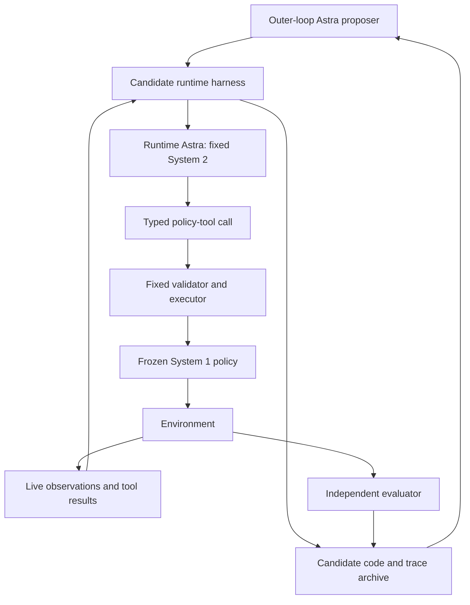

# Meta-Harness for Astra’s System 2 Tool Use

**Research proposal · Revised October 6, 2026**

**Working title:** Improving Astra’s steering of a frozen System 1 policy through harness optimization.

## 1. The idea

Use **Astra itself as the runtime System 2 controller**, with a frozen π0.5 policy as its System 1 execution tool. Apply Meta-Harness to improve the code around Astra: what it observes, what it remembers, how it retrieves relevant examples, when it calls tools, and how it turns their results into subsequent decisions.

Both model checkpoints remain fixed. The optimized object is the **harness that enables Astra to steer System 1 effectively**.

At runtime, Astra observes the live scene and task, selects a bounded conditioning intervention, lets System 1 execute, and revises its choice using actual outcomes. During development, an outer-loop Astra instance inspects previous harnesses and execution traces and proposes improved harness code. These are two separate roles and contexts, even if they use the same underlying model.

The immediate research question is:

> Can Meta-Harness improve Astra’s closed-loop policy-tool use, producing higher task success than a hand-built Astra harness under the same tools, observations, and execution budget?

This version does not require a Gemma controller, foundation-model weight training, or proof that direct System 1 training cannot achieve the behavior. Those questions can be separate later studies. Here, the priority is establishing that better orchestration makes Astra more effective at using the existing policy interface.

**Status:** this is an experimental design. No new rollouts or harness-search runs have been executed for this document. Numerical budgets, API examples, and acceptance targets are proposed starting points.

## 2. What changes, and what stays fixed

| Component | Role | Treatment |
|---|---|---|
| Runtime Astra | Interpret observations and choose policy-tool calls | Fixed checkpoint and reasoning configuration |
| π0.5 / System 1 | Generate and execute motor actions under active conditioning | Fixed checkpoint, preprocessing, and solver |
| Tool executor | Validate interventions and apply supported hooks | Fixed semantics and compatibility rules |
| Harness | Assemble context, retrieve skills, maintain memory, schedule decisions, handle tool results | Optimized through code search |
| Skill cards | Describe available demonstrations and intervention evidence | Fixed eligible source pool; organization/retrieval may be searched |
| Evaluator | Measure original task success and resource usage | Fixed and inaccessible to harness edits |
| Outer-loop Astra | Diagnose failures and propose harness revisions | Development only; receives search-set evidence |

The project’s existing protocol identifies Astra as `gpt-6-astra`. Pin the actual available model/version and reasoning settings in the experiment manifest; do not infer performance guarantees from that identifier.

“Teaching Astra” means improving its external instructions, context, memory, and control logic. It does not mean updating Astra’s weights. A useful outcome may be a better retrieval algorithm or state representation rather than a more elaborate prompt.

## 3. Relation to Meta-Harness and Eureka

**Meta-Harness** [1] is the main method: search executable harness code around a frozen model, using a proposer that can inspect earlier candidate code, scores, and execution traces. Here, the application is Astra’s use of a robot-policy tool.

**Eureka** [2] is optional supporting inspiration for executable progress diagnostics. Its policy-weight training loop is outside the present scope. Initially, use original environment success plus fixed diagnostics; do not introduce simultaneous reward search before demonstrating harness improvement.

This gives a clean first experiment: **fixed Astra + fixed tools + fixed System 1 + searched harness**. The outcome is better tool-use behavior, judged by physical results.

## 4. Starting point in the local study

The inspected archive is:

`/Users/anikethcheluva/Downloads/astra-skill-library-study-20261002`

It documents two arms: demonstration action composition with FRS, and a library of input settings for frozen π0.5. The input-setting arm is the initial interface for this project. Keep FRS as a separate later tool-family comparison.

The documented study uses a 300-action episode limit, five executed actions per System 1 replan, a 50-action prediction horizon, and ten Euler solver steps. These are distinct quantities. A System 1 replan does not require a new Astra call.

The original protocol adapts to 20 compositions in `libero_goal_ood` and `libero_spatial_ood`. Development resets are 0–1, validation resets 2–3, and planned evaluation resets 4–13. Evaluation uses fixed libraries and zero Astra calls. **The new experiment adds runtime Astra decisions**, so it should not be described as simply reproducing the old protocol.

The archive records 244 accepted Astra search decisions and 7,761,266 known tokens, with two records of unknown usage. Final evaluation summaries were not retrieved into the archive, so final success rates remain unknown. Accepted search decisions are not complete expert trajectories.

The archive is a report/evidence bundle, not confirmation that the runnable simulator, policy weights, and hooks are locally available. Recovering those is the first implementation dependency. The recorded source revision is `d4b2b690ac8992137f35af566429f6241c39afca`.

## 5. Architecture: Astra improves the harness around runtime Astra



### Runtime role

Runtime Astra receives the original instruction, live camera observations, robot state, recent execution history, active-program status, and retrieved skill cards. It decides what to do next through typed tools. It cannot edit its harness or the evaluator during an episode.

### Outer-loop role

The proposer inspects search-set failures, prior implementations, and outcomes. It writes a new harness candidate, which is validated and evaluated with the same frozen runtime models. It cannot change task success definitions, add privileged runtime inputs, or inspect final-test outcomes.

Give the roles different system instructions and separate logs. Runtime calls are part of the deployed controller’s cost; proposer calls are harness-development cost. There is no live channel for the proposer to rescue a final-test episode.

## 6. What better System 2 tool calling should mean

Optimize for concrete behaviors:

1. **Choose a useful intervention.** Select a source segment and operator relevant to the current object, goal, and failure mode.
2. **Know when to leave System 1 alone.** Preserve native behavior when intervention has no demonstrated benefit.
3. **Use the right duration.** Avoid changing a useful setting too early or persisting after it becomes harmful.
4. **Read the consequences.** Use new live observations to distinguish progress, failure, and uncertainty.
5. **Recover without repetition.** Avoid repeating a failed operator/source/strength combination without new evidence.
6. **Preserve achieved subgoals.** Do not destroy a stable grasp while attempting to improve placement.
7. **Respect temporal validity.** Do not apply a delayed decision after the scene or phase has changed.

Syntactically valid calls are necessary but insufficient. A harness that produces perfect JSON while repeatedly grasping the wrong object has not solved the task.

## 7. Fixed policy-tool interface

### 7.1 Preserve the existing semantics

The supplied Astra prompt defines the following operators [L2]:

| Operator | Recorded operation | Native/neutral behavior |
|---|---|---|
| TEI | Instruction embeddings become `(1−α)E_A + αE_B` | Zero selects A; native text is a separate `language=null` choice |
| TLI | Retain target text and add `(1−2α)(T_A−T_B)` after blocks 0–16 | `α=0.5` is neutral |
| VEI | Mix projected live visual tokens with paired donor tokens | `α=0` preserves native vision |
| VLI | Mix visual slots after blocks 0–16 with donor representations | `α=0` preserves native vision |
| Pixels/occlusion | Apply the documented camera blending or masking | Zero blend preserves native cameras |

Language and visual strengths are independent. TLI can combine with VEI/VLI. TEI can combine with pixels/occlusion, but simultaneous TEI+VEI/VLI hooks are not implemented in the documented interface. Different sequential stages may use different operators. Do not change these semantics during harness search.

Keep live proprioception in the main experiment. Runtime Astra always receives **raw live camera images**, even when System 1 receives modified inputs. Donor frames are examples, not evidence of the current scene.

VEI/VLI cache keys must include source frame, paired cameras, original target instruction, policy checkpoint, preprocessing, and hook version. Preserve source eligibility restrictions, including the supported TLI text bank.

### 7.2 Expose three action tools initially

```text
set_policy_program(skill_id, language, vision, max_actions,
                   observation_id, expected_stage_id)
keep_policy_program(program_id, observation_id)
clear_policy_program(observation_id)
```

The harness automatically supplies retrieved cards at first, rather than making Astra explore a second tool family for retrieval. A skill card resolves approved source IDs, frame ranges, playback, and termination guards. A fixed compiler translates the validated call into policy settings.

Illustrative proposed wrapper call:

```json
{
  "tool": "set_policy_program",
  "arguments": {
    "observation_id": "obs_120",
    "expected_stage_id": "stage_2",
    "skill_id": "retrieved_skill_03",
    "language": null,
    "vision": {"operator": "vei", "alpha": 0.25},
    "max_actions": 40
  }
}
```

These IDs are placeholders for real entries in a request. This is a new wrapper schema, not a claim that the archived repository already implements it.

`max_actions` bounds an intervention, not an open-loop motor trajectory. System 1 still replans from fresh inputs every five actions. `keep_policy_program` retains the donor cursor and original expiry; it does not silently reset or extend the program. A new program must explicitly identify its start segment. Preserve exclusive end-frame bounds and `hold`/`advance` playback behavior.

Invalid or stale calls produce a bounded, documented fallback and consume the relevant call budget. Repeated self-repair must not create unlimited extra Astra requests. Clearing a program returns to native conditioning; this is a reproducible fallback, not a guarantee of task success.

Start with native, TEI, and VEI. Add TLI/VLI after basic execution works. Use fixed candidate strength grids initially, such as visual `{0, 0.1, 0.25, 0.5}`, TEI `{0, 0.25, 0.5, 0.75, 1}`, and TLI `{0.25, 0.5, 0.75}`. These are proposed bounds, not established optimal settings.

### 7.3 Tool results must be useful and nonprivileged

Return an execution receipt containing:

```text
requested_call and actually_executed_call
program_id and donor_cursor
primitive actions elapsed
termination/expiry reason
current raw paired camera observations
current live proprioception
validation or freshness errors
```

Do not return hidden object poses, simulator grasp labels, privileged reward components, or the final evaluator’s internal predicates to runtime Astra. System 2 must infer progress from deployment-available observations. Fixed benchmark episode termination can end the run without turning privileged success checks into a callable sensor.

## 8. The harness search space

| Searchable component | Example improvement |
|---|---|
| Prompt construction | Make the original goal, current uncertainty, and allowed next tools easy to distinguish |
| Temporal observation selection | Include frames before and after the previous intervention instead of unrelated history |
| Memory | Track attempted interventions, visible outcomes, and unresolved hypotheses |
| Retrieval | Select cards using object roles, relations, phase, and failure context |
| Skill presentation | Present concise applicability evidence and limitations instead of a large undifferentiated catalog |
| Scheduling | Consult Astra at informative moments while respecting an equal call cap |
| Response handling | Reject obsolete decisions and preserve an active valid program |
| Context budgeting | Prioritize current raw images and original instructions before older examples |

Fixed elements include model settings, sensor access, allowed tools, operator implementation, action budget, and evaluator. Keep the eligible source-demonstration pool shared across candidates. If library admission is later optimized, treat that as a separate controlled extension and preserve source provenance.

A proposed per-episode memory structure is:

```json
{
  "original_goal": "the original environment instruction",
  "phase_estimate": "approach",
  "phase_confidence": "uncertain",
  "observations": [],
  "attempted_interventions": [],
  "active_program_id": null,
  "unresolved_questions": []
}
```

Memory entries should cite observations or execution events. “Gripper closed” may be directly observed; “object grasped” remains a hypothesis until supported by visual motion or other permitted evidence. The harness must not convert an earlier model assertion into a verified fact merely by storing it.

## 9. Timing and asynchronous execution

Astra need not act at the motor-control rate. System 1 maintains fast execution while Astra reasons about the next steering decision.

1. The harness captures timestamped observations and dispatches an Astra request.
2. System 1 continues under the active program or native conditioning.
3. At response arrival, the fixed executor checks observation age, expected stage, current program status, and operator validity.
4. A valid response is committed at a System 1 replan boundary.
5. An obsolete response is logged and rejected. Program expiry follows the declared fallback.

Allow at most one outstanding request initially. Use a fixed freshness rule for the first comparisons. Later, search scheduling and staleness handling within shared permitted bounds.

Start with a cap of eight runtime Astra calls per 300-action episode, then compare 4/8/16-call budgets. Cap processed context and output, initially at 8,192 input tokens and 256 output tokens per request, subject to measured image handling. Charge retries and repair requests to the same cap.

Profile Astra using representative images and histories before choosing cadence. Do not assume it can answer within any particular number of robot steps. At a hypothetical 20 Hz, 300 actions last 15 seconds; a slow call may consume a substantial fraction of the episode. The experiment must establish that enough useful decisions can arrive in time.

First debug the interface in synchronous simulation if necessary. For the main runtime claim, use actual asynchronous execution or validated measured-delay replay while the environment continues. Report synchronous results separately. System 1 and Astra serving may contend for hardware, so end-to-end motor deadlines matter in addition to Astra’s standalone latency.

## 10. Meta-Harness optimization procedure

### 10.1 Candidate artifacts

```text
runs/<run_id>/
  manifest.json
  candidates/<candidate_id>/
    harness.py
    prompts/
    retrieval_config.json
    search_metrics.json
    traces/<episode_id>/
      observations.jsonl
      astra_requests.jsonl
      astra_responses.jsonl
      tool_events.jsonl
      timing.jsonl
      outcomes.json
  selected_bundle/
  final_evaluation/             # excluded from proposer access
```

Store exact model settings, prompts, image references, code hashes, selected sources, proposed/executed calls, timing, and physical outcomes. Preserve failed candidates. A short outcome summary is useful for navigation, but the proposer should be able to inspect the underlying trace.

### 10.2 Outer loop

```python
archive = [evaluate(initial_harness, search_suite)]

for iteration in range(search_iterations):
    candidates = proposer_astra.inspect_and_edit(archive)
    for harness in candidates:
        if not validate_harness_contract(harness):
            archive.record_rejection(harness)
            continue
        result = evaluate(
            harness,
            fixed_runtime_astra,
            fixed_system1,
            fixed_tools,
            matched_search_episodes,
        )
        archive.record(harness, result)

selected = select_under_fixed_success_and_cost_criteria(archive)
freeze(selected)
run_final_evaluation(selected)
```

Enforce access and tool restrictions in the runner. A prompt instruction alone is not a sufficient barrier against accidentally exposing evaluator information to a candidate harness.

For the first search, change one coherent mechanism per candidate, such as retrieval or failure memory. Later allow joint edits. Keep the proposer free to inspect previous candidates, but require a concise hypothesis so the effect of each revision remains interpretable.

### 10.3 Selection objective

Select by original-criterion task success under fixed episode, call, and timing budgets. Use latency/tokens as secondary objectives or report a Pareto frontier. Never select a candidate only because it produces a larger self-defined reward.

A simple initial ordering is:

1. Reject access-contract violations or budget violations.
2. Rank valid candidates by task-macro-averaged success on the shared search suite.
3. For close candidates, collect additional matched resets before treating the difference as real.
4. Prefer lower cost only when success is comparable under a predeclared tolerance.

This prevents a harness that merely calls Astra more often from appearing to improve its tool-use strategy.

## 11. Diagnostics that make failures actionable

Keep the success metric unchanged. Use diagnostic measurements to explain failures to the proposer:

| Failure | Evidence to inspect | Possible harness edit |
|---|---|---|
| Wrong target selected | Current raw scene, referent description, chosen card | Improve relational context and source retrieval |
| Repeated failed grasp | Temporal images, previous calls, lack of object motion | Preserve failure memory and diversify the next attempt |
| Premature phase switch | Observations supporting the asserted phase | Require additional visible evidence or explicit uncertainty |
| Harmful persistent intervention | Active program timeline and outcome regression | Adjust expiry and reassessment schedule |
| Obsolete response applied | Request/response timestamps and stage transition | Improve freshness handling |
| Unsupported tool combination | Raw call and validator error | Improve candidate menu and operator instructions |
| No improvement over native | Paired native/intervened rollouts | Prefer native behavior in that context |

Offline diagnostics may use simulator object poses or contacts to localize a failure, but these stay in the proposer/evaluator channel. Runtime observations remain unchanged.

If Astra later proposes executable progress scores, test them on stored transitions: wrong-object grasp, empty-gripper closure, hovering while holding, and repeated close/open cycles must not appear as successful placement. Version these diagnostics, and recompute shared traces when their definitions change. This optional extension should not confound the initial harness-only study.

## 12. A concrete example of harness improvement

Consider “put the cream cheese in the basket.” This is an illustrative failure sequence, not a new observed result.

**Initial harness:** show the current image pair and a generic skill list. Astra selects a grasp-related donor and enables VEI. On the next call, it sees a closed gripper and proceeds to a transport-related program. The object remained on the table.

**Trace diagnosis:** the harness omitted the earlier frame, did not carry forward the uncertainty about contact, and presented the previous phase label as fact. Astra consequently lacked useful evidence for checking whether the intervention worked.

**Candidate revision:** preserve a before/after image pair, record that the previous attempt has no visible object-lift evidence, retain the original goal, and retrieve a recovery-relevant card. Ask Astra to choose between retaining, replacing, or clearing the program based on the observed result.

**Evaluation:** rerun the same search resets and measure original task success, repeated grasp attempts, calls, and latency. Accept the candidate only if actual execution improves at the shared budget. The model, motor policy, and tool operators remain identical.

The change improves the conditions under which Astra reasons and acts. It does not assume that extra verbal reflection alone improves control.

## 13. Evaluation plan

### 13.1 Main baselines

| Condition | Purpose |
|---|---|
| Native π0.5 | Establish unsteered System 1 performance |
| Existing fixed input-setting library | Measure the value of stored programs without runtime Astra |
| Runtime Astra + initial hand-built harness | Primary before-search baseline |
| Runtime Astra + prompt-only search | Determine whether executable harness search adds beyond prompt edits |
| Runtime Astra + Meta-Harness search | Proposed method |
| Fixed selector/phase logic using the same cards | Check whether simple orchestration explains the gain |

Give prompt-only search and Meta-Harness comparable candidate-evaluation and proposer budgets. All runtime Astra conditions use the same model configuration, observations, tools, and call limits.

Direct System 1 adaptation and smaller-model distillation are outside the MVP. They are not prerequisites for the current claim about improving Astra’s tool use.

### 13.2 Ablations

Remove temporal history, failure memory, skill retrieval, and event-driven scheduling from the selected harness one at a time. Compare TEI-only, VEI-only, and their permitted sequential use before adding TLI/VLI. Include fixed cadence versus searched cadence at the same call cap.

Compare paused/synchronous simulation to realistic delays, with and without freshness checks. Add matched perturbation episodes where similar initial scenes lead to different recovery needs, testing whether Astra uses fresh outcomes rather than replaying a task-specific schedule.

### 13.3 Data separation

Use training/development tasks to assemble eligible cards and debug execution, search tasks to compare candidates, and untouched tasks/resets for final reporting. A provisional composition split is 12 development tasks, four search tasks, and four withheld tasks.

The existing 20-task archive has already informed this proposal. Its task-specific settings must not enter a claimed withheld-task library. Use newly constructed, uninspected compositions for stronger generalization claims. Label new resets of already adapted tasks as reset generalization, not unseen-task transfer.

Freeze source eligibility and library contents before final evaluation. Keep entire episodes and alternate branches of a simulator snapshot in the same split. Prevent the proposer from seeing final-test outcomes until the selected system is frozen and the study is complete.

### 13.4 Metrics

Primary: task-macro-averaged success under the original environment criterion.

Also report per-task success, actions/wall time to completion, runtime Astra calls, tokens, p50/p95 response latency, stale-call rate, invalid-call rate, native fallback frequency, repeated ineffective interventions, and motor deadline misses. Separately account for proposer calls and search compute.

Use matched resets and reproducible policy noise where supported. Repeat evaluation across seeds and repeat harness search if resources permit. Report paired differences and uncertainty that respects task grouping. A four-task pilot is exploratory even if it contains many resets.

## 14. MVP budget and milestones

### M0 — Recover the runner

Locate the actual π0.5 checkpoint, simulator, and input hooks. Validate native equivalence, TEI/TLI neutral semantics, compatibility, donor cursors, and action limits. Establish trace capture and matched-reset evaluation.

**Exit:** policy tool calls execute reproducibly and correspond to the documented interface.

### M1 — Implement runtime Astra

Build the three policy tools, fixed context assembly, automatic card retrieval, and bounded memory. Profile latency and confirm that valid high-level decisions can arrive during the episode. Use live cameras for Astra and live proprioception for System 1.

**Exit:** an end-to-end baseline completes episodes with auditable observations, decisions, and outcomes.

### M2 — Search the harness

Evaluate eight candidates over four rounds on four search tasks with five resets each. Give each episode a 300-action cap and eight runtime Astra calls.

Maximum candidate-evaluation budget:

```text
8 candidates × 4 tasks × 5 resets = 160 episodes
160 × 300 = 48,000 primitive actions
160 × 8 = 1,280 runtime Astra calls
```

At 8,192 input and 256 output tokens per request, the nominal cap is approximately 10.8 million processed runtime tokens. Measure actual image accounting. Baseline evaluations, proposer requests, failed attempts, and additional replication are separate costs and must be logged. Count repair requests within the runtime call cap.

**Exit:** a selected harness improves over the initial harness on shared search episodes, with a concrete trace-based explanation and unchanged tool semantics.

### M3 — Freeze and evaluate

Evaluate the initial, prompt-searched, and Meta-Harness-selected controllers on withheld tasks/resets. A four-task, 25-reset pilot is at most 30,000 primitive actions and 800 runtime Astra calls per Astra condition.

**Exit:** improvement survives held-out evaluation at matched calls and realistic latency. Search-set improvement alone is insufficient.

### M4 — Expand if the mechanism works

Add TLI/VLI, more composition families, perturbation/recovery tests, and repeated search runs. Only then consider reward-diagnostic search, a broader tool family such as FRS, or distilling the discovered controller into a smaller model.

## 15. Proposed implementation layout

```text
policy_tools/schema.py       # typed commands and parameter bounds
policy_tools/compiler.py     # cards to valid conditioning programs
policy_tools/pi05_adapter.py # fixed policy and hooks
runtime/astra_worker.py      # fixed runtime model calls
runtime/control_loop.py     # fast execution and pending requests
runtime/validator.py        # source, combination, budget, freshness checks
harness/base.py             # searchable context, retrieval, memory, scheduling
search/proposer.py          # outer-loop Astra code edits
search/archive.py           # immutable candidate code and traces
search/evaluate.py          # shared candidate evaluation protocol
evaluation/metrics.py       # original success and timing metrics
evaluation/diagnostics.py   # isolated offline measurements
```

Deploy a versioned bundle of harness code, prompts, eligible cards, model configurations, compiler, and policy checkpoint. The outer-loop proposer and privileged diagnostics are development services, not hidden runtime assistance.

## 16. What would constitute a useful result

The intended result is:

> With Astra and System 1 frozen, searching Astra’s executable harness improves its selection, timing, and revision of policy-tool calls. These improvements raise independently measured task success over an initial and prompt-optimized harness at matched tool, observation, and runtime budgets.

If prompt-only optimization performs equally well, the simpler method may be sufficient. If fixed phase logic matches runtime Astra, ongoing reasoning may not be necessary for these tasks. If gains disappear under inference delay, the runtime design needs revision. Each outcome is informative without requiring a claim about foundation-model weight learning or the impossibility of directly training System 1.

## References and local evidence

**[1]** Lee et al. *Meta-Harness: End-to-End Optimization of Model Harnesses.* arXiv:2603.28052v1, 2026. [Paper](https://arxiv.org/abs/2603.28052) · [Full text](https://arxiv.org/html/2603.28052v1).

**[2]** Ma et al. *Eureka: Human-Level Reward Design via Coding Large Language Models.* ICLR 2024; arXiv:2310.12931v2. [Paper](https://arxiv.org/abs/2310.12931) · [Full text](https://arxiv.org/html/2310.12931v2).

Local evidence, relative to the archive path in Section 4:

- **[L1]** `protocol.json`: experimental arms, reset partitions, execution counts, and evaluation settings.
- **[L2]** `astra_prompt.txt`: intervention semantics, operator compatibility, guards, and evidence constraints.
- **[L3]** `evidence.json`: selected programs, source revision, task definitions, cost accounting, and missing final results.
- **[L4]** `README.txt` and `verification.json`: archive scope, availability limitations, and report verification.

The runtime wrapper, search space, budgets, and evaluation plan are proposed here. They are not reported implementations or findings of the cited papers or archive.
