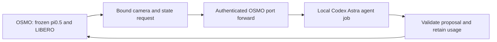
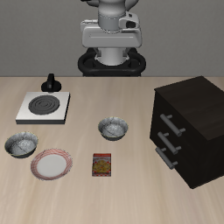

# Codex-backed Astra reasoner

GPT-6 Astra can supply the robot decisions through the user's existing Codex
ChatGPT sign-in. An actual conversation subagent read a recorded LIBERO camera
frame and returned a valid FRS proposal. For unattended OSMO experiments, a local
relay launches a fresh noninteractive Codex agent job for each decision.
Conversation subagents themselves are not a Python API callable from OSMO.

Model: **gpt-6-astra**. Reasoning effort: **medium**. CLI: **0.157.0**.
The configured model is recorded; the tested CLI events do not separately
identify the served model. These results must not be pooled with the earlier
NVIDIA inference endpoint cohort.



The existing method prompts, image ordering, donor catalogs and semantic
validators are retained. FRS receives its current external view and optional
calibrated guide. VEI/VLI receive current raw camera pairs, proprioception,
training-donor previews and the permitted history from their own attempt.
Accepted edits are applied by the existing policy runner. Codex never controls
the simulator through tools.

The Codex wrapper requests no tool use, supplies PNG files as actual image
attachments and requests structured JSON. Jobs run with an isolated working
directory and no prior conversation. Any observed tool use, unavailable service,
CLI timeout, uncertain execution or broken relay stops the study. Completed but
invalid proposals retain the declared rejection behavior. Durable job records
prevent a transport retry from generating a second decision.

The ChatGPT login stays on the local machine. OSMO receives an ephemeral mailbox
token, observations, proposals and receipts. GPU workflows no longer require the
NVIDIA inference credential. The local relay and port-forward must remain alive
while the experiment runs.

## Recorded-observation checks

These checks establish transport and schema compatibility. **They are not new
rollouts and provide no success-rate result.** The initial vision case had a
successful native baseline; both vision agents explicitly chose native
conditioning, a permitted decision.

| Local check | Attached images | Wall time | Input tokens | Output tokens | Result |
|---|---:|---:|---:|---:|---|
| FRS prototype | 1 | 13.36 s | 16,467 | 189 | Valid coarse direction |
| VEI | 12 | 11.07 s | 27,130 | 79 | Valid native deferral |
| VLI | 12 | 9.12 s | 27,807 | 89 | Valid native deferral |

The FRS prototype additionally reported 64 reasoning tokens, already included
in output tokens. A schema setup attempt failed before these successful checks;
its usage is unknown. Per-job token usage for the interactive collaboration
subagent was not exposed. Exact public receipts are in
[smoke_results.json](smoke_results.json); raw CLI event streams stay private.



The subsequent [OSMO relay check](https://us-west-2-aws.osmo.nvidia.com/workflows/astra-pi05-codex-relay-check-20260928-2)
completed with **zero GPUs** and three accepted responses returned to its worker:

| Remote request | Codex job time | Total tokens | Validated proposal |
|---|---:|---:|---|
| FRS, recorded bowl task | 13.47 s | 16,746 | Small coarse motion toward the camera |
| VEI, recorded failed milk task | 10.57 s | 28,187 | Donor `std13-e384-f28`, alpha 0.25 |
| VLI, recorded failed milk task | 10.02 s | 27,526 | Same donor, alpha 0.30 |

For the milk example, Astra's brief rationale identified the prior attempt's
bowl acquisition instead of the requested milk and proposed a packaged-object
acquisition donor. The proposals were returned and validated; their effects
were **not executed or measured** in this transport test. The three jobs used
72,459 reported/derived total tokens, including the Codex harness. Exact worker
receipts and job-versus-relay timing are in
[osmo_relay_results.json](osmo_relay_results.json).

## Benchmark configuration

Separate versioned protocols prepare the requested studies:

- `frs_codex_frozen_evaluation_v1.json`: 20 tasks, ten resets each, native Euler,
  repeated-noise native control and Astra FRS; 600 physical rollouts maximum.
- `vision_codex_representation_screen_v1.json`: all 20 tasks at one reset each,
  shared native baseline and up to two retries for native, random VEI/VLI and
  Astra VEI/VLI; 220 physical rollouts maximum.

Cadence and intervention operators are unchanged. The Codex harness adds its
own context, uses its managed caching and does not expose the former HTTP
completion-token cap. Consequently tokens and latency include Codex overhead.
CLI jobs are counted explicitly; their internal provider request/retry counts
can be unknown. Missing usage is never treated as zero, and no dollar cost is
inferred from a subscription.

The existing HTTP-specific offline audit/report programs do not yet validate
this new cohort. New benchmark success rates must be audited separately before
publication. No Codex benchmark success rate is available in this report.

## Running the bridge

Use the matching `osmo/*codex*_l40s.yaml` template with a committed source payload
and a private `relay_token_file`. Each task has its own mailbox on port 8769.
Forward a different local port for each worker, then run one local relay per
worker using the same token file. For example:

```sh
osmo workflow port-forward WORKFLOW worker0 --port 18769:8769
python -m astra_reversal.codex_relay \
  --url http://127.0.0.1:18769 \
  --token-file /private/path/relay.token \
  --directory /private/path/worker0-jobs
```

Activate the project environment before Python. Stop local relays and tunnels
when their workers finish. Failed Codex GPU workers exit without the older
15-minute debugging hold.

Validation: **1,469 unit tests passed; five optional OpenPI tests skipped** in the
local environment. Ruff checks and formatting passed.

Codex automation can reuse saved CLI authentication and report usage in JSONL.
[Official noninteractive documentation](https://learn.chatgpt.com/docs/non-interactive-mode).
Subagents consume the account's Codex allowance; this test does not establish
unlimited entitlement. [Official usage limits](https://learn.chatgpt.com/docs/pricing).
