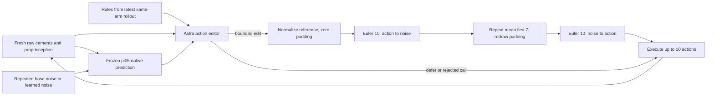

# Astra feedback, flow reversal, and auxiliary-policy learning

This section describes the implementation and its evidence requirements. It contains no FRS success measurements. The reviewed implementation is commit `a50f92dfd18a7fdfe1c6198d34ddb43386d28396`, using prompt template **`astra-frs-http-2`**. Its operators, runner, and noise actor are unchanged from `0ec9fdffa2e5a74657116ab08aaa5ca90c512f8b`; the later commit clarifies critique capabilities and seals completed-task evidence. Exact source and prompt hashes appear below. Execution receipts must identify the source revision and payload actually run.

The experiment uses the frozen pi05 prior to convert suggested behavior into robot actions, then tests whether a small, separate network can learn useful input noises from Astra-approved rollouts. It adapts flow reversal and noise-space supervision from [Flow Reversal Steering, Sections 4.1–4.3](https://arxiv.org/html/2606.13675v2#S4). The critique, conditional-rule, and pairwise-judgment loop is an additional experimental design.

The [protocol](../../configs/frs_policy_improvement_v1.json) covers all [20 released LIBERO-OOD task compositions](COVERAGE.md): ten Goal and ten Spatial tasks. For each task, seed 43 reset index 0 is used for adaptation; indexes 1–10 are separately captured evaluation resets. Both simulator dynamic state and model body poses are restored and checked. These are new resets of known task compositions. Checkpoint training overlap is unknown. Development uses the three previously inspected seed-19 tasks, with only evaluation reset 1; development is reported separately.

The checkpoint is the pinned [LeRobot pi05 export](../../checkpoints/lerobot_pi05_libero_base.json), revision `a217bfd3b14673cf2ce597e69997ab21866438dd`, with the explicit [OpenPI LIBERO input profile](../../openpi_inputs.py): original task text, paired 224-pixel RGB views, quantile normalization, and a ten-action horizon. This profile changes preprocessing and chunk length from the export's saved defaults; published checkpoint performance is not assumed. Original task language remains unchanged, and policy cameras receive fresh, unmodified frames throughout this study.

The six evaluation methods separate online steering from learned-policy execution:

| Method | Noise and online behavior | Learned parameters |
|---|---|---|
| `native_euler10` | Fresh independent Gaussian noise in the full `[1,10,32]` tensor; native generation | None |
| `native_repeated_noise` | One fresh standard-normal seven-vector repeated over ten rows, plus independent padding | None |
| `astra_direction_direct` | Astra direction decoded and executed directly; fine/error calls use the current native prediction | None |
| `astra_frs` | Astra direction becomes a normalized reference, then inverse flow and forward flow | None |
| `critique_frs_no_learning` | Fixed promoted adaptation rules guide fresh online Astra edits of native predictions | None |
| `learned_noise` | A task-specific visual network predicts repeated seven-channel noise; no Astra calls during evaluation | Auxiliary visual noise actor only |

The learned method is evaluated after each of three fixed adaptation rounds. The final comparison uses round 3, including an unchanged checkpoint if no later update was admitted. Evaluation success never selects a checkpoint, rule set, or replay sample. The other five methods are evaluated once on the same ten resets. If the full plan completes, this yields 200 evaluation episodes per method at the final round, another 400 evaluations of learned checkpoints 1 and 2, and 140 adaptation rollouts. These are planned counts, not completed coverage.

Every rollout permits at most 300 environment actions. The runner replans at action counts `0,10,20,...,290`, executes at most ten actions, then obtains a fresh observation. A simulator terminal condition can end a chunk early. Up to ten reset stabilization actions lie outside this control budget and are separately represented in the reset audit. The online Astra budget is therefore at most 30 calls per rollout. There is no wall-clock control frequency claim: synchronous model and provider latency pause simulation between action chunks.

At each replan, the runner first prepares one frozen-policy condition from the current paired raw views, proprioception, and original instruction. It draws that reset/step's deterministic RNG stream and generates the current native prediction with ten Euler velocity evaluations. The decoded prediction is clipped to the verified controller bounds, with clipping recorded. An online edit uses this current prediction; an error never reuses an old action edit. The same prepared condition is used for inversion and subsequent generation at that replan.



The defer/error edge executes the native prediction already produced at that step. After training has begun in the learning arm, that prediction is generated from the current auxiliary actor's noise. It still uses frozen pi05 to decode the noise.

The directional interface has a different reference construction. Astra receives the current external RGB view and a separate copy carrying a calibrated gripper-to-table guide. It receives no wrist view for this role. The policy continues to see both raw cameras. The guide uses robot end-effector position, known table height, and camera calibration; no object pose or goal predicate is used. Its endpoint references the controller's `grip_site`, so it should not be described as a visually tracked object or a guaranteed fingertip-center marker.

The [guide code](../../frs_guide.py) accounts for the actual displayed image orientation. It derives signs for camera-nearer/world-X and image-right/world-Y from projected calibration probes, while world-up is positive Z. This is a sign mapping for the fixed benchmark camera, not a general camera-frame rotation solver. The guide image, projection matrix, probe displacements, signs, and raw/guide pixel hashes are recorded. Visual agreement and source-site semantics require review in addition to arithmetic reproduction.

For a coarse direction, the three values in `{-1,0,1}` are mapped to controller-axis signs, normalized to unit length, and multiplied by 0.5 for `less` or 1 for `more`. That vector fills the **normalized translation** channels in every reference row. The implementation first encodes a raw all-zero controller action to preserve the correct normalized representation of zero rotation and zero gripper input; it then replaces only normalized XYZ and sets the 25 padding channels to zero. A normalized zero translation can decode to a nonzero controller value because the quantile midpoint need not be zero. This distinction is implemented in [directional_reference](../../frs_operators.py), following the interface described in [Appendices D.2–D.3](https://arxiv.org/html/2606.13675v2#A4.SS2).

`fine=true` requires zero coordinates and defers to the current native prediction. The direct method decodes and executes the reference. The FRS method inverts it, redraws only padding noise, and generates actions. It preserves the recovered first seven noise channels separately at each of the ten rows; it does **not** perform the temporal averaging used by the learning loop.

The critique/edit loop begins with one physically recorded repeated-noise baseline, shared by the two adaptation arms. Each arm then completes three revisions even if an earlier rollout meets the simulator success predicate:

1. **Critique the latest rollout.** Astra receives at most four evenly spaced paired-camera snapshots, including the first and final observations, their eight-value robot states, and all executed controller actions. It returns an observational assessment, up to five replacement rules, and one to four references to supplied snapshot steps/cameras. Each rule has a `rule_id`, an observable `trigger`, and an `action` suggestion. Triggers and suggestions each have a 160-character cap.
2. **Restore the same adaptation reset and execute a candidate.** Every ten actions, Astra sees the current paired raw cameras, eight-value state, current decoded `[10,7]` native chunk, this revision's rules, verified controller/camera-axis context, and at most the last two decisions from this attempt. The original task instruction accompanies every request. Rules stay fixed within that rollout, while their triggers are reassessed from current observations.
3. **Apply an available edit.** Astra chooses `defer` or adds one world-XYZ offset, each component bounded by ±0.5 dimensionless controller-input units, to the first 1–10 rows. It may keep the native gripper values or request opening/closing for that prefix. Reference rotations and the suffix are preserved. Controller-bound clipping is explicit and recorded. The edited reference is normalized, reversed, converted to repeated physical-channel noise, and generated through pi05.
4. **Judge recorded behavior.** Astra compares candidate snapshots/actions with the best previously promoted rollout from the same arm. Both use the same adaptation reset. The verdict is `better`, `same`, `worse`, or `uncertain`, supported by bounded visible evidence. A valid critique and a valid `better` judgment are both required for promotion. There is no confidence threshold.
5. **Retain rules or update the actor.** The arm without learning retains the promoted rule set for evaluation. The learning arm adds nonempty executed samples from an admitted candidate to replay and performs its fixed optimizer update. Regardless of promotion, this candidate becomes the next critique's latest rollout; the judge's incumbent changes only on promotion.

The two adaptation arms share only the initial baseline. Their later critiques, candidates, incumbents, and rules are isolated. An unsuccessful critique supplies an empty rule set for that candidate and prevents promotion. A failed or rejected online call executes the fresh current native prediction. A failed judge prevents promotion. There are no hidden retries. The provider ledger distinguishes errors from explicit native deferral even though both lead to `native_defer` generation records.

Critique and judgment requests contain only task text, identifiers, raw snapshots, robot proprioception, and executed actions. They omit simulator success, rewards, termination fields, reset object poses, and dense progress. The separate measured success fields are used for reporting. Because the simulator can stop an episode on success, rollout length and the final view can indirectly reveal termination; the prompts explicitly prohibit treating duration alone as proof. Four snapshots also cannot establish every intermediate contact or grasp event.

The time convention is the checkpoint's convention: **action at `t=0`, noise at `t=1`**. [flow.py](../../flow.py) implements inversion with ten `+0.1` Euler steps and generation with ten `-0.1` Euler steps. If `v` denotes the fixed native velocity field under the current condition `c`, the solves are:

```text
inverse: x[k+1] = x[k] + 0.1 v(x[k], k/10 | c),        k=0,...,9
forward: x[k+1] = x[k] - 0.1 v(x[k], 1-k/10 | c),      k=0,...,9
```

There is no optimization over a hidden action target inside these solves. Finite Euler integration is approximate, and padding replacement intentionally changes the recovered tensor. The learning loop additionally changes the first seven channels by averaging them over the horizon and repeating that mean. The recorded `reconstruction` difference therefore includes these deliberate transformations as well as integration error. It is a diagnostic, with no identity-error acceptance threshold. Good task behavior must be established empirically; an approximate round trip does not guarantee feasibility or improvement.

For a concrete **illustrative example, not a recorded Astra response or result**, suppose a snapshot shows a bowl visibly moving with the closing fingers. A permitted rule is “when the bowl rises with the fingers, lift clear before translating.” Suppose a native reference row is:

```text
[dx, dy, dz, drx, dry, drz, gripper]
[.10, -.08, -.03, .02, -.01, .00, .60]
```

The editor could propose `delta_xyz=[0,0,.20]`, `gripper="keep"`, and `apply_steps=3`. Each of the first three native rows receives this translation offset, so the displayed row's `dz` becomes `.17`. Its rotation and gripper values stay unchanged, as do rows 4–10. The resulting reference is clipped only if it exceeds controller bounds; these values are controller inputs, not meters.

For physical channel `j`, the actual [input profile](../../openpi_inputs.py) uses pinned checkpoint statistics:

```text
N_j(u) = 2 (u - q01_j) / (q99_j - q01_j + 1e-6) - 1
N_j^-1(a) = (a + 1)/2 (q99_j - q01_j + 1e-6) + q01_j
```

It normalizes all seven channels and pads to `[1,10,32]`. Padding is explicitly zero before inversion. There is no assumption that `.20` controller units equals `.20` normalized units, or that a controller-bounded action must lie inside `[-1,1]` after normalization.

The inverse solve yields a computed tensor `z_hat`. In the critique loop, `m = mean(z_hat[0,:,0:7], axis=0)` is accumulated in float64 then cast to float32, repeated across the ten rows, and combined with fresh standard-normal noise in channels 7–31. The forward solve receives this exact transformed tensor under the same raw condition. Its decoded, clipped actions are executed. Final rotations, gripper values, and suffix rows can differ from the edited reference. No claim that the bowl actually lifts follows from the illustrative proposal.

An accepted `mode="edit"` with zero offsets and `gripper="keep"` is still a valid request to run FRS. Consequently, the `interventions` counter counts entries into the FRS/direct-reference path; it is not proof of a nonzero semantic edit. Reference-array differences, transformed noise, executed arrays, and provider decisions must be examined to make that distinction.

The actual policy update is defined in [frs_noise_policy.py](../../frs_noise_policy.py). A separate actor is initialized per task. It resizes the two raw RGB views to 84×84 with Pillow bilinear interpolation, maps pixels to `[-1,1]`, and uses the raw float32 eight-value proprioceptive vector. A shared three-layer CNN has widths 16, 32, 32, kernels 5, 3, 3 and strides 2, 2, 2, followed by fixed average pooling. Its two view features are concatenated with proprioception and passed through three 128-wide layers and a seven-value `5*tanh(...)` output. The actor has **181,255 trainable parameters**. It is task-specific and receives no language input.

Before the first admitted update, actor prediction exactly returns the repeated Gaussian baseline tensor without running the CNN or drawing extra noise. After training, the actor's deterministic seven-value mean is repeated over the ten rows; padding is freshly sampled. That tensor is decoded by the same frozen pi05 policy. Evaluation of `learned_noise` performs neither Astra inference nor flow inversion.

There is one replay sample per executed policy chunk, not one independently observed label for every low-level action. The sample binds current raw-image hashes, resized images, state, the actual tensor used for generation, and its repeated first seven values. It includes FRS edits and native deferrals within an admitted rollout, including deferrals caused by failed calls. A favorable judgment about a rollout therefore does not make every constituent action an accepted Astra edit. Evaluation samples are discarded and never admitted to training.

For each admitted, nonempty learning rollout, replay retains all previously admitted same-task samples and receives exactly 1,000 Adam updates at learning rate `1e-4`, batch size 128 sampled with replacement. The loss is:

```text
mean((actor(observation) - executed_noise_first7)^2)
    + 0.001 * mean(actor(observation)^2)
```

Targets are the raw executed noise labels and are not clipped to the actor's ±5 output range. Out-of-range targets and post-fit residuals are recorded. There is no learned variance, value function, policy-gradient update, or reward target. The three-round cap permits at most 3,000 optimizer steps and 90 chunk-level examples per task. This is a small supervised data regime; repeated minibatch fitting does not establish generalization.

Only the auxiliary CNN/MLP parameters and its Adam state change. pi05 weights, tokenizer, action normalization, language/vision encoder parameters, and native velocity implementation remain frozen. The worker checks `requires_grad`, records full native tensor hashes before and after the run, and rejects changed weights. Each completed task is additionally sealed with its post-task native tensor hashes and file/metadata hashes before archiving, preserving its evidence if a later task is interrupted. The auxiliary checkpoint includes weights, optimizer state, replay, update history, source hashes, and a state identity. Training restores its prior model and optimizer state if an update raises an exception.

The exact four system prompts are exported by `prompt_manifest()` from [frs_agent.py](../../frs_agent.py). Each role's text is the common contract concatenated with its role-specific body. Every worker writes the full strings in `prompts.json`; they are also required in the complete HTML evidence report. The hashes below cover exact UTF-8 system-message bytes, including whitespace, for `astra-frs-http-2`:

| Role and exact source | System-prompt SHA256 |
|---|---|
| [`paper_direction`](../../frs_agent.py#L79) | `2a532271c65e66adfaebf7f50538145df31e8bbb4ceeaad3aad34672663d20cc` |
| [`action_edit`](../../frs_agent.py#L94) | `b6d8a66649445a8e63ca92100194670de179b3d986c523331a925a3e357fde00` |
| [`critique`](../../frs_agent.py#L113) | `4fe0c7ac8be23ce36bbb2dfb8e21935c2cec46f45091cff38d3b83a5fb3c775d` |
| [`judge`](../../frs_agent.py#L134) | `4204ef869649f0118b9faeb80ce19d32fd7d17db9fad6f7247e394fcffaba216` |

These are original experiment prompts. They request compact observable justification/evidence, not a transcript of hidden reasoning. The user message is generated by `build_payload`: schema, exact task/attempt/step identity, controller context where applicable, lossless PNG attachments, and a strict response schema. Critique carries up to eight images; judge carries up to sixteen. All executed actions are supplied, displayed at six decimal places to reduce text volume; full-precision actions remain bound in the request fingerprint and recording. Native predictions and state values are not rounded by this display rule.

The configured provider is `azure/openai/gpt-6-astra`, reasoning effort `medium`, maximum completion budget 8,192 tokens, request timeout 170 seconds, JSON-object response mode, and `cache={"no-cache":true}`. Responses must match the exact configured model and echo the role, episode, attempt, request index, step, and short request ID. The full request fingerprint is attached locally after validation. Prompt and serialized HTTP-body hashes provide separate bindings to template text, settings, and images. A truncated, stale, malformed, refused, or wrong-model response is rejected rather than repaired.

An initial **development-v1 interface mismatch** motivated template v2. On worker 2, Spatial task 8, critique request 1 produced rule `avoid_low_rotation`: “Pause rotation and retract upward; adjust grasp orientation only after clearing the bowl and neighboring plate.” The editor cannot directly pause or alter reference rotation. The v2 critique prompt now states its available translation/gripper/deferral controls and asks it to omit rules requiring unavailable controls, while naming that limitation in its assessment. Operators, allowable edits, and learning logic did not change in this correction. This is evidence of a contract mismatch, not a task-performance result or proof that the revised prompt will always obey the constraint.

That observation comes from a provider-record prefix, not a complete-task audit: request fingerprint `e2762d7f0ca13f2988a91199395563bf74fc5a69d2039d39a79f44a4748866cf`, exact JSONL record-line SHA256 `bf2f376718fc5415031472fac208b34f92696db0cdb2badb6c01e20ac1914a49`. The v1 critique prompt SHA was `119181a4f3ba2c7f9009475680b6d931049f5f82162a5ca6cc88775ccf7b7a15`. Those development records and costs belong to their original version and must remain separately visible when reporting the restart.

The relationship to the paper is deliberately bounded:

| Aspect | This experiment | Paper reference |
|---|---|---|
| Reasoner | Astra; separate raw/guide views; original strict prompts | Gemini-ER-1.6 and an annotated external view in [D.2](https://arxiv.org/html/2606.13675v2#A4.SS2) |
| Training selection | Valid critique plus pairwise `better`; no simulator label | Successful-rollout DSBC in [4.3/E.2](https://arxiv.org/html/2606.13675v2#S4.SS3) |
| Learner | Explicit small shared CNN and deterministic MSE mean; 1,000 steps per admitted round | Main simulation setup uses NLL and 12,500 steps; MSE alternatives are discussed in [E.2](https://arxiv.org/html/2606.13675v2#A5.SS2) |
| Tasks and budget | Known 20 OOD compositions, 300-action cap, ten evaluation resets/task, three adaptation rounds | Different standard LIBERO cohorts and fifty evaluation trials/task in [E](https://arxiv.org/html/2606.13675v2#A5) |
| Optimization scope | Supervised auxiliary-noise updates only | RL with FRS initialization is an additional paper setting in [E.3](https://arxiv.org/html/2606.13675v2#A5.SS3) |

The CNN and MSE implementation is fully specified here; it is not an exact reproduction of the paper's learner or numerical results. A `better` judgment can admit a rollout that fails the released simulator predicate, or reject one that passes it. Judgment agreement and disagreement should be reported independently of update eligibility. The learned actor also cannot exactly represent target means outside ±5. Sparse views, ambiguous contact, incorrect triggers, bounded editing capacity, shared errors between editor and judge, and reuse of a single adaptation reset are material failure modes.

Iteration and cost fields distinguish three quantities. **Adaptation revision 0** is the shared physical baseline; revisions 1–3 are full candidate rollouts after reset. `first_success_round=0` means the baseline passed; a rescue at revision `r` required `r` intervention rollouts and `r+1` baseline-plus-candidate rollouts. Failure through revision 3 is censored and keeps a null first-success value. All three revisions still run after success. **Accepted optimizer-update count** is separate and can remain zero through three revisions. **Checkpoint round** identifies the actor evaluated after that revision; checkpoint success is not a best-of-retries score and can decrease.

Every client invocation has one ledger row. Physical HTTP attempts, accepted responses, rejected responses, and failures before network access remain separate. Available token usage from paid schema/HTTP failures is included; an absent provider usage field stays unknown. Input plus output gives total tokens when all fields are known; reasoning tokens are a subset of output and are never added twice. No dollar rate is assumed. Critique and judge costs sit outside online rollout records, so a study total must include both those records and all rollout calls. The renderer's rescue-cost prefix includes every attributed round cost through the successful round, including its post-rollout judge; it is a completed-round cost, not latency to the first terminal simulator step.

Physical accounting counts the shared baseline once. A native, deferred, or direct-reference chunk currently spends ten pi05 velocity evaluations. An FRS chunk spends thirty: native prediction, inverse solve, and forward solve each use ten. The first chunk of each task also spends ten on an independent native-sampler parity check. Prefix conditioning, auxiliary inference/training, simulation, encoding, and provider latency have their own wall/computation scope and are not extra velocity evaluations. Setup tests and interrupted development runs require separate overhead entries. Summed rollout wall times exclude critique/judge calls outside rollouts, training, and orchestration, and cannot be presented as total parallel job elapsed time.

Final efficacy requires exact planned coverage, recording audits, reset pairing, provider-response binding, operator/label checks, and native-weight verification. The source review here confirms the intended code paths; it does not rerun GPU velocity fields or prove a physical outcome. Without a matched RL comparison this experiment cannot establish greater efficiency than value-based RL. Three revisions, a fixed action cap, and VLM judgments provide no guarantee of 100% success.

The following portable source bindings identify the implementation reviewed for this section:

| Source | SHA256 |
|---|---|
| [Protocol](../../configs/frs_policy_improvement_v1.json) | `56f87290fc78e57f24f27a0c264858d987bdffb577916e33773ad1df56a6b2d5` |
| [Runtime](../../frs_experiment.py) | `b901ce68fa329044052315c87dded4fa144179dce70954d78ee704642c7631b3` |
| [Client, template v2](../../frs_agent.py) | `c81cbe2509cd77334aee054809957d7c76aa0ff8166f804583fe7bf6619eb2b4` |
| [Reference/noise operators](../../frs_operators.py) | `46f0e8a46676d59562235c4e2be1cb8c5626f07e4d532ed6a281f098e8359cee` |
| [Auxiliary actor](../../frs_noise_policy.py) | `560d985387629f07826daa5a3b6b25d8718360ad80c9bd54a6de57cb86445c1e` |
| [Guide](../../frs_guide.py) | `1ae7542368cd9d273dff6622541c6ebc1319f898046fcc0bfdf60fa1274ae1c8` |
| [Flow integrator](../../flow.py) | `98f54818bc99ca10c53d723f27a8763023403a70a5bf839dd038a4a1742f1784` |
| [Input profile](../../openpi_inputs.py) | `6d68cb13b70798b37b61529505cb9e7b6638922fe81781be4670eec44d7a44b2` |
| [Reset/rollout helper](../../intervention_rollout.py) | `be662dc5f4e13b74e14558e6bc663a86d99bc37aff6f30f723b17915c2656040` |
| [OSMO worker](../../osmo/frs_policy_improvement.py) | `87f895e4f3fec6b16cedcf886872188bdc353b6c473535bd0d58e2e2d2b689b4` |
