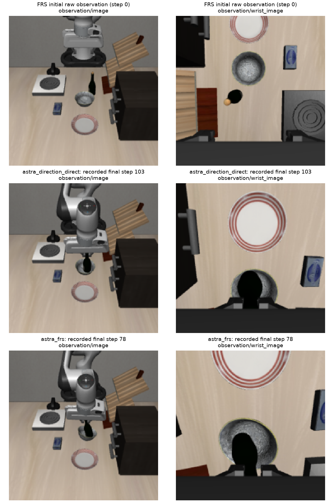
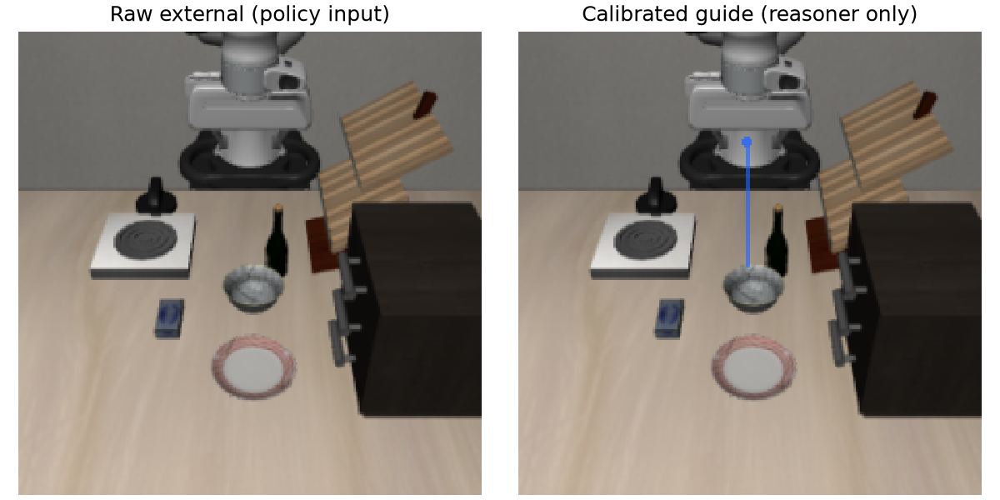

# Completed development behavior review

This review covers three seed-19 development tasks, with adaptation on reset 0
and evaluation on separate reset 1. All three task archives passed the existing
full recording/array audits. The independent reconciliation rehashes the
archives, binds their completion seals and audit receipts, joins all 775 provider
records to decisions, and recomputes token totals from the original HTTP usage.
It does not rerun models or physics. This is not the 20-task evaluation.

| Reset-1 task | Native Euler / repeated | Direction, direct | FRS | Final no-learning rules | Learned actor, rounds 1–3 |
|---|---|---|---|---|---|
| Goal 6: wine bottle → bowl | Fail / fail | Success | Success | Fail | All fail |
| Spatial 2: milk task | Fail / fail | Fail | Success | Fail | All fail |
| Spatial 8: cabinet task | Fail / fail | Success | Fail | Fail | All fail |

These are recorded benchmark outcomes: direct steering and FRS each succeed on
2/3 development resets, with different second successes. They do not establish
generalization or an FRS advantage over direct steering. The experiment records
45 physical rollouts, 12,766 actions, and 14,720 vector-field evaluations.

All 18 adaptation judgments were `same`. No rule set was promoted, no auxiliary
optimizer update occurred, and the actor retained its exact untrained-noise
fallback. The final no-learning evaluation therefore received empty retained
rules and deferred on all 90 calls. That evaluation applied no action edits;
its result cannot be read as an independent test of an actively editing agent.
During adaptation, the editor chose 77 edits, 460 native deferrals, and had
three rejected calls across 540 invocations. Including evaluation, the counts
are 77 edits, 550 deferrals, and three rejections.

| Role | Physical calls | Accepted | Known tokens |
|---|---:|---:|---:|
| Native-action editor | 630 | 627 | 2,247,815 |
| Completed-rollout critique | 18 | 18 | 290,607 |
| Incumbent/candidate judge | 18 | 18 | 536,895 |
| Paper-direction reasoner | 109 | 108 | 154,387 |
| **Total** | **775** | **771** | **≥3,229,704** |

The direction reasoner chose 53 directional interventions and 55 native
deferrals; one call was rejected. Two timeouts and one HTTP 503 have unknown
usage. A rejected request-ID echo consumed 3,599 reported tokens, included above.
The four rejections led to 40 actual native-fallback actions, all in unsuccessful
rollouts. Reasoning tokens (23,128) are already included in output tokens
(169,048). No dollar rate is assumed. Earlier interrupted runs and the separate
transport smoke are excluded from this development-run total.

The wine example below is selected to show both a direct and an FRS predicate
success on the same held-out development reset. The paired images are recorded
raw pixels; labels are outside the images.



Direct execution stops at action 103; FRS stops at action 78. The direct rollout
contains four steered chunks (40 actions) and seven accepted native deferrals
(63 actions). FRS contains two steered chunks (20 actions) and six accepted native
deferrals (58 actions). Neither whole trajectory is exclusively Astra-steered.

Both final views show the bottle positioned in/over the bowl while the gripper
remains very close around it. They do not demonstrate release or stable
unsupported placement. The exact hash-bound BDDL goal is
`(On wine_bottle_1 akita_black_bowl_1)`: its implementation checks vertical center
ordering, contact, and XY center separation below 0.1. It requires neither
gripper release nor a stability/dwell interval. The recorded task instruction
says “put the wine bottle in the bowl”; the released BDDL language says
“Put the wine bottle on the bowl.” This review preserves that distinction rather
than silently strengthening the success criterion.



Selected FRS request 204 at step 0 passes exact request/HTTP/response binding under
the matched codec, calibrated guide reconstruction, and the recorded action/noise
boundary replay. The camera signs are `[1,-1,1]`: the proposed direction
`[0,1,0]` with `less` becomes world direction `[0,-1,0]`, then normalized
translation `[0,-0.5,0]`. The reference preserves encoded zero rotations/gripper,
zeros inverse padding, and preserves recovered physical-channel noise while
refreshing padding. This check does not rerun either Euler solve. The guide marker
denotes the recorded end-effector/palm reference, not an estimated fingertip or
object contact point. It is supplied to the reasoner separately from raw policy
pixels.

An earlier adaptation edit illustrates a separate execution limitation:
[request 11 at step 90](first_action_edit_review.json) changes all ten reference
gripper commands from open to close, but the post-FRS chunk closes for six rows
and reopens for four. The reference application is correct; finite reversal and
the declared noise transform do not enforce a hard reference-following constraint.
The selected recorded arrays and prefix joins are bound to the completed archive.

Evidence: [independent reconciliation](independent_reconciliation.json),
[selected direction replay](selected_direction_verification.json), and
[visual/predicate source binding](visual_review.json). Exact source, file and
archive hashes are retained in those receipts and [manifest.json](manifest.json).
Only safe numerical receipts, raw example figures and checker source are
published; provider bodies remain in the retained private archives.

To reproduce the reconciliation, activate the project environment, prepend the
matched audit-codec directory and repository root to `PYTHONPATH`, and run:

```sh
python astra_reversal/reports/frs_policy_improvement/development/behavior/build_review.py \
  --run-root astra_reversal/.deps/frs-development-v7 \
  --ood-source /path/to/pinned/pi0-text-latent-checkout
```

The checker expects the preserved selected-array review under the run root's
`visual-review/worker_0_direction` directory and binds it to the complete worker
archive. Its exact selected-array checker is preserved in
[source/verify_direction_sample.py](source/verify_direction_sample.py); run it in
the original `visual-review` layout with the selected NPYs and normalization file
to repeat the guide/action/request replay. The pinned dependency revision is
`587a6cbf64f16c7b87fa5805dc0ed934192239a4`; the codec is NumPy 1.26.4,
Pillow 12.3.0, and classic zlib 1.3.
