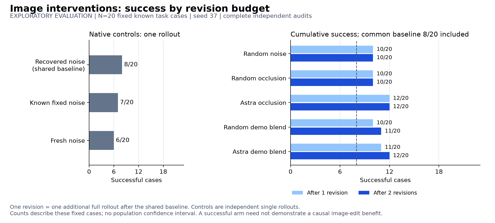
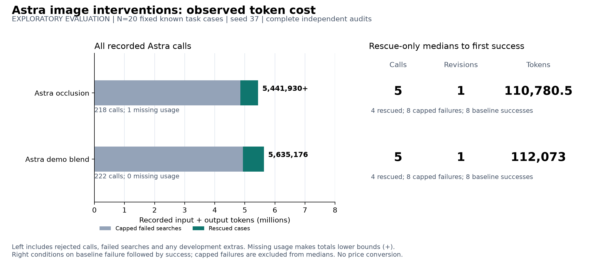
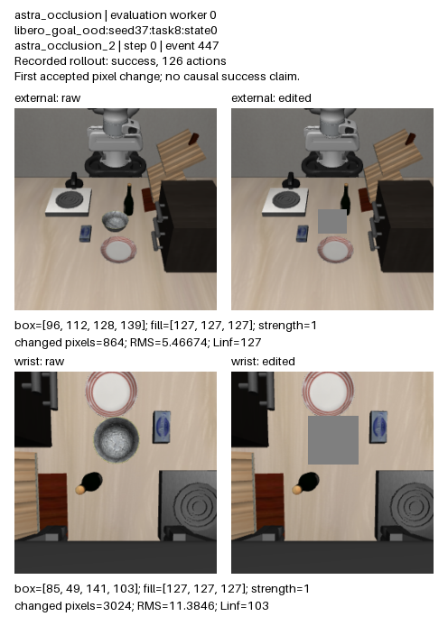
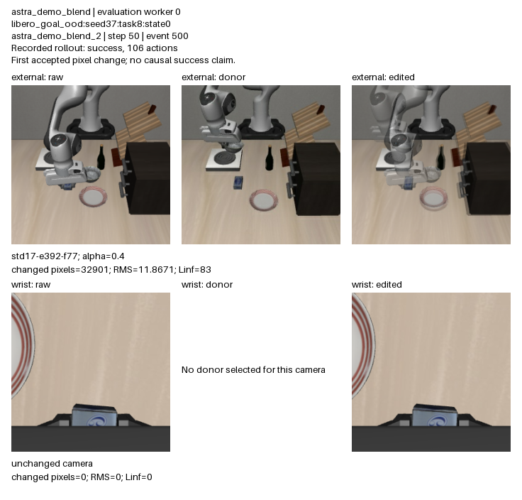

# Actual image perturbations: complete 20-task evaluation

All 20 released LIBERO-OOD tasks were tested at seed 37, reset index 0. Astra-guided occlusion and demonstration blending each reached 12/20 cumulative successes within two revisions after the shared 8/20 baseline. Matched random occlusion reached 10/20 and random blending 11/20. These modest differences describe these fixed task/reset cases; this study does not establish generalization to unseen tasks or a population-level advantage.

[Open the standalone HTML report](index.html). Exact numerical data: [report.json](results/report.json), [all case/arm rows](results/case_arms.csv), [physical attempts](results/physical_attempts.csv).

The policy is the frozen real lerobot/pi05_libero_base checkpoint. Every arm uses the original task language. The image arms reuse the same recovered noise throughout a rollout. Astra receives current raw external/wrist observations, the preceding rollout's raw snapshots, earlier decisions and its outcome, plus a fixed catalog of 45 paired training-demonstration frames. It chooses neutral occlusion boxes or a same-camera donor and blend coefficient. There is no OOD demonstration in that catalog. The catalog contains standard training demonstrations; overlap with checkpoint training is not known to be absent.

Astra is queried at actions 0,25,50,…,275: at most 12 calls per rollout. Its selected operation is applied independently to every fresh policy observation at five-action replans until the next query. Boxes are fixed image coordinates, without object tracking. At a rejected query the previous operation is cleared and raw camera inputs are used until the next scheduled query. Each arm stops at first simulator success or after two full-rollout revisions. A revision is a new rollout from the same recorded reset; it is not one Astra call. The common baseline is counted once physically.

Occlusion replaces a half-open integer rectangle with RGB(127,127,127), optionally mixed by strength. Each box covers at most half of its camera. Demo blending forms (1−alpha)×live + alpha×donor, rounds to uint8, and leaves the other camera unchanged unless separately selected. Alpha 1 would fully replace that camera. These are actual policy-input pixel changes. Same-condition RK4-100 inversion establishes the reusable baseline noise; Euler-10 then generates actions. This image experiment does not edit actions or learn weights. It differs from the newer Euler-10 reverse/forward FRS and learned-noise experiment.

The canonical evaluation executed 167 physical rollouts, 43,594 actions and 113,140 velocity evaluations. Its 440 provider calls include 439 accepted responses and one HTTP 503 rejection. Known usage is 11,077,106 tokens (10,939,148 input + 137,958 output); that rejected call has unknown usage. Reasoning tokens are already included in output. No dollar price is assumed.

The original evaluation was preempted by shared-GPU quota enforcement. Its fully archived worker0 was retained; workers1–7 were restarted with byte-identical payload and protocol, independent of outcomes. Their interrupted original work adds at least 58 known provider calls and 1,388,628 tokens. Unsynced in-flight usage may be missing. The separate three-case development study used 105 calls and 2,647,564 tokens. Combined known image-study usage is therefore at least 15,113,298 tokens; development, interruption costs and canonical evaluation remain separately attributable.

The exported example is the first worker's first pixel-changing decision in each Astra arm, selected by worker/task/event order without using outcomes. On “put the cream cheese on the stove”, Astra observed that the preceding attempt appeared to put the cheese into the bowl before moving the bowl. At action 0, its occlusion masks the competing bowl in both cameras: external [96,112,128,139], wrist [85,49,141,103], strength 1. In the separate blend arm, at action 50 it chooses donor std17-e392-f77 with alpha 0.4 for the external image while keeping the wrist raw. That donor depicts a different object near the stove. The recorded rollouts succeeded after 126 and 106 actions respectively. These images document executed input changes; they do not prove that a particular edit caused success.

Cells below show full-rollout revisions to first success: 0 means the shared baseline already succeeded, 1/2 means a rescue, and — means failure at the cap. IDs are zero-based release order.

| Task | Released instruction | Baseline | Random noise | Random occlusion | Astra occlusion | Random blend | Astra blend |
| --- | --- | --- | --- | --- | --- | --- | --- |
| Goal 0 | put the cream cheese in the basket | yes | 0 | 0 | 0 | 0 | 0 |
| Goal 1 | put the orange juice on the stove | no | 1 | 1 | 1 | 2 | 1 |
| Goal 2 | put the bbq source on the plate | no | — | 1 | 1 | — | — |
| Goal 3 | put the tomato sauce on top of the cabinet | no | — | — | — | — | — |
| Goal 4 | put the wine bottle on the stove | yes | 0 | 0 | 0 | 0 | 0 |
| Goal 5 | put the wine bottle on the plate | no | — | — | — | — | — |
| Goal 6 | put the wine bottle in the bowl | no | — | — | — | — | — |
| Goal 7 | put the cream cheese on the plate | yes | 0 | 0 | 0 | 0 | 0 |
| Goal 8 | put the cream cheese on the stove | no | 1 | — | 1 | 1 | 1 |
| Goal 9 | put the cream cheese on top of the cabinet | yes | 0 | 0 | 0 | 0 | 0 |
| Spatial 0 | put the butter on the plate | yes | 0 | 0 | 0 | 0 | 0 |
| Spatial 1 | put the chocolate pudding on the plate | yes | 0 | 0 | 0 | 0 | 0 |
| Spatial 2 | put the milk on the plate | no | — | — | 1 | 1 | 2 |
| Spatial 3 | put the orange juice on the plate | yes | 0 | 0 | 0 | 0 | 0 |
| Spatial 4 | put the bowl on cookie box on the stove | no | — | — | — | — | — |
| Spatial 5 | put the bowl on cookie box on the cabinet | no | — | — | — | — | — |
| Spatial 6 | put the bowl next to the plate on the cabinet | no | — | — | — | — | — |
| Spatial 7 | put the bowl next to the plate on the stove | no | — | — | — | — | — |
| Spatial 8 | put the bowl at table center on the cabinet | yes | 0 | 0 | 0 | 0 | 0 |
| Spatial 9 | put the bowl at table center on the stove | no | — | — | — | — | 1 |

The 20 compositions are known published OOD tasks, with one reset each in this experiment. Retry success includes reset access and simulator stopping; eight initial baseline successes require no intervention. The eight capped failures in each Astra arm remain in the denominator and have no invented success iteration. The image agent receives the preceding outcome; the new FRS preference judge intentionally receives no simulator success flag. Released BDDL predicates determine measured success, which is not equivalent to a human stability assessment. Randomized operators are matched by intervention family and budget, not by distributions of Astra-selected semantics. The small fixed comparison supports further testing, not a claim of 100% success, unseen-task generalization or superiority over value-based RL.

The eight [worker audit receipts](audits/) bind complete recorded arrays, reset pairing, numerical/image gates, modified camera pixels, provider requests/responses and executed action prefixes. Audits replay recorded arithmetic and provenance; they do not rerun simulator physics. [Canonical archive mapping](results/canonical_sources.json), [interruption cost](interruption_cost.json), [exact selected decisions](examples/selected_decisions.json), and [pixel provenance](examples/examples.json) preserve the underlying evidence.

Source report SHA256: `bd2ae73794dcdf9c73f9033c8934ab23ce8ea2ab0b878b239d2af8c963adff87`.
