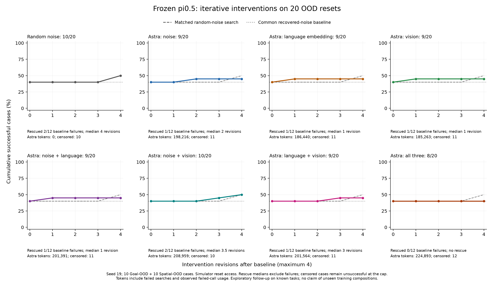

# Iterative intervention measurements

These reports measure the new propose–rollout–feedback–revise experiment. They
are separate from the earlier Stage 1 numeric-action reversal results. The
[frozen protocol](../../INTERVENTIONS.md) defines the operators, paired resets,
five-attempt limit, and cost accounting.

All runs are complete on OSMO L40S. The best Astra arm, noise + vision, reached
**10/20 successes, tied with random-noise search**, versus 8/20 for the common
recovered-noise baseline. No Astra arm exceeded random search at the full budget.
Some semantic edits rescued a case in fewer attempts, but this experiment does
not establish a recipe that improves aggregate success over matched search or
approaches 100% success.

## Completed 20-case OOD comparison

Every arm uses the same ten Goal-OOD and ten Spatial-OOD captured resets, seed 19.
The baseline is attempt 1, followed by up to four revisions. An arm stops on
success. Each revision resets the simulator to the same initial scene; this is
adaptation with reset access. It is an exploratory follow-up on previously known
tasks, with one reset per task and unknown checkpoint training overlap.

| Allowed interventions | Goal /10 | Spatial /10 | Total /20 | Rescued baseline failures /12 | Median rescue revisions | Median rescue tokens | All search tokens |
| --- | ---: | ---: | ---: | ---: | ---: | ---: | ---: |
| Random noise | 6 | 4 | 10 | 2 | 4 | 0 | 0 |
| Astra noise | 5 | 4 | 9 | 1 | 2 | 7,904 | 198,216 |
| Astra language embedding | 6 | 3 | 9 | 1 | 1 | 3,657 | 186,440 |
| Astra vision | 5 | 4 | 9 | 1 | 1 | 3,587 | 185,263 |
| Astra noise + language | 6 | 3 | 9 | 1 | 1 | 3,841 | 201,391 |
| Astra noise + vision | 5 | 5 | 10 | 2 | 3.5 | 15,395.5 | 208,959 |
| Astra language + vision | 6 | 3 | 9 | 1 | 3 | 12,313 | 201,564 |
| Astra all three | 5 | 3 | 8 | 0 | — | — | 224,893 |

Rescue medians exclude the eight cases that already succeeded at baseline and
exclude failures. Unsuccessful cases remain censored after four revisions; they
are not assigned a successful iteration count. All-search tokens include those
failed searches and rejected calls. Zero Astra tokens for random search does not
mean zero simulator or policy computation.

| Single-attempt control | Goal /10 | Spatial /10 | Total /20 |
| --- | ---: | ---: | ---: |
| Recovered noise reused: common baseline | 5 | 3 | 8 |
| Original known noise reused | 5 | 3 | 8 |
| Native fresh noise after the shared initial latent | 3 | 3 | 6 |

The 6/20 fresh-noise score belongs to these 20 new resets and settings. The earlier
200-episode seed-7 native baseline remains 86/200 and is reported separately in
[RESULTS.md](../../RESULTS.md); neither denominator replaces the other.

The [full report](evaluation/report.md), [per-suite tables](evaluation/suite_tables.md),
[attempt ledger](evaluation/attempts.csv), and [budget curves](evaluation/budgets.csv)
retain every outcome. JSON and CSV include standalone arm computation as well as
unique physical totals; shared baseline and initialization costs must not be
summed across arms to estimate actual experiment cost. A
[PDF figure](evaluation/figure/success_and_tokens.pdf) and its
[source/hash manifest](evaluation/figure/plot_manifest.json) are available.

## What Astra's prior achieved here

Language-only rescued Goal task 6 in one revision for 3,657 tokens; random search
needed four revisions on that reset. Vision-only rescued Spatial task 8 in one
revision for 3,587 tokens; noise-only took two revisions and 7,904 tokens, while
random needed four revisions. These are case-specific reductions in attempts,
with additional API cost.

The [milk-to-plate example](first_rescue/README.md) is the one case rescued by an
Astra arm that random search did not rescue: noise + vision succeeded after
three revisions and 13,018 tokens. It retained the visual marks and reversed a
previously tested noise direction. That arm missed Goal task 6, which random
search rescued, so their aggregate scores tie. The
[paired comparison](evaluation/paired_vs_random.md) preserves these discordant
cases instead of treating equal rates as equal behavior.

Combined-arm names denote allowed channels. The winning noise + language and
language + vision candidates on Goal task 6 actually selected language alone.
The winning noise + vision candidate on Spatial task 8 selected vision alone.
Only the milk-to-plate winner selected both noise and vision. See all
[winning channel selections](evaluation/winning_channels.md). These selections
do not by themselves prove causal contributions from each channel.

Only noise-only versus random noise holds the intervention operator and bounds
fixed. Astra noise-only had 9/20 successes versus random's 10/20, with no unique
rescue over random. The vision/language comparisons also change the available
operator. Giving Astra every channel added no rescues within this budget.

The evidence supports testing a more selective recipe: diagnose the failure,
try one semantic edit, then use controlled noise probes while holding successful
grounding choices fixed. This is a hypothesis for a new, independently evaluated
recipe, not the result of a tested cross-arm selector. The current results do not
justify silently combining each arm's successful cases into a deployable score.
Larger budgets, moving visual annotations, other embedding operators, and
reinversion under augmented conditioning were not evaluated. This input-embedding
operator also differs from the paper's TEI/TLI procedure; the
[scope note](evaluation/protocol_scope.md) identifies that distinction.

## Measured cost and verification

Evaluation used **323 Astra calls: 1,290,573 input + 116,153 output = 1,406,726
tokens**. The 19,177 reasoning tokens are already included in output. All calls
have provider-reported usage and returned the configured model. Seven HTTP-200
responses were rejected: four wrong request fingerprints, one wrong episode ID,
and two wrong noise-basis IDs. Their 29,632 tokens are included, their attempts
were consumed, and no candidate rollout executed for those rejections. The
[independent provider review](evaluation/provider_review/final-provider-review.json)
reconciles the call, proposal, execution, and token records.

The experiment physically executed **424 rollouts, 121,433 actions, and 267,580
velocity evaluations**, including 24,600 initialization evaluations. It finished
in 57.94 minutes across eight one-GPU L40S workers. The sum of OSMO task start-to-end
windows was 5.1443 GPU-hours; this includes waiting, API calls, recording, and
uploads, and is not active-kernel time or an invoice. The
[resource-window receipt](osmo_resource_windows.json) also includes both development
runs. No verified dollar price was supplied for the endpoint or compute.

All eight archives and 151,076 saved arrays passed the independent read-only
audit, covering all 24,298 generations and 424 rollout resets. The
[numerical summary](evaluation/array_audit/safe_summary.json) retains every case
and archive receipt; the [final reset check](evaluation/array_audit/final_validation.json)
binds all resets to their manifest and initial observations. The
[audit source](audit_source/README.md) explains the exact checks and their limits:
saved endpoints and controller decoding can be recomputed, whereas the text
embedding tensors and simulator success outcomes were not independently rerun.
The report and array audits are separate. The CPU postprocessor records bounded
float64 random-coefficient roundoff and reproduces the verified Linux image-blend
arithmetic without a pixel tolerance. Neither correction changed the frozen
experiment, proposals, images, or success scores.
The largest regenerated candidate-latent difference was 5.96e-8, within the
original 1e-7 CPU-expression check; raw array and image hashes remain exact.
Local repository validation passed 608 unit tests, with five existing optional
OpenPI skips. The frozen payload also passed all 11 native LeRobot integration
tests; every allocated GPU performed the native parity and inversion gates.

The evaluation workflow was `astra-pi05-interventions-eval-20260924-1`, using the
unchanged development-v2 payload from commit `e0283747`, SHA-256
`fde89be9786f85f6ed5e889d7f736784a500dd6fc2f81e9db65480cadb606fb4`.
The canonical report's file SHA-256 is
`81bd679d49d23130c2c63547043d42cd68c603fa78d676c2c433cfe26129d1bb`.
All reports are unchanged copies with [snapshot provenance](snapshot_sources.json).
Frozen operational Python scripts in `evaluation/**/source/` have `.txt` appended
to their original `.py` filenames; their bytes and original names remain bound
by the receipts. Restore the recorded source layout when reproducing those
workflow-scoped scripts. The reusable report and plot CLIs remain in the package.

## Development and additional diagnostic cost

Development verifies integration; both development baselines already succeeded,
so it does not measure rescuing a failed policy. The 20-case follow-up used the
exact development-v2 payload.

| Development run | Actual Astra calls | Accepted / executed Astra candidates | Recorded Astra tokens | Physical rollouts | Actions | Velocity evaluations |
| --- | ---: | ---: | --- | ---: | ---: | ---: |
| [v1: failed transport](development_v1/report.md) | 14 | 0 / 0 | Unknown for all 14 calls | 8 | 2,454 | 7,410 |
| [v2: integration passed](development_v2/report.md) | 14 | 14 / 14 | 48,463 input + 3,139 output = **51,602** total | 22 | 7,851 | 18,280 |

The first run received HTTP 400 for every Astra request. The gateway required
the JSON output instruction in the user content as well as the system prompt.
That transport fix and stronger development validation were committed before
the second payload was built. Neither run is omitted from cost accounting.

All 14 accepted development-v2 Astra proposals chose zero edits and reproduced
their successful baselines. They exercised the actual request/execution path,
but demonstrate no nonzero Astra benefit. The separate fixed embedding probes
changed the weighted model's full output by maximum absolute values 0.00449219
and 0.00427425. They performed no simulator actions and are not Astra proposals.
Native Euler and zero-edit parity were exact on both allocated L40S GPUs.

The generated development tables report zero search tokens to first success
because their common baselines succeeded at attempt 1. **The forced integration
trials still cost 51,602 tokens**, included in the physical totals and
`budgets.csv`'s actual-cost columns. Reasoning tokens were reported as zero and
are a subset of output tokens. No endpoint dollar price is assumed.

Two local [transport diagnostics](transport_diagnostics.json) were outside the
rollout experiments: one HTTP 400 call with unavailable usage, and one successful
post-fix call costing 3,487 input + 227 output = 3,714 tokens. Neither executed a
rollout or supplied an experimental candidate. A preceding remote diagnostic
terminated without an observed result, so whether its API call executed remains
unknown. Observed development-plus-diagnostic usage is therefore at least
55,316 tokens, with 15 observed calls missing usage and that remote attempt
unresolved; it is not an invoice total.

Adding the completed evaluation yields **at least 1,462,042 observed tokens**
for these development, diagnostic, and iterative-evaluation runs. The missing
development/diagnostic usage remains unknown; earlier Stage 1 experiments are
outside this subtotal.

Each run includes JSON and CSV records for arms, cases, attempts, and cumulative
budgets. They distinguish first successful attempt, intervention revisions,
censored failures, rescue-only statistics, shared-baseline standalone cost,
and unique physical cost. [Snapshot provenance](snapshot_sources.json) binds
the unchanged report copies to their source bytes and immutable payloads.
The report audit checks events, provider records, resets, and recorded numerical
gates; independent tensor reconstruction is a separate audit.

The [worker-1 independent review](development_v2/worker1_final_read_only_review.json)
verified all 5,627 referenced arrays and 914 recorded generations. Its
[initialization audit](development_v2/worker1_initialization_read_only_audit.json)
recomputed the nonzero fixed embedding probe's effect, including a maximum
0.00369541 change in the seven decoded controller channels. These read-only
checks used saved arrays and made no additional model or simulator calls.
The [worker-0 independent review](development_v2/worker0_final_read_only_review.json)
also verified all 4,139 arrays and 666 recorded generations from its development
case.
