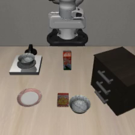
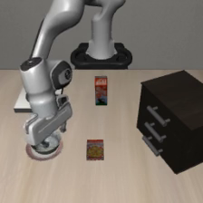
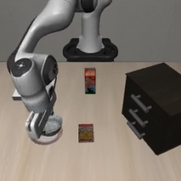
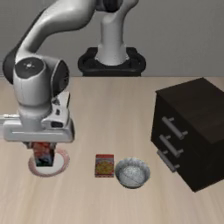

# A noise-and-vision rescue: put the milk on the plate

This is the first rescue observed during the frozen evaluation, selected for
inspection rather than as a representative sample. It is Spatial-OOD task 2,
seed 19, captured reset 0. All candidate episodes start from the same saved state.

| Initial observation | Baseline final frame | Language-only final frame | Noise + vision successful final frame |
| --- | --- | --- | --- |
|  |  |  |  |

The baseline failed after 300 actions. The final frames show the bowl on the
plate while the milk remains at its initial location. Language-only search
diagnosed the wrong object but failed after all four revisions, costing
**16,598 Astra tokens**. Random search and the other six Astra arms also failed
within their budgets on this case; only the noise + vision arm succeeded.

In that arm Astra first marked the milk's initial region and the plate, leaving
noise unchanged. After that failed, it kept the boxes fixed and tested a noise
direction at scale 0.3. It failed again, so Astra reversed the coefficients at
the same scale. This third revision succeeded after 93 actions. The search cost
was **13,018 tokens: 11,733 input + 1,285 output**, across three accepted calls.
The reported 175 reasoning tokens are already included in output tokens.

| Revision after baseline | Noise coefficients (fixed case-specific basis) | Scale | Vision | Outcome |
| ---: | --- | ---: | --- | --- |
| 1 | all zero | 0 | milk and plate boxes | Failed, 300 actions |
| 2 | `[0.5, -0.5, 0.5, -0.5, 0, 0, 0, 0]` | 0.3 | same boxes | Failed, 300 actions |
| 3 | `[-0.5, 0.5, -0.5, 0.5, 0, 0, 0, 0]` | 0.3 | same boxes | Succeeded, 93 actions |

Both boxes are in the 224×224 agent-view image: milk `[103,82,120,119]` at gain
0.65, plate `[28,146,70,179]` at gain 0.35. They stay at fixed pixels during each
rollout; the wrist image is unchanged. The basis has no assigned physical XYZ
meaning, and its winning coefficient vector is specific to this case.

The search executed 993 actions including its failed baseline and candidates,
with 3,220 velocity evaluations including initialization. This is a concrete
example of feedback-driven revision reaching success. It does not isolate a
noise–vision interaction: the winning coefficient vector was not also tested
without these boxes. It does not establish a transferable recipe or guarantee
success from another reset.

[Provenance and exact proposals](provenance.json) bind these unmodified extracted
frames to the original videos and complete case summary. The
[read-only winning-candidate audit](winning_candidate_array_review.json) checked
124 saved arrays, all 19 generations, the exact perturbed latent, and rendered
camera hashes. Success remains the recorded simulator outcome; no extra rollout
was performed for this example.
