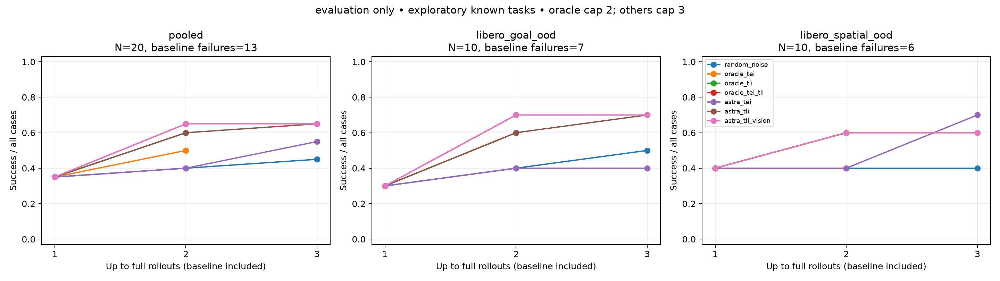

# Observed phase interpolation: completed experiment

The frozen π0.5 policy completed all **20 LIBERO-OOD compositions at seed 29**
on eight OSMO L40S workers. Astra received fresh paired camera observations and
could revise its conditioning every 25 actions. **Astra TLI and TLI plus vision
each reached 13/20 successes (65%)**, compared with the shared recovered-noise
baseline's **7/20 (35%)** and random-noise retries' **9/20 (45%)**. All eight
archives passed the numerical, full-array and feedback checks.

These are baseline-plus-rescue results with simulator reset access, one reset
per known composition, and capped retries. They are an exploratory π0.5 port of
the paper's operators, not a held-out-task result or reproduction of its π0 rate.
Seven cases still failed under each Astra TLI arm; this experiment did not reach
100% success.

## Complete evaluation comparison

Every arm retains the same seven successful baselines and intervenes only on
the 13 failures. A revision is a new full rollout from the same reset, capped
at 300 actions. Oracle methods get one revision; random noise and Astra get up
to two, stopping at success. Baseline successes use zero intervention calls.

| Intervention | Success within 1 revision | Success within 2 revisions | Provider tokens, all attempts |
| --- | ---: | ---: | ---: |
| Random noise | 8/20 | 9/20 | 0 |
| Oracle TEI | 10/20 | Capped at 1 | 0 |
| Oracle TLI | 12/20 | Capped at 1 | 0 |
| Oracle TEI+TLI | 13/20 | Capped at 1 | 0 |
| Astra TEI | 8/20 | 11/20 | 2,250,708 |
| Astra TLI | 12/20 | 13/20 | 1,757,115 |
| Astra TLI+vision | 13/20 | 13/20 | 1,750,151 |

The separate native controls scored **7/20 with known noise** and **8/20 with
fresh policy noise**. Zero provider tokens for a control does not mean zero GPU
compute. At the same two-revision cap, each Astra TLI arm succeeded on all nine
random-success cases plus four additional cases. At one revision, oracle TLI
and Astra TLI each scored 12/20; oracle TEI+TLI and Astra TLI+vision each scored
13/20. Oracle TEI+TLI and Astra TLI+vision reach that score on different task sets.

| Astra arm | Rescues / 13 baseline failures | Median revisions to rescue | Median decisions through rescue | Median tokens through rescue |
| --- | ---: | ---: | ---: | ---: |
| TEI | 4/13 | 2 | 16.5 | 121,924 |
| TLI | 6/13 | 1 | 5 | 28,529.5 |
| TLI+vision | 6/13 | 1 | 5 | 28,777.5 |

These medians condition on successful rescues and include earlier failed
revisions and rejected calls. Censored failures remain in the success
denominators and the all-attempt token totals above. Each unsuccessful Astra arm
used two revisions and 24 calls. The full evaluation used **190 physical
rollouts, 46,653 actions, 119,140 velocity evaluations and 679 provider calls**.
All **58,884 arrays** and every provider/observation binding passed their audits.
The common baseline is counted once in physical totals.

All 679 calls reported usage: **5,757,974 tokens**, comprising 5,543,789 input
and 214,185 output tokens. The 24,960 reasoning tokens are included in output.
There were **26 rejected proposals**, 600 actions retaining previously valid
text after rejection, and 50 actions falling back to native conditioning.
The rejected calls' 227,306 tokens are included in the total. Those intervals
remain in the measured controller's outcomes and cost.

The [complete report](evaluation/results/report.md) contains suite breakdowns;
the [case table](evaluation/results/cases.csv),
[decision table](evaluation/results/decisions.csv) and
[cost/success curves](evaluation/results/curves.csv) retain individual outcomes.

## What the observed behavior supports

A useful candidate recipe is to **retain the target instruction and add a
phase-dependent text-latent residual**, using recent camera observations to
choose the donor pair and strength. TEI replaces eligible input embeddings with
`(1−α)E_A + αE_B`; TLI adds `(1−2α)(T_A−T_B)` at effective text-layer boundaries.
Astra can switch donor pairs, reverse α, and use the previous failed rollout's
images, decisions and outcome on its next revision. No weights are updated.

For **orange juice → stove**, TLI's second revision used a weaker wine-versus-bowl
acquisition contrast, then switched after lift to
`0.6(T_bowl-on-stove − T_bowl-on-cabinet)`. It succeeded at action 96, after
**two revisions, 16 decisions and 116,604 tokens** including the failed first
revision. TLI+vision succeeded in one revision with six calls and 34,897 tokens.
Both random-noise retries failed; oracle TEI also rescued the task.

For the exact instruction **“put the bbq source on the plate”**, Astra recognized
distractor manipulation and revised both text donors and a box around the
apparent sauce bottle. All arms still failed within their caps. Its three Astra
arms consumed 72 calls and 655,371 tokens. Recognizing failure did not ensure
that the available conditioning edits could fix object acquisition.

The [verified evaluation examples](evaluation/behavior/README.md) show the actual
external/wrist feedback, temporary policy-side marks, decisions and costs.
The wine vision rescue includes 25 initial native-condition actions after a
rejected call, followed by two accepted decisions; fresh native sampling and
random noise also rescued that case. Its whole trajectory cannot be attributed
to accepted Astra edits.

Vision here means translucent points/boxes blended into current RGB images.
Each mark lasts at most five actions, with fresh Astra decisions 25 actions
apart; Astra always sees raw observations. TLI and TLI+vision used different
language decisions. Their equal final success rate and different retry costs
therefore do not isolate a vision effect. TLI's pooled advantage over TEI is
also task-dependent: TEI scored 7/10 on Spatial-OOD versus TLI's 6/10, while TLI
scored 7/10 on Goal-OOD versus TEI's 4/10.

All conditioning arms reuse the same recovered baseline noise. This comparison
tests conditioning changes; it supplies no causal evidence that reversing a
policy-generated reference adds information or improves success. The restricted
nine-donor library is informed by the benchmark, and the semantic interpretation
of donor contrasts remains a hypothesis. Broader generalization needs additional
tasks, reset seeds and controlled ablations.

## Development and total follow-up cost

All three previously inspected seed-19 development cases completed before the
evaluation was submitted. Native controls and random noise scored 0/3; oracle
TEI scored 1/3, oracle TLI and combined scored 2/3. Astra TEI scored 1/3, TLI and
TLI+vision 3/3 within two revisions. At one revision, Astra TLI and oracle TLI
each scored 2/3. Development success is not an evaluation success-rate estimate.

The [development tables](development/results/report.md),
[milk/wine feedback](development/behavior/README.md), and
[cabinet example](development/examples/README.md) retain the complete evidence.
Development used 37 physical rollouts, 105 calls and 799,093 tokens; all 10,986
arrays passed. Milk TLI needed one revision, four decisions and 21,929 tokens;
wine TLI needed two revisions, 17 decisions and 132,062 tokens.

| Follow-up cost category | Recorded provider tokens |
| --- | ---: |
| Complete three-case development | 799,093 |
| Complete 20-case evaluation | 5,757,974 |
| Interrupted development overhead, preserved usage only | 519,361 |
| Separate transport-only smoke | 2,550 |
| **Known total for this follow-up** | **7,078,978** |

The completed case studies total 6,557,067 tokens. The interrupted overhead is
additional: 63 preserved usage records plus one further accepted decision proved
by events whose usage was not preserved. Its tokens, other unuploaded work and
in-flight calls remain unknown, so the known total is a lower bound. No verified
monetary provider rate is available. Earlier static-intervention and Stage 1
studies, donor extraction GPU work and infrastructure time are separate.

The [interruption record](development/interruption/README.md) preserves the
original OSMO control failure and the unchanged recovery inputs. The completed
cabinet worker was retained once; only the interrupted wine/milk workers were
rerun. An earlier recovery deployment failed before either worker ran the study
and contributed no study API calls.

## Frozen execution and evidence

The [implementation](../../PHASE_INTERPOLATION.md) pins the checkpoint and all
intervention rules. The [bank record](banks/README.md) verifies nine standard
training donors, 180 demonstrations and 18,947 frames. The identical rollout
payload was used for development, recovery and evaluation: source commit
`4e54e9ae8f55cc4e663e599e4bd19bb94add2baa`, SHA256
`5b51adf8a604ec68461a8b8933d11f9b9f2b7cd9295eb463b715272f3cc7c842`.

The [evaluation workflow](https://us-west-2-aws.osmo.nvidia.com/workflows/astra-pi05-interpolation-evaluation-20260925-1)
and all eight workers completed. No intervention setting changed after inspecting development
outcomes. [Input compatibility](evaluation/input_compatibility/README.md)
verifies exact checkpoint/bank identities, packages, assignments and genuinely
different seed-29 reset tensors for the three overlapping development cases.
The [archive receipts](evaluation/audits/worker_0_receipt.json) through
[worker 7](evaluation/audits/worker_7_receipt.json) bind the retained lossless
archives and all passed array/feedback checks.

These audits verify saved evidence and recorded execution; they do not replay
model inference or simulator physics. The strict complete-coverage reporter and
[independent reconciliation](evaluation/reconciliation/receipt.json) verify
outcome, budget and cost arithmetic; a separate
[completion receipt](evaluation/reconciliation/completion.json) records all
eight terminal worker statuses. The
[publication helper](report_publication/README.md) preserves all Markdown/CSV/PNG
bytes and measurements while normalizing only declared local JSON path prefixes;
original and published hashes remain available with the reports.
