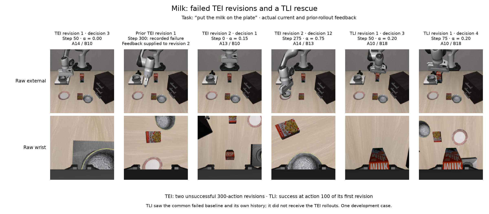
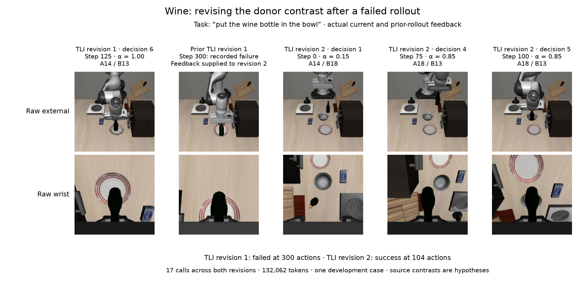

# Online adaptation: two verified development cases

Astra recognized unsuccessful behavior and revised its conditioning in the
recorded wine and milk cases. Both tasks failed under two TEI revisions; TLI
rescued milk on its first revision and wine on its second. The useful candidate
recipe was **changing donor contrasts with the observed phase**. This is evidence from
two development resets, not a generalization result or proof of semantic
cancellation.

| Task / arm | Intervention rollout actions | Successful revision | Accepted / physical calls | Tokens through success or cap |
|---|---:|---:|---:|---:|
| Milk, TEI | 300 + 300, both failed | — | 22 / 24 | 200,797 |
| Milk, TLI | 100 | 1 | 4 / 4 | 21,929 |
| Milk, TLI + vision | 101 | 1 | 5 / 5 | 29,281 |
| Wine, TEI | 300 + 300, both failed | — | 23 / 24 | 201,219 |
| Wine, TLI | 300 failed + 104 succeeded | 2 | 17 / 17 | 132,062 |
| Wine, TLI + vision | 300 failed + 104 succeeded | 2 | 17 / 17 | 134,638 |

Each arm also includes the common failed 300-action baseline. A revision is a
new rollout from the same initial state; decisions occur every 25 actions within
it. TLI adds `(1−2α)(T_A−T_B)` to the target hidden states. TEI replaces instruction
embeddings with `(1−α)E_A + αE_B`. The same α therefore has different meanings.

The relevant donor prompts were:

| ID | Exact prompt |
|---|---|
| 10 | put the bowl on the plate |
| 13 | put the cream cheese in the bowl |
| 14 | put the wine bottle on top of the cabinet |
| 18 | put the bowl on top of the cabinet |

## Milk: recognizing failure did not make TEI recover



TEI revision 1 started with A14/B10, α=0.25. At decision 3, step 50, Astra
identified a grasp attempt at the stove bowl while the milk remained untouched,
and changed α to 0. The complete rollout still failed. Revision 2 received that
failure, all 12 prior decisions and paired snapshots at steps 0/100/200/300.
Its first decision changed the initial mixture to A13/B10, α=0.15, explicitly
testing a packaged-food analogy from the reset rather than trying it only after
getting stuck. It again manipulated bowls and failed after 300 actions. This
shows informed revision without successful recovery.

The TLI arm independently received the failed baseline, **not the TEI history**.
At decisions 1–2, steps 0/25, it chose A14/B18, α=0.10: a
`0.8(T_14−T_18)` contrast between wine and bowl handling with a shared cabinet
destination. After apparent milk acquisition, decisions 3–4, steps 50/75,
changed to A10/B18, α=0.20: `0.6(T_10−T_18)`, a plate-versus-cabinet contrast
with a shared bowl object. Recorded success followed at action 100.

Astra's stated hypotheses separated object acquisition from destination
selection. TLI also retains the target instruction while adding a residual;
none of the nine donor prompts names milk. These facts motivate the recipe,
but this comparison does not establish which mechanism caused the rescue.

## Wine: revising the contrast after a placement stall



TLI revision 1 initially used A14/B13. At decision 5, step 100, Astra tentatively
described bowl alignment; at decision 6, step 125, it corrected this assessment
after the wrist view showed the red-rimmed plate. It tried other pairs, a zero
residual at decision 8 (α=0.50), and a backward change to α=0.20 at decision 9
to attempt renewed lifting. The rollout nevertheless failed at 300 actions.

Revision 2 received that failed rollout's snapshots and decisions. At decision 1
it changed acquisition to A14/B18, α=0.15, explicitly treating the shared
cabinet destination as a way to focus the contrast on the manipulated object.
It retained that pair through grasp closure, with α=0.25 at step 50. After a
visible lift, decision 4 at step 75 changed to A18/B13, α=0.85, applying
`0.7(T_13−T_18)` for bowl-directed placement. It retained this at step 100 and
the recorded task succeeded at action 104. The model explicitly called the
donor cancellation idea a hypothesis, not a guaranteed effect.

This is adaptation to the arm's own failed attempt through context. No model
weights were updated, and histories from other arms or oracle rollouts were not
supplied. The [cabinet example](../examples/README.md) provides a separate TEI
success; TEI did not fail in every development case.

## Vision, rejection handling and costs

TLI + vision also succeeded on both tasks. Its language decisions differed from
TLI, so these cases do not isolate a vision benefit. Milk's winning rollout had
21 actions with changed images; wine had 30 in its failed revision and 24 in its
successful revision. Each fresh mark lasted at most one five-action policy
chunk. Astra always received raw feedback, not the policy-side marked image.

All **91 physical calls returned HTTP 200**; **88 proposals were accepted and
executed**. Milk TEI revision 1 rejected decisions 8 and 10 for malformed or
incorrect fingerprints. Wine TEI revision 1 rejected decision 8 for an incorrect
episode ID. They consumed their slots and tokens, without hidden retries.
Previous valid text remained active for 50 milk actions and 25 wine actions;
there were no native-condition fallback actions. An intentionally selected
α=0.50 TLI residual is zero and is distinct from a rejected-call fallback.

The two cases used **719,926 reported tokens**; every call has usage, including
the three rejections. Reasoning counts are part of output tokens, not added to
the total. No dollar rate is assumed. The
[interrupted original-run overhead](../interruption/README.md), retained cabinet
case and separate 2,550-token transport smoke are outside this two-case total.

## Evidence and reproduction

[behavior.json](behavior.json) retains all 91 call identities, accepted/rejected
status, source choices, explicit response `observed_phase`/`rationale` fields,
feedback scope, costs and source hashes. Those fields are the model's reported
assessments, not hidden reasoning or measured progress. The
[wine receipt](../audits/worker_0_receipt.json) and
[milk receipt](../audits/worker_1_receipt.json) bind complete archives and passed
array and feedback audits. [milk_example.json](milk_example.json) and
[wine_example.json](wine_example.json) additionally bind every displayed PNG to
its actual stored raw camera arrays, request fingerprint and current/prior
attempt identity. No new model, GPU or simulator calls were made for this review.

After activating the project Python environment, run from the repository root:

```sh
python -m astra_reversal.reports.phase_interpolation.development.behavior.build_behavior \
  --wine-case astra_reversal/.deps/interpolation-development-recovery-v2/extracted/worker_0/results/case_6_0 \
  --milk-case astra_reversal/.deps/interpolation-development-recovery-v2/extracted/worker_1/results/case_2_0
python -m astra_reversal.reports.phase_interpolation.development.behavior.build_milk_figure \
  --case-dir astra_reversal/.deps/interpolation-development-recovery-v2/extracted/worker_1/results/case_2_0
python -m astra_reversal.reports.phase_interpolation.development.behavior.build_wine_figure \
  --case-dir astra_reversal/.deps/interpolation-development-recovery-v2/extracted/worker_0/results/case_6_0
```

The figure builders refuse to proceed without matching passed audit receipts.
The audits verify recorded execution and provenance; they do not independently
rerun task success or establish performance on the full 20-case evaluation.
