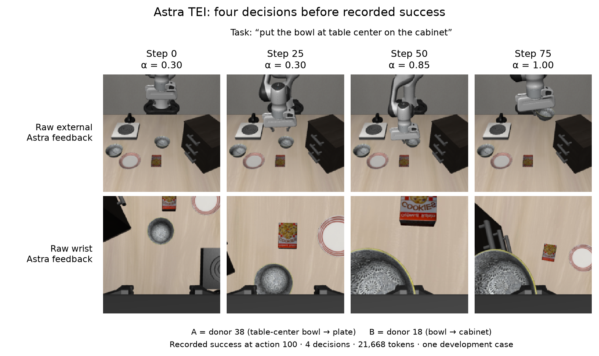
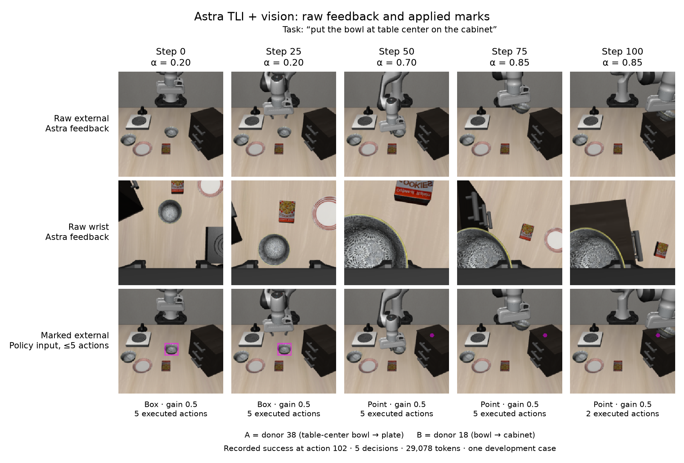

# Verified cabinet development example

For **“put the bowl at table center on the cabinet”** (Spatial task 8, seed 19,
initial state 0), the shared recovered-noise baseline and oracle TEI each failed
within 300 actions. Astra TEI succeeded at action 100 of its first intervention
rollout: **one full-rollout revision, four online decisions, 21,668 tokens**.
This is one development case, not a full evaluation result.

| Recorded rollout | Outcome | Actions in that rollout | Astra decisions | Reported tokens |
|---|---|---:|---:|---:|
| Common baseline | Failed | 300 | 0 | 0 |
| Oracle TEI | Failed | 300 | 0 | 0 |
| Astra TEI | Succeeded | 100 | 4 | 21,668 |
| Astra TLI | Succeeded | 124 | 5 | 28,421 |
| Astra TLI + vision | Succeeded | 102 | 5 | 29,078 |

Each Astra intervention started from the same reset and received the failed baseline's
feedback. Astra selected from nine donor prompts; it received no oracle pair.
All shown decisions chose these sources:

- **A, ID 38:** “pick up the black bowl from table center and place it on the plate”
- **B, ID 18:** “put the bowl on top of the cabinet”

## TEI: changing the embedding mixture



Each column shows the latest **raw external and wrist camera pair sent to Astra**,
immediately before that decision. TEI uses `(1−α) E_A + α E_B`; α is the weight on
the cabinet donor. Its values were **0.30, 0.30, 0.85, 1.00** at steps
**0, 25, 50, 75**. The recorded success occurred at action 100, after the last
displayed observation. Recent frames and the failed baseline's snapshots were
also included in the requests; the figure displays only each current pair.

The token total is 20,716 input + 952 output. The 30 reported reasoning tokens are
already part of output tokens. All four genuine calls used
`azure/openai/gpt-6-astra`, medium reasoning and an 8,192-token completion budget;
all returned HTTP 200 and were accepted and applied. There were no fallback
actions. The 400 actions through success include the common 300-action baseline.

## TLI + vision: temporary marks on current observations



The first two rows are raw feedback sent to Astra. The third row reconstructs the
**actual policy input** with the recorded Linux renderer and verifies its exact
hash. The wrist image remains unchanged. In 224 × 224 pixel coordinates, Astra
requested an external-camera box `[98, 116, 128, 142]` at steps 0 and 25, followed
by a point `[187, 99]` on the cabinet at steps 50, 75 and 100. All gains were 0.5;
the fixed marks use a magenta 3-pixel outline or 4-pixel point radius.

Each mark expires at the next policy replan, after **at most five actions**.
Calls are 25 actions apart; the marks are not tracked or carried through that
interval. The first four marked chunks each executed five actions. The last
executed two before success at action 102: **22 changed-vision actions total**.
The accepted language decision persists between calls.

TLI adds `(1−2α) (T_A−T_B)` to the target hidden states; it is not a convex
hidden-state overwrite. Its α values and trajectories differed between arms:

| Decision step | TLI α | TLI + vision α | TLI + vision mark |
|---:|---:|---:|---|
| 0 | 0.20 | 0.20 | Bowl box |
| 25 | 0.20 | 0.20 | Bowl box |
| 50 | 0.35 | 0.70 | Cabinet point |
| 75 | 0.85 | 0.85 | Cabinet point |
| 100 | 0.85 | 0.85 | Cabinet point |

Both succeeded. Because the language decisions and resulting observations also
differ, this example **does not isolate vision's causal contribution**. The
TLI + vision total is 27,567 input + 1,511 output = 29,078 tokens, including 108
reasoning tokens within output. All five calls were accepted and applied, with
no fallback actions. No dollar cost is inferred without a verified rate.

## Evidence and reproduction

The [worker receipt](../audits/worker_2_receipt.json) binds the complete archive,
the [array audit](../audits/worker_2_arrays.json), and the
[compressed feedback audit](../audits/worker_2_case_8_0_feedback.json.gz).
Both audits passed: 2,976 stored arrays, 470 policy generations, 2,341 actions and
11 physical rollouts across this case's arms and controls. Feedback checks bind
decoded request PNGs to raw recorded arrays and check provider identity,
per-arm history, accepted decisions and annotation expiry.

[examples.json](examples.json) retains every displayed request fingerprint,
camera PNG and NPY hash, rendered-observation digest, selected source IDs, α,
annotations, token counts and source-file hashes. It also retains the five TLI
decisions used in the comparison table. Provider rationale, hidden reasoning,
credentials and signed URLs are omitted. Separate transport-only smoke usage
(2,550 tokens, no rollout) is excluded from the table's rollout costs.

With the recorded archive extracted and the project Python environment activated,
run from the repository root:

```sh
python -m astra_reversal.reports.phase_interpolation.development.examples.build_examples \
  --case-dir astra_reversal/.deps/interpolation-development-v1/extracted/worker_2/results/case_8_0
```

The [builder](build_examples.py) checks the audit and input-file hashes, validates
all 14 provider decisions, and compares the current PNG pixels and exact rendered
images against stored arrays. It performs no provider, model or simulator calls.
