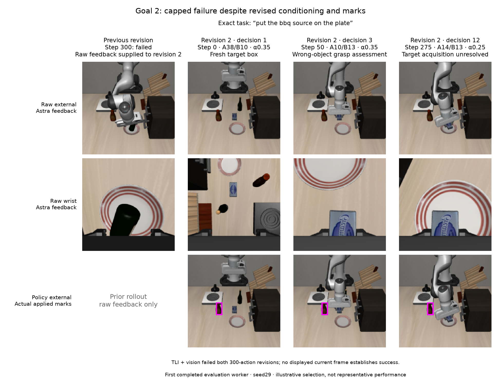
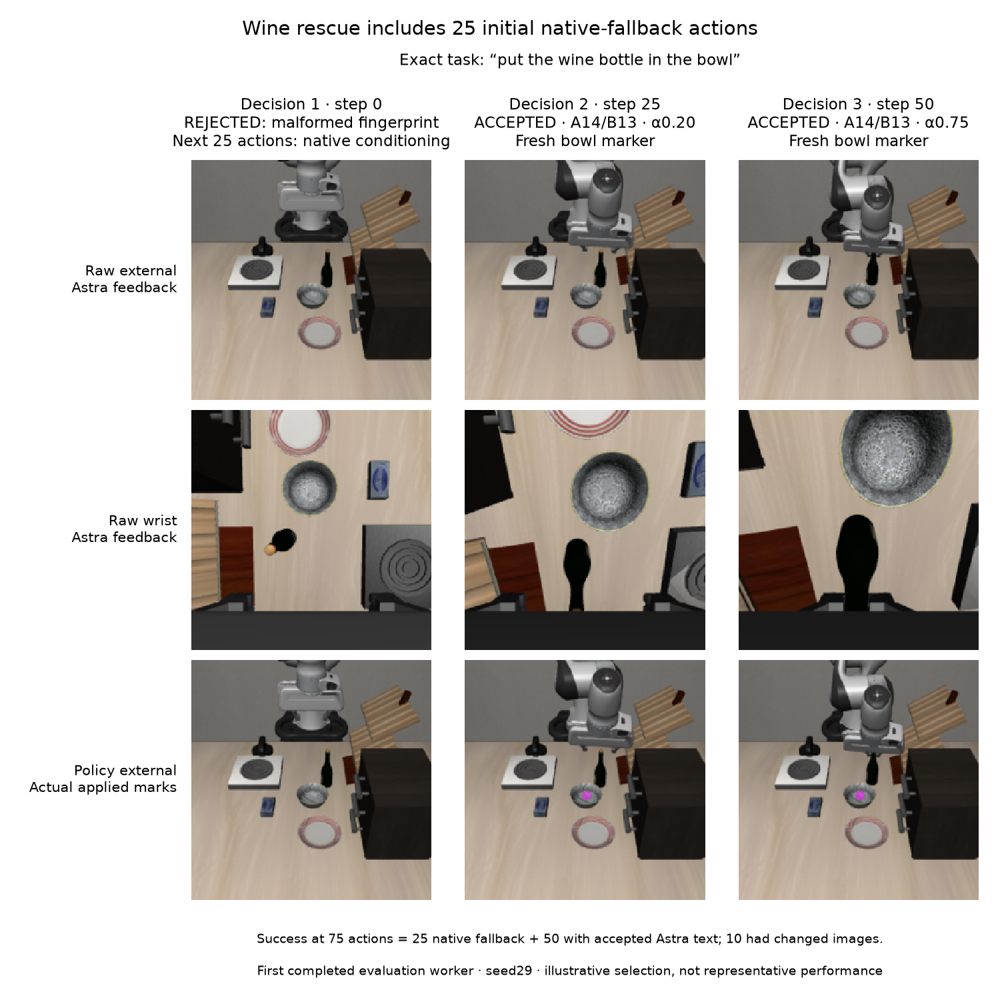

# First completed evaluation worker: failure and rescue

These two cases were selected because **worker 2 completed first**, not as a
representative sample or an estimate of evaluation performance. Goal 2 exhausted
the tested budgets without success. Wine succeeded under random-noise search,
every oracle arm and every Astra arm, so its rescue is **not uniquely attributable
to Astra**.

The wine TLI + vision success also includes **25 initial actions with native
conditioning after a rejected proposal**, followed by 50 actions with accepted
Astra text. The entire trajectory must not be described as accepted Astra
steering. Both cases passed full archive, array and feedback audits before these
examples were built.

## Recorded outcomes and iteration costs

Both common baselines failed at 300 actions. The table shows the subsequent
intervention rollouts; a successful first revision is attempt 2 including that
baseline. Astra and random search had at most two revisions; each oracle had
one fixed intervention rollout. Each Astra revision allowed 12 calls and 300
actions. Token counts include rejected calls through success or the cap.

| Arm | Goal 2 intervention outcome | API tokens | Wine intervention outcome | API tokens |
|---|---|---:|---|---:|
| Random noise | Failed, 300 + 300 actions | 0 | Succeeded, 86 actions | 0 |
| Oracle TEI | Failed, 300 actions | 0 | Succeeded, 76 actions | 0 |
| Oracle TLI | Failed, 300 actions | 0 | Succeeded, 79 actions | 0 |
| Oracle TEI + TLI | Failed, 300 actions | 0 | Succeeded, 80 actions | 0 |
| Astra TEI | Failed, 300 + 300 actions | 202,003 | Succeeded, 80 actions | 21,553 |
| Astra TLI | Failed, 300 + 300 actions | 219,994 | Succeeded, 77 actions | 21,691 |
| Astra TLI + vision | Failed, 300 + 300 actions | 233,374 | Succeeded, 75 actions, including 25 native fallback | 15,220 |

Goal 2 used **72 calls / 68 accepted / 655,371 tokens** across its three Astra
arms. Wine used **11 calls / 10 accepted / 58,464 tokens**. All 83 calls returned
HTTP 200 and reported usage. Zero API tokens for the controls does not imply zero
compute cost. Across all worker rollouts, including native controls and the
shared baselines counted once, the archive records 24 physical rollouts,
5,429 actions and 13,450 vector-field evaluations including initialization and
numerical gates.

## Goal 2: recognizing the distractor did not resolve acquisition

The exact benchmark instruction is **“put the bbq source on the plate”**. The
model described the brown capped object as the likely BBQ sauce and distinguished
it from the dark wine bottle and blue package.



The figure follows TLI + vision. Its first revision selected the dark bottle and
failed. Revision 2 received that failed outcome, its 12 decisions and raw paired
snapshots at steps 0/100/200/300. The explicitly labeled first column is the
previous rollout's terminal feedback, not the current reset.

At revision 2, decision 1 (step 0), Astra changed from the bottle donor to
A38/B10, α=0.35, and marked only the apparent sauce bottle. At decision 3
(step 50), it recognized a grasp attempt at the blue package, switched to
A10/B13, α=0.35, and refreshed the sauce box. At decision 12 (step 275), it
still reported unresolved acquisition and tried A14/B13, α=0.25. The sauce
remained on the table while the gripper interacted with distractors. Neither
revision succeeded.

Relevant donors are table-center bowl → plate (38), bowl → plate (10), cream
cheese → bowl (13), and wine bottle → cabinet (14). None names BBQ sauce.
The recorded decisions show failure awareness and contextual revision; the
available conditioning changes did not reliably select the intended object in
this reset. This is a bounded failure, not evidence that every possible revision
or larger budget would fail.

The top two rows are raw frames supplied to Astra. The bottom row shows the exact
Linux-rendered policy input: a fresh box `[68,115,83,145]`, gain 0.9 at step 0
and 1.0 at steps 50/275. Each mark expires after at most five actions; no mark is
carried across the 25-action call interval. Astra did not receive these edited
images as feedback.

## Wine: a rescue with native fallback and successful controls



In the TLI + vision arm, decision 1 at step 0 returned a malformed request
fingerprint. Its proposed text and point were rejected. With no previous valid
decision, the next 25 actions used native conditioning. Two later accepted
decisions used A14/B13: α=0.20 at step 25 for acquisition, then α=0.75 at step
50 after apparent grasp closure. The record reports success at action 75.

| Executed action indices | Applied accepted decision ID | Text / image behavior |
|---|---|---|
| 0–24 | None; step-0 call rejected | Native conditioning; no mark |
| 25–49 | `astra_tli_vision_2_d2` | Accepted text; point only during actions 25–29 |
| 50–74 | `astra_tli_vision_2_d3` | Accepted text; point only during actions 50–54 |

Thus 50 actions used accepted text and only **10 actions had changed images**.
The rejected call, complete fingerprints, applied IDs and individual generation
sequences are bound in `cases.wine.calls` and
`cases.wine.vision_rescue_application_segments` in [examples.json](examples.json).
The successful trajectory includes native fallback and does not isolate a
causal vision effect. Separate TEI and TLI rollouts succeeded with four accepted
calls each and no native fallback.

Random noise also rescued wine in its first revision, and all three oracle arms
succeeded. This evaluation case uses **seed 29**, with reset digest beginning
`dd2a32924a71`; the [development wine case](../../development/behavior/README.md)
used seed 19 and digest `6d04f3d7eb09`. The full distinct reset hashes are retained
in the example receipt. The development failure/rescue sequence must not be
treated as a repeated result on this reset.

## Additional contrast: orange juice, with random search capped

After reviewing the first worker, we selected **Goal 1, seed 29**, from worker 1
as an additional outcome-based illustration: **“put the orange juice on the
stove”**. Its baseline and both random-noise revisions failed. These are
separate case totals, not part of the two-case totals above.

| Arm | Intervention outcome | Accepted / physical calls | API tokens |
|---|---|---:|---:|
| Random noise | Failed, 300 + 300 actions | 0 / 0 | 0 |
| Oracle TEI | Succeeded, 93 actions | 0 / 0 | 0 |
| Oracle TLI; oracle TEI + TLI | Each failed, 300 actions | 0 / 0 | 0 |
| Astra TEI | Failed, 300 + 300 actions | 24 / 24 | 210,878 |
| Astra TLI | Failed at 300, then succeeded at 96 | 14 / 16 | 116,604 |
| Astra TLI + vision | Succeeded, 135 actions | 5 / 6 | 34,897 |

TLI's first revision repeatedly attempted acquisition and obtained a late
apparent carton grasp. Its second revision began with a weaker A14/B18
contrast, α=0.35, explicitly citing the prior unsuccessful rollout. After a
visible lift, decision 4 at step 75 switched to A18/B17, α=0.80:
`0.6(T_17−T_18)`, contrasting bowl-on-stove with bowl-on-cabinet. Recorded
success followed at action 96. The model described the weaker initial residual
as a test, not a proven cause of improved acquisition.

TLI + vision succeeded in its first revision but used different language choices,
so this does not isolate vision's effect. Three malformed/incorrect fingerprint
calls consumed slots and reported tokens: two in failed TLI revision 1 and one
in the successful vision rollout. Previous text was held after rejection;
there were no native-condition fallback actions. The full case used **46 calls,
43 accepted proposals and 362,379 tokens**, including failed TEI and TLI attempts.
It demonstrates a rescue absent from this bounded matched random search;
oracle TEI also rescued it, and no unique Astra capability or population-level
advantage is inferred.

[orange_juice.json](orange_juice.json) binds all 46 calls, iteration costs and
the [passed worker 1 receipt](../audits/worker_1_receipt.json). No additional
image was rendered for this supplementary case.

## Rejections, evidence and reproduction

For the primary two-case contrast, all five rejections were malformed fingerprints: four in Goal 2 and the initial
wine vision call. Goal 2 retained its previous valid text for 100 actions after
those failures; wine had the 25-action native interval described above. Calls
consumed their scheduled slots without hidden retries. Total usage was
**713,835 tokens**, with no missing usage; the 4,086 reasoning tokens are already
part of output tokens. No dollar rate is inferred. Development, interrupted-run
overhead and transport-smoke costs are outside this evaluation-worker total.

The [worker receipt](../audits/worker_2_receipt.json) binds the full archive and
both passed case audits. [examples.json](examples.json) retains all call
identities, reported phase/rationale fields, costs, source hashes, seven displayed
camera-pair bindings and exact rendered-image hashes. Response rationale is an
explicit model output, not hidden reasoning or independently measured progress.
The audits verify recording and provenance; they do not rerun task success.

After activating the project Python environment, run from the repository root:

```sh
python -m astra_reversal.reports.phase_interpolation.evaluation.behavior.build_examples \
  --results-root astra_reversal/.deps/interpolation-evaluation-v1/extracted/worker_2/results \
  --orange-results-root astra_reversal/.deps/interpolation-evaluation-v1/extracted/worker_1/results
```

The [builder](build_examples.py) refuses incomplete or mismatched audits, verifies
actual NPY/PNG bytes and applied rendering, and makes no new provider, model,
GPU or simulator calls. Runtime and frozen development artifacts are unchanged.
