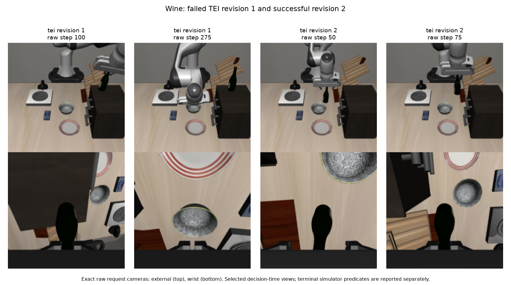
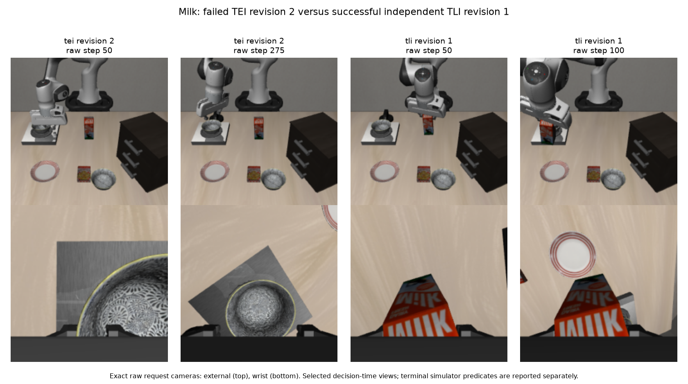
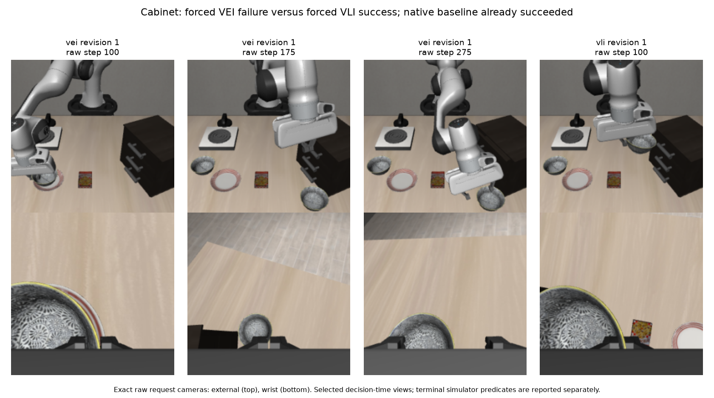
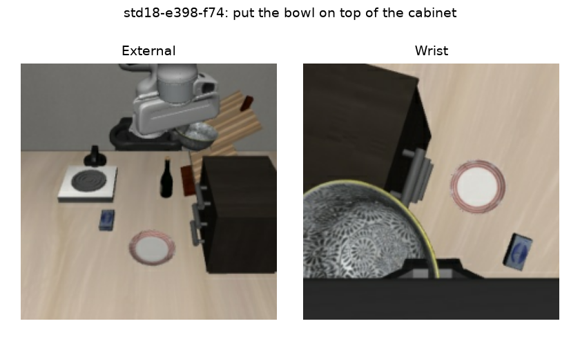

# Verified observations from the interrupted representation pilot

This is **partial development evidence**, from three seed-19/reset-0 cases. Provider budget errors interrupted two workers; the cabinet worker completed its forced development rollouts. The planned 20-task evaluation did not run. Accepted and executed proposals exist for TEI, TLI, VEI and VLI, but not for TLI+VLI or pixel blend, so the six-arm admission gate did not pass. There is no cohort efficacy estimate here.

[Evidence JSON](evidence.json) and [complete selected timelines](timelines.csv) bind each illustrated request ID/fingerprint, raw-camera digest, accepted decision, executed interval and cost to the preserved archive. The phase and rationale columns are Astra's short observable assessments, not hidden reasoning or independent ground truth.

| Individual observation | Native baseline | Intervention outcome | Calls and known tokens for that arm through the outcome |
|---|---|---|---|
| Goal 6: “put the wine bottle in the bowl” | Failed at 300 actions | TEI revision 1 failed at 300; revision 2 succeeded at 98 | 16 calls; 182,881 tokens, including the failed first revision |
| Spatial 2: “put the milk on the plate” | Failed at 300 actions | TLI revision 1 succeeded at 120 | 5 calls; 55,559 tokens |
| Spatial 8: “put the bowl at table center on the cabinet” | Succeeded at 106 actions | Forced VEI revision failed at 300; forced VLI revision succeeded at 125 | VEI: 12 calls / 143,408 tokens; VLI: 5 calls / 58,412 tokens |

“Succeeded” means the recorded simulator predicate. The selected images are decision-time observations; they do not independently establish stable final placement. The cabinet VLI result is not a rescue over its already successful baseline. All intervention arms retain the frozen native policy weights; these are conditioning decisions, not learned policy updates.

## Wine: a second rollout changes acquisition and transport weights

TEI used source A **14**, “put the wine bottle on top of the cabinet,” and source B **13**, “put the cream cheese in the bowl.” Its alpha is B's embedding weight: `(1-alpha) E_A + alpha E_B`. Alpha zero means source A, not native conditioning.

In revision 1 Astra started at alpha 0.35, raised it to 0.75 at step 75 and to 1 at step 100, then varied it while trying to reacquire the bottle. The raw images show the bottle on the cabinet while the gripper later moves over the bowl. That failed 300-action rollout consumed 12 calls and 136,266 tokens.

Revision 2 received that same arm's failed rollout snapshots, decisions and binary outcome. At step 0 Astra explicitly referred to the prior cabinet placement and chose 0.4. Its four accepted decisions were:

| Revision 2 step | Alpha, A=14/B=13 | Observable assessment / reason for the decision | Actions executed under this decision | Cumulative TEI calls / tokens, including revision 1 |
|---|---|---|---|---|
| 0 | 0.4 | Bottle unheld; retain bottle identity while adding bowl-destination conditioning after the prior failure | 25 | 13 / 146,848 |
| 25 | 0.4 | Bottle increasingly centered under the descending open gripper | 25 | 14 / 158,667 |
| 50 | 0.4 | Fingers beginning to close; no confirmed lift yet | 25 | 15 / 170,776 |
| 75 | 0.65 | Bottle rises with the gripper; increase bowl-destination weight during transport | 23 | 16 / 182,881 |

All 98 actions in this successful revision used a logged nonzero TEI condition; none were provider-error fallback. Counting the shared failed baseline gives three completed episodes through this arm's first success: baseline plus two revisions. The four winning-rollout calls alone cost 46,615 tokens; reporting only those would omit the first revision's cost. Different revision noise seeds and the small sample prevent attributing success solely to the alpha changes.

## Milk: independent TLI changes object emphasis, then destination emphasis

Both TEI revisions failed after 300 actions each, consuming 24 calls and 280,505 tokens. Their raw frames repeatedly show the gripper at a bowl while the milk remains on the table. **TLI did not see those TEI attempts**: histories were isolated by arm, so its first revision received the shared native baseline failure only.

At steps 0–75, TLI selected A **14**, “put the wine bottle on top of the cabinet,” minus B **18**, “put the bowl on top of the cabinet.” At step 100 it changed to A **10**, “put the bowl on the plate,” minus B **17**, “put the bowl on the stove.” With alpha 0.25, each decision adds `0.5 * (T_A - T_B)` to the corresponding language slots; this is the paper-style residual, not a convex replacement. Astra's object/destination interpretation is a hypothesis about that residual, not proof of semantic cancellation.

| Step | A / B; alpha | Observable assessment / reason for the decision | Actions executed | Cumulative TLI calls / tokens |
|---|---|---|---|---|
| 0 | 14 / 18; 0.25 | Baseline moved a bowl, leaving milk untouched; test upright-container versus bowl emphasis | 25 | 1 / 9,987 |
| 25 | 14 / 18; 0.25 | Milk centered in the wrist view during descent | 25 | 2 / 21,172 |
| 50 | 14 / 18; 0.25 | Milk rises with the gripper; retain the residual | 25 | 3 / 32,623 |
| 75 | 14 / 18; 0.25 | Milk retained during transport | 25 | 4 / 44,076 |
| 100 | 10 / 17; 0.25 | Milk descends over the stove with the plate offset; test plate-versus-stove destination emphasis | 20 | 5 / 55,559 |

All five requests were accepted and all 120 actions used a nonzero TLI condition, with no provider-error fallback. The arm reached recorded success after one intervention revision, or two episodes including its failed baseline. The worker had physically spent 29 calls and 336,064 tokens by then, including the separate TEI trials; those costs remain in the overall ledger even though their feedback was unavailable to TLI.

## Cabinet: real visual steering, with a failure and a forced success

The baseline had already succeeded in 106 actions. Development deliberately forced one additional rollout for every arm; these extra trials do not improve its already successful first-success score.

Both VEI and VLI initially selected explicit native mode at steps 0, 25 and 50. At step 75 Astra observed transport toward the stove instead of the cabinet and selected paired donor **std18-e398-f74**. That is frame 74 from the pinned bowl-to-cabinet demonstration. Its original training task text is metadata: donor visual activations were captured under the **current target instruction**. VEI interpolates post-projector visual tokens; VLI interpolates visual slots after blocks 0–16, using `(1-alpha) * current + alpha * donor`.

| Arm and steps | Actual visual choice | Observed behavior and subsequent decision |
|---|---|---|
| VEI 75 / 100 / 125 / 150 | std18-e398-f74; alpha 0.35 / 0.55 / 0.55 / 0.3 | Initial descent onto the plate, followed by transport toward the cabinet |
| VEI 175 / 200 | Native | Bowl is visibly separated from the gripper beside the cabinet; restore live vision for reacquisition |
| VEI 225 / 250 / 275 | std38-e1283-f34 at 0.2; then std18-e398-f25 at 0.35 / 0.55 | Test acquisition donors after stalling; still fails at the 300-action cap |
| VLI 75 / 100 | std18-e398-f74; alpha 0.3 / 0.3 | Bowl remains held and moves toward the cabinet; recorded success at action 125 |

VEI had 175 actions with nonzero visual conditioning and 125 explicit-native actions. VLI had 50 nonzero-conditioned actions and 75 explicit-native actions. Neither used provider-error fallback. Their chosen strengths and later schedules differ, so this is not an isolated test of VEI versus VLI. It suggests a useful visual-feedback hypothesis while also showing loss of grasp and unsuccessful recovery.

## Costs, rejected calls and evidence limits

The final preserved ledger contains **220 physical calls: 98 accepted and executed, 122 HTTP 429 responses**. Exactly **48** errors have the structured type `budget_exceeded`; the other 74 are retained as HTTP 429 without that explicit type. No Retry-After metadata was recorded. Successful responses identify `azure/openai/gpt-6-astra`, medium reasoning, 8,192 completion-token cap and disabled cache; error responses do not establish a returned model identity.

Known reported usage is **1,129,046 tokens**: 1,113,516 input and 15,530 output. The 4,910 reasoning tokens are already contained in output. Usage is unavailable for all 122 HTTP errors, so this is a known-token subtotal, not a complete bill or evidence that failures were free. No dollar rate is inferred. The calls were not manually retried.

| Arm | Recorded calls | Accepted and executed decisions | Important coverage limit |
|---|---:|---:|---|
| TEI | 52 | 52 | Three pilot cases only |
| TLI | 41 | 29 | Wine's second revision ran entirely on error fallback |
| VEI | 60 | 12 | Accepted only on the already successful cabinet case |
| VLI | 43 | 5 | Accepted only on the already successful cabinet case |
| TLI+VLI | 12 | 0 | No accepted Astra intervention |
| Pixel blend | 12 | 0 | No accepted Astra intervention |

There are 42 verified completed rollouts with 11,849 actions, plus two unfinished VLI attempts. The last recorded requests prove at least 25 additional wine actions and 275 milk actions; their terminal outcome and unrecorded work remain unknown. At least **3,000 actions** were native policy fallback after provider errors: 2,700 in completed rollouts and 300 in those proven unfinished prefixes. Explicit accepted-native decisions are a separate category. On the cabinet case, each rejected-call TLI+VLI and pixel-blend rollout matches the corresponding native-retry raw observations, condition IDs, noise and generated/controller array digests across all 60 generations. Those fallback failures say nothing about the untested operators.

Worker 2 has a complete sealed archive audit. Workers 0 and 1 have full-byte checks of their interrupted finally archives and all available referenced NPYs, but no complete-case seal or final frozen-weight receipt. The provider checks bind all 220 exact wire payloads and all 98 accepted decisions. Two final rejected requests have no subsequent generation record; their new current-frame-to-generation join remains explicitly unmatched. This review performs no new model, numerical counterfactual or physics replay.

The portable [manifest](manifest.json), [provider receipts](provider_worker_0.json), [worker 1 receipt](provider_worker_1.json), [worker 2 receipt](provider_worker_2.json) and [offline checker receipt](provider_auditor_validation.json) retain hashes and scope. [Reproduction instructions](source/README.md) accompany the exact offline helper sources. Raw provider envelopes, encoded images, provider error messages, credentials and signed URLs are not included in the public JSON.
