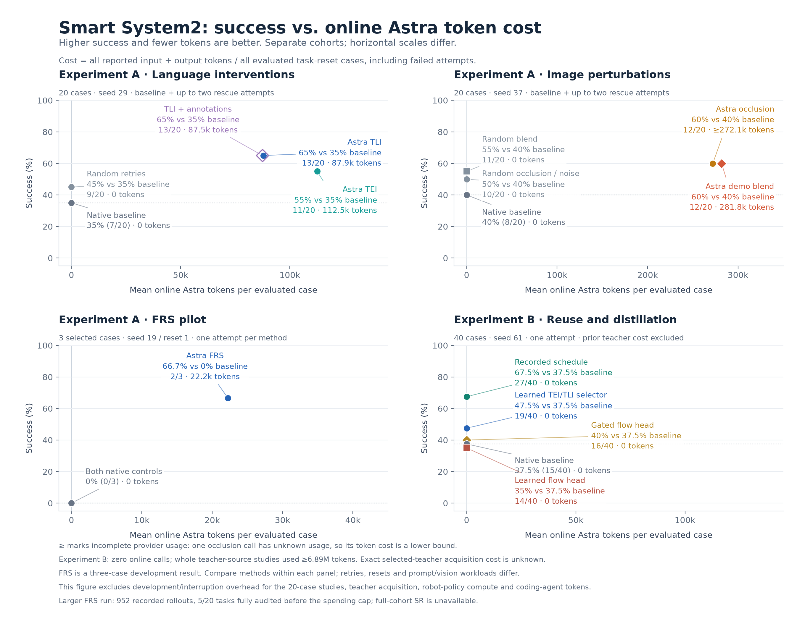

# Smart System2: results and token cost

[Figure PNG](success_vs_tokens.png) · [Editable SVG](success_vs_tokens.svg) · [PDF](success_vs_tokens.pdf) · [Exact values CSV](plotted_values.csv) · [Values and source hashes JSON](plotted_values.json)

## How success rate is measured

**SR means success rate.** After each executed action, the shared [LIBERO runner](../../libero_runner.py) calls `env.check_success()`, which evaluates the task's programmed goal predicates. An OOD rollout succeeds if that check becomes true within the 300-action control budget. It stops on success; reaching the cap without success counts as failure. Videos and Astra's judgment do not determine the reported SR. In particular, an Astra judgment that a rollout is better is separate from simulator success and from permission to update the auxiliary policy.

For **single-attempt evaluation**, SR is successful rollouts divided by prescribed task/reset cases. For the **baseline-plus-rescue studies**, a case counts once if its baseline or any allowed rescue succeeds. Their SR is cumulative success within the attempt budget, not the fraction of all physical attempts that succeed. Failed attempts remain in the token cost. A reset is a starting configuration; retries restore that same configuration, while separate evaluation resets test different starting configurations.

| Study | Tasks | Resets per task | Attempts per task/reset and method | SR denominator |
|---|---:|---:|---|---:|
| Earlier native-only OOD baseline | 20 | 10 | 1 | 200 |
| A — language interventions | 20 | 1 | 1 native baseline, then up to 2 retries after failure | 20 |
| A — actual image perturbations | 20 | 1 | 1 native baseline, then up to 2 retries after failure | 20 |
| A — completed FRS development comparison | 3 selected | 1 evaluation reset | 1 | 3 |
| B — offline reuse/distillation | 20 | 2 new evaluation resets | 1 | 40 |
| Small ID retention panel | 4 | 2 | 1 | 8 |
| Larger FRS evaluation, incomplete | 20 planned | 10 evaluation resets planned | 1 per final method, plus separate adaptation/checkpoint evaluations | 200 planned per final method; unavailable |

Thus **TLI's 65% means 13 of 20 task/reset cases solved within at most three attempts each**. It does not mean 65% of single policy rollouts succeeded. The learned selector's **47.5% means 19 successful single-attempt rollouts out of 40**, with two resets per task. With one reset per task, per-task success is binary; with two it is 0%, 50% or 100%; ten resets give 10-percentage-point increments. The shared baseline is executed once physically and reused in each rescue arm's accounting. These equal numbers of resets per task make pooled case SR equal to mean per-task SR within each completed cohort.

The earlier [native-only OOD run](../ood_baseline.json) scored **86/200 (43%)**, using ten trials for each of twenty tasks. Its different seed and execution settings make it historical context, not the matched baseline for the later intervention studies. Each result below instead names its own matched native baseline.

## Experiment A — Active intervention

- **Language steering improved success while reducing token use relative to TEI.** Astra-guided TLI scored **13/20 (65%) versus native 7/20 (35%)**, a **30-percentage-point gain**. TEI scored **11/20 (55%) versus native 7/20 (35%)**, a **20-point gain**. Random-noise retries scored **9/20 (45%) versus native 7/20 (35%)**, a **10-point gain**. TLI used **87.9k Astra tokens per evaluated case**, versus **112.5k** for TEI: **22% fewer tokens** with a ten-point higher success rate on this cohort. Both allow up to two rescue attempts after baseline failure. TLI plus visual annotations scored **13/20 (65%) versus native 7/20 (35%)**, a **30-point gain**, at **87.5k tokens/case**; these annotations are separate from the actual pixel perturbations below.
- **Successful TLI rescues usually needed one additional rollout.** Among rescued baseline failures, the median was **one revision and 28.5k tokens** for TLI, versus **two revisions and 121.9k tokens** for TEI. These are success-conditioned medians on different rescued subsets; they exclude cases that never succeeded. The plot instead counts spending on all evaluated cases.
- **Actual image perturbations recovered additional failures.** On a separate twenty-case cohort, Astra-guided occlusion and demonstration-image blending each scored **12/20 (60%) versus native 8/20 (40%)**, a **20-point gain**, using **at least 272.1k** and **281.8k tokens/case**, respectively. Random occlusion and random-noise retries each scored **10/20 (50%) versus native 8/20 (40%)**, a **10-point gain**; random blending scored **11/20 (55%) versus native 8/20 (40%)**, a **15-point gain**. These random controls used zero Astra tokens. These image arms also allow two rescue attempts.
- **FRS demonstrated successful assisted control in the three-case pilot.** FRS scored **2/3 (66.7%) versus native 0/3 (0%)**, a **66.7-point gain**, at **22.2k tokens/case**. Both native noise controls scored 0/3. This is a small development result; its efficacy and efficiency on the full twenty-task benchmark remain unestablished.

## Experiment B — System2-in-the-loop improvement

The completed positive results demonstrate **offline reuse and distillation of successful Astra interventions**. They do not establish a repeatedly improving online policy-update loop.

- **Recorded teacher schedules transferred to new resets without online Astra calls.** Schedule replay increased single-attempt success from **15/40 (37.5%) to 27/40 (67.5%)**, recovering **twelve native failures without losing any native successes**, at **0 online Astra tokens/case**.
- **A learned selector retained part of the improvement without online Astra calls.** The observation-conditioned TEI/TLI selector scored **19/40 (47.5%) versus native 15/40 (37.5%)**, a **10-point gain**, also at **0 online Astra tokens/case**. Its paired outcomes were five recoveries and one lost native success.
- **Action corrections gave mixed results.** The flow head scored **14/40 (35%) versus native 15/40 (37.5%)**, a **2.5-point drop**. The gated head scored **16/40 (40%) versus native 15/40 (37.5%)**, a **2.5-point gain**. Both used **0 online Astra tokens/case**.
- **The small ID panel showed no observed regression.** Each of the four intervention methods scored **8/8 (100%) versus native 8/8 (100%)**, with **no change** across four standard tasks and two resets each.

Teacher acquisition was not free. The two whole source studies recorded **at least 6,887,020 tokens across 899 calls**, including unsuccessful trials and unused arms. The exact acquisition cost attributable to the twelve selected teachers is unknown. Zero deployment-time Astra tokens therefore demonstrate an online cost saving, not a measured end-to-end amortized advantage. Training and evaluation still required robot-policy compute, reported separately in the original recipe.

The earlier three-task critique/FRS adaptation arms each scored **0/3 (0%) versus their shared native baseline 0/3 (0%)**, with no rescues and no Astra-approved improvements. The final separate-reset critique/FRS and auxiliary-noise evaluations also each scored **0/3 (0%) versus native 0/3 (0%)**. The auxiliary learner performed **zero optimizer updates** because no candidates passed the improvement gate. This remains separate from the positive offline reuse/distillation results.

## Larger FRS run: launched for twenty tasks, incomplete

The eight-worker OSMO L40S workflow `astra-pi05-frs-evaluation-20260925-1` was launched for all **20 tasks**, with **ten separate evaluation resets per task** and **200 final evaluation episodes per method** planned. Its six final methods, intermediate learned checkpoints and adaptation rollouts totaled **1,740 planned physical rollouts**.

The inference provider returned `budget_exceeded`, and the run ended on **September 26, 2026**. The retained records contain **952 completed physical rollouts** and **197,806 actions**; only **5/20 tasks** completed all methods and passed their full task audits. The 952 count combines methods, adaptation and checkpoint evaluations, so it is not the SR denominator for any one method. The completed subset is determined by execution progress and does not supply an unbiased full-cohort score. **A completed twenty-task FRS-versus-native success rate is unavailable.** The 2/3 result above is specifically the completed three-case development pilot.

The larger run recorded **6,587 provider calls and at least 15,562,019 tokens**, with unknown token usage for 1,166 calls. Across the five fully audited tasks, Astra made **30 candidate judgments: 29 same and one uncertain**, yielding **zero promotions or optimizer updates**. This is an observation about the learning gate on that subset, not a full-benchmark efficacy result. [Interruption report](../frs_policy_improvement/EVALUATION_INTERRUPTION.md) · [Recorded scope and cost](../frs_policy_improvement/evaluation_interruption.json) · [Learning-gate evidence](../frs_policy_improvement/evaluation_gate_observations.json).

## Success versus token cost

The horizontal coordinate is **all known online Astra input plus output tokens for an arm divided by all task/reset cases in that cohort**. It includes rejected calls when usage is reported, failed attempts, and zero-intervention baseline successes. It is not the mean over successful rollouts or the mean per provider call. Reasoning tokens are already included in output tokens and are not added twice. The vertical coordinate is simulator success under each panel's protocol. Horizontal scales differ; these are separate descriptive comparisons, not a shared performance frontier.

| Experiment / cohort | Method | Method SR | Matched native SR | Difference (pp) | Known online tokens, total | Mean tokens / case | Unknown-usage calls |
|---|---|---:|---:|---:|---:|---:|---:|
| A — language, 20 cases | Native baseline | 35.0% (7/20) | 35.0% (7/20) | 0 | 0 | 0.0 | 0 |
| A — language, 20 cases | Random noise retries | 45.0% (9/20) | 35.0% (7/20) | +10.0 | 0 | 0.0 | 0 |
| A — language, 20 cases | Astra TEI | 55.0% (11/20) | 35.0% (7/20) | +20.0 | 2,250,708 | 112,535.4 | 0 |
| A — language, 20 cases | Astra TLI | 65.0% (13/20) | 35.0% (7/20) | +30.0 | 1,757,115 | 87,855.8 | 0 |
| A — language, 20 cases | Astra TLI + annotations | 65.0% (13/20) | 35.0% (7/20) | +30.0 | 1,750,151 | 87,507.6 | 0 |
| A — pixels, 20 cases | Native baseline | 40.0% (8/20) | 40.0% (8/20) | 0 | 0 | 0.0 | 0 |
| A — pixels, 20 cases | Random noise retries | 50.0% (10/20) | 40.0% (8/20) | +10.0 | 0 | 0.0 | 0 |
| A — pixels, 20 cases | Random occlusion | 50.0% (10/20) | 40.0% (8/20) | +10.0 | 0 | 0.0 | 0 |
| A — pixels, 20 cases | Random demo blend | 55.0% (11/20) | 40.0% (8/20) | +15.0 | 0 | 0.0 | 0 |
| A — pixels, 20 cases | Astra occlusion | 60.0% (12/20) | 40.0% (8/20) | +20.0 | ≥5,441,930 | ≥272,096.5 | 1 |
| A — pixels, 20 cases | Astra demo blend | 60.0% (12/20) | 40.0% (8/20) | +20.0 | 5,635,176 | 281,758.8 | 0 |
| A — FRS pilot, 3 cases | Native Euler 10 | 0.0% (0/3) | 0.0% (0/3) | 0 | 0 | 0.0 | 0 |
| A — FRS pilot, 3 cases | Native repeated noise | 0.0% (0/3) | 0.0% (0/3) | 0 | 0 | 0.0 | 0 |
| A — FRS pilot, 3 cases | Astra FRS | 66.7% (2/3) | 0.0% (0/3) | +66.7 | 66,707 | 22,235.7 | 0 |
| B — offline recipe, 40 cases | Native baseline | 37.5% (15/40) | 37.5% (15/40) | 0 | 0 | 0.0 | 0 |
| B — offline recipe, 40 cases | Recorded teacher schedule | 67.5% (27/40) | 37.5% (15/40) | +30.0 | 0 | 0.0 | 0 |
| B — offline recipe, 40 cases | Learned TEI/TLI selector | 47.5% (19/40) | 37.5% (15/40) | +10.0 | 0 | 0.0 | 0 |
| B — offline recipe, 40 cases | Learned flow head | 35.0% (14/40) | 37.5% (15/40) | -2.5 | 0 | 0.0 | 0 |
| B — offline recipe, 40 cases | Selector-gated flow head | 40.0% (16/40) | 37.5% (15/40) | +2.5 | 0 | 0.0 | 0 |

Numbers marked **≥** have incomplete provider usage and are lower bounds. Zero Astra tokens does not mean zero VLA compute, simulator compute, human effort, or teacher cost. Token counts include provider-reported multimodal input usage, and are not dollar prices or latency measurements. The plot excludes separate development/interruption overhead for the twenty-case studies, historical teacher acquisition, and uninstrumented coding/review/orchestration tokens. Selected-teacher acquisition cost is unknown, so no amortized cost or break-even deployment count is invented.

These studies use different seeds, reset states, prompts, image inputs, control cadences and retry budgets. Compare methods within each panel. The FRS panel reports single-attempt evaluations on three selected development cases; the larger FRS benchmark remains incomplete. The complete language/image studies test all twenty published OOD compositions on one reset each; Experiment B uses two new resets per composition. The compositions were known during the research; this is not held-out-task generalization. All measurements use the benchmark's simulator predicates, not a separate human assessment of stable placement.

The figure covers the completed comparisons highlighted in the draft. It does not plot privileged oracle controls, the earlier joint noise/language/annotation search, partial VEI/VLI experiments, the critique/adaptation arms, the interrupted full FRS evaluation or the small ID panel. Their results and costs remain in their original reports.

## Provenance and regeneration

- [Language results and rescue protocol](../phase_interpolation/evaluation/results/report.md)
- [Actual image perturbation results](../image_perturbations/evaluation/README.md)
- [FRS development results](../frs_policy_improvement/development/report.md)
- [Offline reuse/distillation results](../learned_correction_recipe/README.md)
- [Teacher acquisition accounting](../learned_correction_recipe/results/HISTORICAL_CONTEXT.md)

Run `python astra_reversal/reports/smart_system2_results/build_results.py` from the repository's activated Python environment. The builder extracts the values from the original JSON reports, reconciles complete cohort sizes and token subtotals, and exports one four-panel figure as PNG, SVG and PDF. CSV/JSON retain both native FRS controls and both identical-rate random pixel controls even where the plot combines their labels. [manifest.json](manifest.json) binds the source and output bytes. No new policy rollout or inference call is made.
