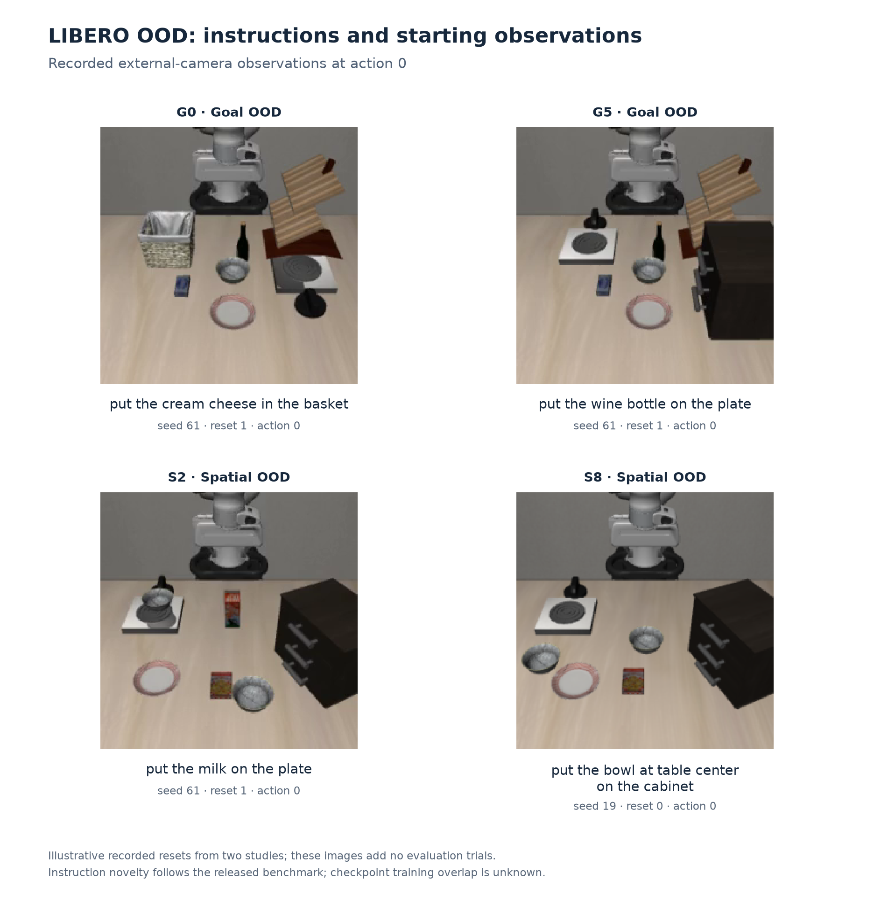
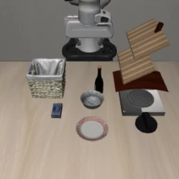
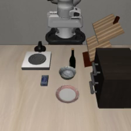
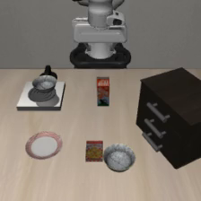

# Task inventory and recorded starting images

The evaluated paper benchmark contains 20 released OOD instructions: ten Goal and ten Spatial tasks. IDs are zero-based release order. Wording is preserved exactly, including ‘bbq source’. These are benchmark compositions; their absence from all checkpoint training data has not been established.

[Standalone HTML](tasks.html) · [CSV](tasks.csv) · [Example sheet PNG](task_examples.png) · [Example sheet PDF](task_examples.pdf)

| ID | Suite | Exact instruction |
|---|---|---|
| G0 | Goal | put the cream cheese in the basket |
| G1 | Goal | put the orange juice on the stove |
| G2 | Goal | put the bbq source on the plate |
| G3 | Goal | put the tomato sauce on top of the cabinet |
| G4 | Goal | put the wine bottle on the stove |
| G5 | Goal | put the wine bottle on the plate |
| G6 | Goal | put the wine bottle in the bowl |
| G7 | Goal | put the cream cheese on the plate |
| G8 | Goal | put the cream cheese on the stove |
| G9 | Goal | put the cream cheese on top of the cabinet |
| S0 | Spatial | put the butter on the plate |
| S1 | Spatial | put the chocolate pudding on the plate |
| S2 | Spatial | put the milk on the plate |
| S3 | Spatial | put the orange juice on the plate |
| S4 | Spatial | put the bowl on cookie box on the stove |
| S5 | Spatial | put the bowl on cookie box on the cabinet |
| S6 | Spatial | put the bowl next to the plate on the cabinet |
| S7 | Spatial | put the bowl next to the plate on the stove |
| S8 | Spatial | put the bowl at table center on the cabinet |
| S9 | Spatial | put the bowl at table center on the stove |

## Example starting observations

The three seed-61 images are first decoded frames of native evaluation videos, after reset stabilization and before the first policy action. S8 is the exact raw action-zero PNG sent to Astra in the seed-19 phase-development study. Image content is unedited. The original camera observations are 224 × 224; the contact sheet enlarges them for display.

Examples come from available recorded artifacts, including the existing outcome-selected video gallery; they are illustrations, not a representative sample or an additional evaluation cohort.

**G0: put the cream cheese in the basket**

Seed 61, reset 1, external camera, action 0.

**G5: put the wine bottle on the plate**

Seed 61, reset 1, external camera, action 0.

**S2: put the milk on the plate**

Seed 61, reset 1, external camera, action 0.

**S8: put the bowl at table center on the cabinet**

Seed 19, reset 0, external camera, action 0.

## Sources

[Released task inventory](../frs_policy_improvement/coverage.json) · [Video provenance](../learned_correction_recipe/results/gallery.json) · [Cabinet image audit](../phase_interpolation/development/examples/examples.json) · [Image provenance](task_examples.json) · [File hashes](tasks_manifest.json)

The sixteen additional generated compositions remain a [separate task catalog](../ood_extensions/v1/index.html), with policy evaluation pending. They are not included in this twenty-task table.

Regenerate with `python astra_reversal/reports/smart_system2_results/build_task_examples.py` in the activated project environment. This uses existing video files and the audited cabinet PNG; no simulator, model or provider calls are made.
