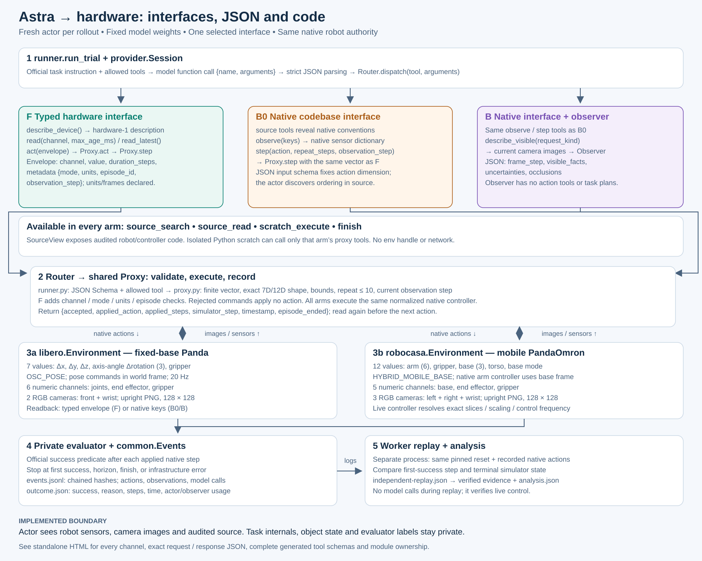

# Direct Astra control on RoboCasa365

This extends the LIBERO hardware-interface study to all **50 official RoboCasa
target tasks**, with one matched scenario seed per task and three interfaces
(150 pilot rollouts). A fresh Astra session chooses robot actions online. There
is no robot-policy training, expert-action playback, or learned skill library.

The pilot is exploratory. Its single seed per task does not reproduce the
official benchmark's 50-scenario evaluation and is not a leaderboard result.
Historical LIBERO results remain a separate cohort.



[Standalone framework guide](figures/framework.html) · [PNG](figures/framework.png) ·
[Editable Mermaid](figures/framework.mmd) · [Complete JSON contracts](figures/framework-contracts.json)

The offline guide includes the architecture diagram, every LIBERO and RoboCasa
sensor mapping, action semantics, tool request/response examples, generated JSON
Schemas, code ownership and a complete control-cycle trace. Its examples are
synthetic and schema-validated, not evaluation evidence. Regenerate the SVG,
HTML, JSON and Mermaid sources with
`python -m experiments.robocasa_hardware_interface.tools.build_framework`.

## Matched interfaces

| Arm | Agent interface |
| --- | --- |
| F | Typed hardware channels: describe, read, act |
| B0 | Audited source discovery and native observation/action tools |
| B | B0 plus a separate image-only Astra observer |

All three arms share the audited robotics source, isolated scratch execution,
native 12-value PandaOmron controller, sensor allowlist, three upright 128px
cameras, official task instruction, initial scenario, and success evaluator.
Native arm commands use the RoboCasa controller's base reference frame. The
mobile base, torso, gripper and arm remain available in every arm. The adapter
discovers and records the live composite controller's slice order and scaling.
No object coordinates, task implementations, demonstrations, success labels,
or simulator handles are exposed to an actor.

## Frozen design

`preregistration.yaml` contains the complete target50 catalog and official
per-task horizons, copied from the pinned upstream registry before outcomes
exist. Every task uses seed 0. A fixed seed shuffles task order and interleaves
the three interfaces within each scenario. The commissioning task, CloseDrawer
at seed 1000003, is disjoint from target50 and uses 20-step unscored checks.

There are no experiment token, elapsed-time, model-output, context or tool-call
caps. The native episode horizon, ten-step repeat maximum, controller bounds,
180-second individual request timeout and scratch isolation remain. Provider
usage is recorded separately for actor and observer, including cached input and
reasoning subsets where available. Three retries handle transient transport
errors; each failed request has explicitly unknown usage and no robot command
is dispatched until a valid response arrives. Unresolved infrastructure errors
stop collection and retain all previous outcomes.

Repeated model request histories are represented by their exact item hashes in
the private log; original model responses and tool observations are retained.
This avoids storing a growing camera history again on every request.

Before model trials, the worker verifies native interface equivalence, repeated
reset and observation equality, source isolation, scratch isolation and the
focused unit suite. Three live commissioning trials then verify provider calls,
control and independent replay. Every pilot outcome is replayed in a separate
process using the saved native actions. Replay makes no model calls. Logs,
outcomes and replay receipts are archived under an immutable workflow prefix
after each completed trial. Replay videos are sampled at frozen task IDs 0,
18 and 34; every rollout retains initial and terminal camera images.

Success rate is reported separately from time. The time-to-success comparison
uses matched starting scenarios that both arms solve, requires successful replay,
and is explicitly conditional on success. Failed attempts do not become fast
solutions in this metric. All-started duration, steps and token usage are also
retained.

## Runtime and launch

The release is RoboCasa 1.0.1 at `456174f62b89b8fca99eaaf33949c29fec9cfc2a`,
with upstream robosuite at `5ce6643f3092639d08f7b0f90ed1c6a84f50552c`,
Python 3.11.13, and a digest-pinned Linux container. The bootstrap installs the
official dependencies, downloads public simulation assets without demonstrations,
and records asset archive hashes, a dependency freeze and wheel hashes. CPU
PyTorch satisfies upstream dependencies; inference runs through the existing
NVIDIA Astra endpoint. Credentials are transferred separately from source.

The Debian package snapshot is 2025-10-01, compatible with the image's
2025-09-29 base. An OSMO CPU-only package-resolution probe reproduced the
initial older-snapshot conflict and passed with this date. That check verifies
system-package resolution, not simulator commissioning or benchmark success.

```bash
source emimic/bin/activate
python -m pytest --confcutdir=tests/unit/hardware_interface tests/unit/hardware_interface -q
# Commit tested sources before preparing a launch payload.
python experiments/robocasa_hardware_interface/tools/prepare_osmo.py \
  /path/to/new/launch-artifacts --stage pilot
```

The owned worker requests one L40S on `groot-l40s-01`, or an L40 when prepared
with `--pool groot-l40-05`. All arms of a cohort run on the same worker; hardware
is recorded with the run. It does not use sky1 or sky2. No benchmark rollout
should be described as launched until its workflow receipt and gate outputs
are available.

Upstream references: [installation](https://robocasa.ai/docs/build/html/introduction/installation.html),
[task registry](https://github.com/robocasa/robocasa/blob/456174f62b89b8fca99eaaf33949c29fec9cfc2a/robocasa/utils/dataset_registry.py),
[native environment factory](https://github.com/robocasa/robocasa/blob/456174f62b89b8fca99eaaf33949c29fec9cfc2a/robocasa/utils/env_utils.py).
